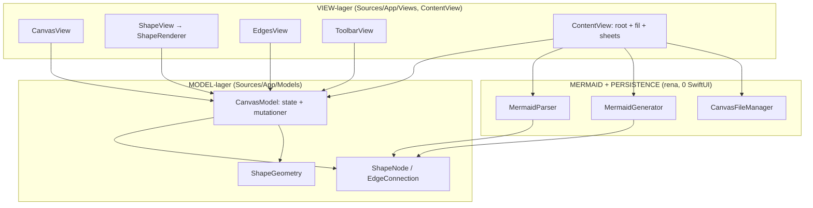

# ARKITEKTUR-MERMAID — Version v78
*Datum: 2026-06-17*

> **v78 "arkitektur-ombyggnad, checkpoint 1":** Stor strukturell omgång (milstolpe MA).
> Funktionellt identisk med v77 — men koden är nu lagerindelad, maskinellt grindad, och
> Claude kan se/styra appen själv i simulatorn. Den stora monoliten CanvasView gick
> **1781 → 1070 rader** i små, verifierade steg (171 unit-tester gröna efter varje).
> Återstående ombyggnad + recept: se **`ARKITEKTUR-OMBYGGNAD.md`** (aktivt uppdrag).

## Vad v78 innehåller (utöver v77)
- **Lagerindelning** (View → Model → Mermaid/Persistence) med tillåten beroenderiktning.
- **Maskinell grind** (`scripts/arch-check.py` + pre-commit): filstorlek-ratchet, lager-regler, version-sync, inga kraschpunkter i Model/Mermaid.
- **Skyddsnät**: 36 nya unit-tester (djup round-trip, per-fält-symmetri, CanvasModel-beteende).
- **`se-appen`**-loopen: Claude bygger/startar sim, tar egen skärmbild, läser UI + state-dump, trycker/drar.
- **ShapeGeometry** flyttad till Model-lagret; ShapeView delad (ShapeRenderer utbruten); små canvas-vyer i `Views/Canvas/`.
- **Version-sync**: bundle-version härleds nu från `AppVersion.swift` (v78 → 1.78.0 / 78).

## Lager + flöden

arch-check.py (pre-commit) tvingar pilarnas riktning + filstorlek + version-sync.

## Komponenter

| Komponent | Fil | Ansvar |
|---|---|---|
| Root-vy | `Sources/App/ContentView.swift` | App-root, filhantering, sheets, autosave (691 → delas i MA) |
| Canvas-vy | `Sources/App/Views/CanvasView.swift` | Canvas-content + interaktion (1781 → 1070, delas vidare) |
| Form-vy | `Sources/App/Views/Canvas/ShapeView.swift` | En forms vy + gester (279) |
| Form-rendering | `Sources/App/Views/Canvas/ShapeRenderer.swift` | Bakgrund/ram/highlight per ShapeType |
| Canvas-hjälpvyer | `Sources/App/Views/Canvas/{ConnectionOverlay,FreeLineView,ShapeBackgrounds}.swift` | Rubber band/handtag, lösa linjer, tabell/länk-bakgrund |
| Kant-vy | `Sources/App/Views/CanvasView.swift` (EdgesView, delas i MA steg 6) | Pilar + handtag + collapse-badges |
| Verktygsrad | `Sources/App/Views/ToolbarView.swift` | Form/färg/textstil/paket/multi-select (1069, delas i MA) |
| Modell | `Sources/App/Models/CanvasModel.swift` | All state + mutationer (857, delas i MA) |
| Datatyper | `Sources/App/Models/{ShapeNode,EdgeConnection}.swift` | Former + kanter (Equatable + Codable) |
| Geometri | `Sources/App/Models/ShapeGeometry.swift` | Bredd/höjd/hit-test (ren domänlogik) |
| Mermaid | `Sources/Mermaid/{MermaidParser,MermaidGenerator}.swift` | Text ↔ modell (round-trip, 0 SwiftUI) |
| Persistens | `Sources/App/Persistence/*.swift` | iCloud-fil-IO + dokument |
| Testläge | `Sources/App/{UITestScenarios,StateDump}.swift` | Känt canvas-innehåll + state-dump för se-appen |
| Version | `Sources/App/AppVersion.swift` | Single source of truth (v78) |

## Kärninvarianter (icke förhandlingsbara)
- **Förlustfri round-trip + korrekt semantik:** canvas → mermaid/state-JSON → canvas ger IDENTISK bild. Bevisas av `RoundTripFidelityTests` + `StateJSONSymmetryTests` (måste vara gröna före deploy).
- **Mermaid-blocket självbärande** (v61): state-JSON är sanningskällan; mermaid-fallback finns kvar för AI-ritade filer utan JSON.
- **Lagerregler** (ARKITEKTUR-REGLER.md): Mermaid rör aldrig UI; Model ritar aldrig; jättefiler får bara krympa.

## Att verifiera på iPhone (Kims ögon)
- Appen startar och visar **v78** i status-baren.
- Öppna en befintlig canvas-fil, flytta former, dra en pil, spara — inget tappas (round-trip).
