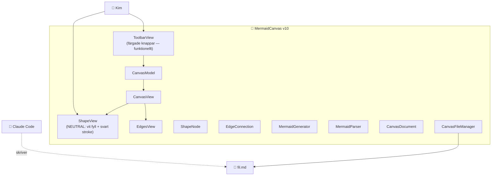

# ARKITEKTUR-MERMAID — Version v10
*Datum: 2026-05-14*

Aktuell arkitektur för MermaidCanvas-appen. Uppdateras vid varje deploy enligt `VERSIONSHANTERING.md`.

## Diagram

Samma arkitektur som v9. Endast rendering förändrad.

## Ändringar från v9

- **Former är nu färgfria**: `ShapeView` använder `Color(.systemBackground)` som fyllning (vit i light mode, svart i dark mode) och `Color.primary` som stroke (svart i light mode, vit i dark mode). Den tidigare type→färg-mappningen (cirkel=blå, fyrkant=grön, romb=orange) är borttagen.
- **Toolbar-knappar behåller färg**: knapparna i toolbar är funktionella UI-element och behåller sina färger (Cirkel blå, Box grön, Romb orange, Pil/Dubbel lila, Spara grön, Öppna orange) så Kim lätt kan urskilja dem.
- **Datamodell oförändrad**: ShapeType, EdgeConnection, persistens — allt likadant. Bara rendering på canvasen ändrad.

## Färg som "separat feature" — planerat

Färg blir en *egenskap per form* som Kim kan ändra efter att en form skapats. Tänkt UI:
- Tap på en form (utanför pil-mode) → meny med textinput för label + färgväljare
- Färgen sparas i `ShapeNode.color` (eller i en parallel ColorStyle-property)
- Renderas via `.fill` på shape-bakgrunden om satt, annars neutral

Detta blir v11 eller senare.

## Planerat för v11+

- Tap-meny på form: ändra label + färg + ta bort
- Tap-meny på pil: ändra label + ta bort + byta riktning
- Bookmark: kom ihåg senast öppnade fil
- NSFilePresenter: live-reload utan re-öppna
- Pan/zoom på canvas
