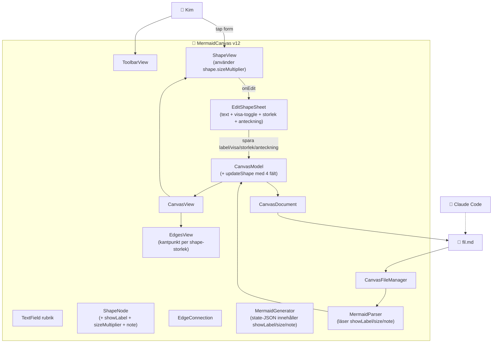

# ARKITEKTUR-MERMAID — Version v12
*Datum: 2026-05-14*

> **Status**: kod skriven och `BUILD SUCCEEDED`. Install/launch på iPhone har **inte** körts (Kim avbröt för att säkerställa att allt sparas innan eventuell session-clear). Koden är pushad till GitHub. Vid nästa session: install + launch + verifiera enligt VERSIONSHANTERING.md.

## Diagram

## Ändringar från v11

1. **Storlek per form**: `ShapeNode.sizeMultiplier: CGFloat` (default 1.0, range 0.5–2.0 i UI). ShapeView och EdgesView räknar dimensioner från `sizeMultiplier`. Pilarnas kantpunkter följer den nya storleken.
2. **Toggle visa/dölj text**: `ShapeNode.showLabel: Bool` (default true). ShapeView ritar bara Text om `showLabel == true`. I Mermaid-koden genereras en form med ett mellanslag som etikett om text är dold (Mermaid-kompatibelt).
3. **Anteckning per form**: `ShapeNode.note: String` (default ""). Visas inte på canvasen. Sparas i state-JSON och i sheet:en. Följer med filen.
4. **EditShapeSheet redesign**: tre sektioner — "Text i form" (toggle + textfield), "Storlek" (slider med ikoner), "Anteckning". Stöder både medium- och stora-detents.
5. **`ShapeGeometry` är nu en exposed enum** med funktioner per shape istället för fasta konstanter.
6. **Canvas-protokoll (delat språk)**: state-JSON innehåller nu `canvas: {width, height, shapeBaseWidth, shapeBaseHeight, unit}` så att alla läsare (även Claude Code från Mac) vet referensramen. `CanvasModel.canvasSize` håller aktuell storlek, uppdateras från GeometryReader. Reglerna för det visuella protokollet är samlade i `METOD-VISUELL-DIALOG.md`.

## Komponenter — ändringar i v12

| Komponent | Fil | Ändring |
|---|---|---|
| ShapeNode | `Sources/Models/ShapeNode.swift` | + `showLabel`, `sizeMultiplier`, `note` |
| CanvasModel | `Sources/Models/CanvasModel.swift` | `updateShape(id:label:showLabel:sizeMultiplier:note:)` ersätter `updateLabel` |
| EditShapeSheet | `Sources/Views/EditShapeSheet.swift` | Ny `ShapeEdit`-struct. Sheet med 3 sektioner (text + toggle, storlek-slider, anteckning) |
| CanvasView | `Sources/Views/CanvasView.swift` | `ShapeGeometry` har nu per-shape-funktioner som beaktar `sizeMultiplier`. ShapeView ritar Text bara om `showLabel`. |
| MermaidGenerator | `Sources/Mermaid/MermaidGenerator.swift` | State-JSON innehåller `showLabel`/`size`/`note`. Genererar mellanslag i mermaid-label om `showLabel == false`. |
| MermaidParser | `Sources/Mermaid/MermaidParser.swift` | Läser `showLabel`/`size`/`note` från state-JSON med säkra defaults. Klampar size till 0.3–3.0. |
| ContentView | `Sources/ContentView.swift` | Skickar `ShapeEdit` till sheet och tar tillbaka uppdaterat ShapeEdit vid Klar. |

## Planerat för v13 och framåt

- **v13**: regnbåge-knapp + färgväljare per form (Kims tidigare önskemål).
- **v14**: Apple-snygg app-ikon (1024×1024 + AppIcon.appiconset).
- **v15+**: NSFilePresenter för automatisk live-reload utan re-öppna, bookmark för senast öppnade fil, ta bort form/pil, pan/zoom-canvas.
