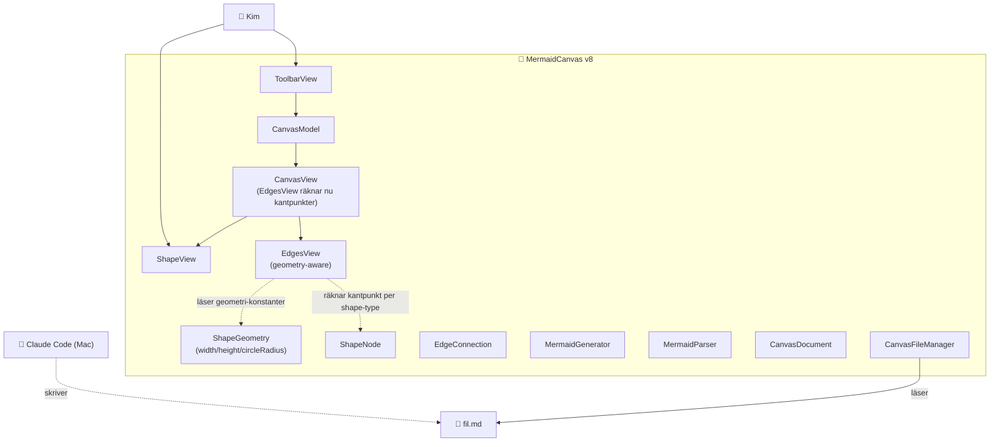

# ARKITEKTUR-MERMAID — Version v8
*Datum: 2026-05-14*

Aktuell arkitektur för MermaidCanvas-appen. Uppdateras vid varje deploy enligt `VERSIONSHANTERING.md`.

## Diagram

Samma arkitektur som v7 — endast pil-rendering har förbättrats. Inga nya komponenter eller flöden.

## Komponenter (oförändrade från v7)

| Komponent | Fil | Ansvar |
|---|---|---|
| Geometri-konstanter (NY i v8) | `Sources/Views/CanvasView.swift` (private ShapeGeometry) | width, height, halfWidth, halfHeight, circleRadius — delade mellan ShapeView och EdgesView. |
| Pil-rendering | `Sources/Views/CanvasView.swift` (EdgesView) | Räknar nu **kantpunkter** per shape-typ innan ritning. |
| Övriga komponenter | Samma som v7 | Oförändrade. |

## Ändringar från v7

- **Pilar slutar vid form-kanten, inte i center**: EdgesView har nu en `edgePoint(for:towards:)`-funktion som returnerar punkten där en linje från form-center mot målpunkten skär formens periferi.
  - **Cirkel**: punkten på cirkelns kant i riktning mot målet (radius = 39 px för 110×78-frame).
  - **Fyrkant**: axelparallell rektangel-intersection — räknar minsta skalfaktor `t` så linjen träffar kanten.
  - **Romb**: använder romb-ekvationen `|dx|/halfWidth + |dy|/halfHeight = 1` för att hitta intersection.
- **Privat ShapeGeometry-enum**: delar dimensioner mellan rendering och kantberäkning.

## Vad som inte är fixat än (planerat för v9)

- **Drag-ut former från toolbar**: Kim vill kunna dra en form direkt från toolbar-knappen till önskad plats på canvasen, istället för att tap → placeras på center → drag.
- **Pilriktning (en eller båda)**: Kim vill kunna välja om en pil är enkelriktad eller dubbelriktad. EdgeConnection behöver ett `bidirectional`-fält.

## Planerat för v9 och framåt

- v9: Drag-ut + dubbel-pil-stöd
- v10+: Namnge former (tap → text-input), ta bort former/pilar, bookmark-persistens, NSFilePresenter för live-reload
