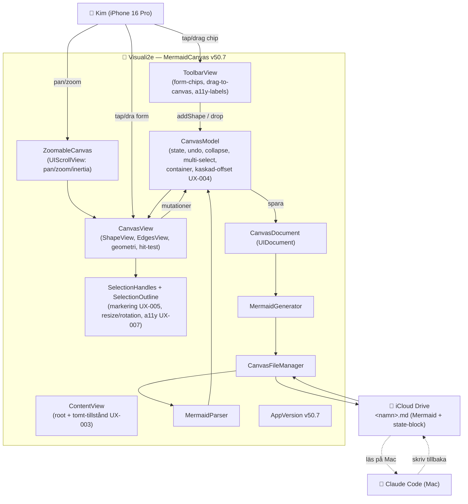

# ARKITEKTUR-MERMAID — Version v50.7
*Datum: 2026-06-01*

**Aktuell version:** v50.7
**Single source of truth för version:** `app/MermaidCanvas/Sources/App/AppVersion.swift`

> Detta dokument speglar **nuvarande** kod (v50.7). Den kompletta modul-kartan med
> ansvarsfördelning bor i `BLUEPRINT.md` — det här dokumentet ger systemöversikten,
> dataflödet och Mermaid-diagrammet. Tidigare arkitektur-versioner: `arkiv/ARKITEKTUR-MERMAID-vN.md`.

---

## Vad appen är (oförändrat sedan grunden)

En native SwiftUI iPhone-app — en visuell flödesschema-editor (känsla: Lucidchart).
Former dras/skapas på en canvas, text bara *i* former, riktade pilar mellan former.
Allt persistas som **Mermaid-kod i en markdown-fil i iCloud Drive**. Claude Code läser
och skriver samma fil → tvåvägs visuellt språk mellan Kim och Claude Code.

Canvas-filer: `~/Library/Mobile Documents/com~apple~CloudDocs/00000. Claude Code/1. Mermaid/`

---

## Modul-karta (kondenserad — full version i BLUEPRINT.md)

```
Sources/
├── App/
│   ├── AppVersion.swift              versionsnummer (single source of truth)
│   ├── MermaidCanvasApp.swift        app-entry
│   ├── ContentView.swift             root: toolbar + canvas + sheets + tomt-tillstånd
│   ├── Canvas/                        ZoomableCanvas (UIScrollView), CanvasViewportState, FloatingChipPreview
│   ├── Models/                        CanvasModel (state/undo/collapse/multi-select/container),
│   │                                  ShapeNode, EdgeConnection, ColorPack, TextStyle
│   ├── Views/                         CanvasView (ShapeView/EdgesView/geometri), ToolbarView,
│   │                                  EditShapeSheet, EmptyCanvasHint, badges, popovers, sheets
│   ├── Views/Handles/                 SelectionHandles (resize+rotation), SelectionOutline
│   ├── Persistence/                   CanvasDocument (UIDocument), CanvasFileManager (iCloud)
│   └── Preview/                       Flow/Architecture/UI/Godot/Roadmap-renderare
├── Mermaid/                           MermaidGenerator (canvas→kod), MermaidParser (kod→canvas), SpecType
└── ClaudeCode/                        Platform, PlatformRules, ShapeCategory, ShapePack
```

**Kärninvarianter:**
- **Modellen muteras aldrig direkt från View** — alltid via `CanvasModel`-metoder (varje muterande metod gör `snapshotForUndo()`).
- **Förlustfri round-trip** (fidelity: positioner/storlekar/färger; semantik: kategori per nod) är icke förhandlingsbar — se `METOD-VISUELL-DIALOG.md`.
- **Ny data i ShapeNode/EdgeConnection** är alltid Codable med bakåtkompatibel default.

---

## Diagram



---

## v50.7 — denna version (UX-svep efter persona-audit)

Fixar UX-fynd från `UX_PERSONA_AUDIT.md` (6 personas via idb). Verifierade i simulator;
känsel-/gest-fynd bekräftas på iPhone.

- **UX-004 — kaskad-offset på nya former.** Nya former staplades pixel-exakt i center
  (osynlig hög, sågs av 4/6). `CanvasModel.cascadedPosition(near:)` förskjuter nedåt-höger
  tills platsen är fri. Gäller form, tabell, lös linje/pil.
- **UX-005 — markeringsfeedback direkt vid tap.** Enkel-vald form fick tidigare bara handtag
  (syntes vid drag). Nu ritas samma streckade `SelectionOutline` som multi-select direkt.
- **UX-001/007/010/013 — VoiceOver-labels.** Toolbar-knappar, form-chips och resize/rotation-
  handtag exponerade råa SF Symbol-namn / chip-id. `ToolbarView.a11yLabel(for:)` + labels på
  handtagen ger läsbara svenska namn.
- **UX-006 — träffytor ≥44pt.** Collapse-badge och 100%-zoomknapp fick expanderad tap-yta
  (visuell storlek oförändrad). Resize/rotation-handtag hade redan ~2× tap-yta via `contentShape`.
- **UX-003 — tomt-tillstånd.** `EmptyCanvasHint` vägleder förstagångsanvändare på tom canvas.
- **UX-012 — rektangel-chip tydligare avlångt** (skiljs från kvadrat-chipet).

**Verifierat som icke-buggar (ingen ändring):** UX-002 (undo är korrekt per-steg),
UX-008 (drag fungerar på omarkerad form — snabbsvep fångas av scroll-vyn by design),
UX-014 (kosmetiskt animations-kantfall i a11y-trädet).

**Kvar som follow-up (kräver dedikerad design):** UX-009 (pil-upptäckbarhet),
UX-011 (tabell-redigerings-affordance).

---

## Versionsutveckling v40 → v50.7

v40–v50 växte fram via många små iterationer (root-cause-fixar, resize/edge/collapse-finputs,
round-trip-härdning, ux-personas-test-verktyget). Per-version-detaljer finns i `ROADMAP.md`
och git-loggen (`git log --oneline`); tidigare arkitektur-snapshots i `arkiv/`.

Milstolpar värda att känna till:
- **v47:** explicit `childOfContainerId` — container-barn följer med robust vid flytt.
- **v50.5–v50.6:** chips ritas med samma geometri-tokens som canvas (`DesignTokens`),
  long-press → egen popover (ingen snapshot-flash), round-trip-krasch (`-->` i text) fixad,
  tabell-klamp `max(1,…)`, regressionstester (RoundTripTests).

---

## Att verifiera på iPhone vid denna deploy (v50.7)

- [ ] Tom canvas visar "Börja här"-hinten; försvinner när första formen läggs
- [ ] Två snabba former staplas INTE — andra hamnar nedåt-höger (UX-004)
- [ ] Tap på form ger direkt streckad markeringsram (UX-005)
- [ ] VoiceOver läser "Former", "Färg", "Ångra", "Cirkel" osv. — inte symbolnamn (UX-001)
- [ ] Collapse-badge och 100%-knapp är lätta att träffa med fingret (UX-006)
- [ ] Round-trip mot iCloud-filen är förlustfri (oförändrat sedan v50.6)
