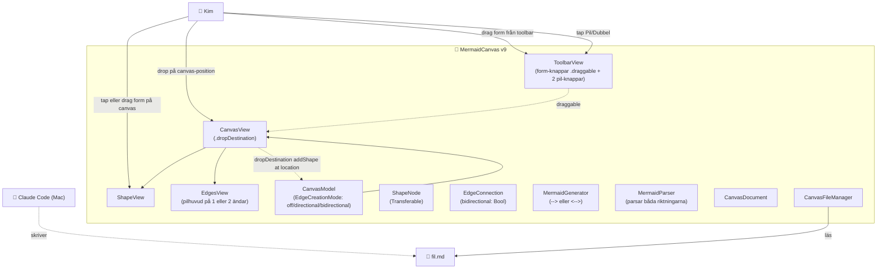

# ARKITEKTUR-MERMAID — Version v9
*Datum: 2026-05-14*

Aktuell arkitektur för MermaidCanvas-appen. Uppdateras vid varje deploy enligt `VERSIONSHANTERING.md`.

## Diagram

## Komponenter (endast ändringar listade)

| Komponent | Fil | Ändring i v9 |
|---|---|---|
| ShapeType | `Sources/Models/ShapeNode.swift` | Nu Transferable via ProxyRepresentation av rawValue. Möjliggör drag-out. |
| EdgeConnection | `Sources/Models/EdgeConnection.swift` | Ny `bidirectional: Bool`-flagga (default false). |
| CanvasModel | `Sources/Models/CanvasModel.swift` | `EdgeCreationMode` enum (off/directional/bidirectional) ersätter Bool. `startEdgeMode(_:)`, `cancelEdgeMode()`. `handleEdgeTap` läser mode och sätter bidirectional på nyskapade pilar. |
| ToolbarView | `Sources/Views/ToolbarView.swift` | Form-knappar har `.draggable(type)` med en preview. Två pil-knappar (Pil + Dubbel) toggle:as separat. |
| CanvasView | `Sources/Views/CanvasView.swift` | `.dropDestination(for: ShapeType.self)` — när en drag släpps på canvas anropas `addShape(type, at: location)` med exakta koordinater. EdgesView ritar pilhuvud på båda ändar om `bidirectional`. |
| MermaidGenerator | `Sources/Mermaid/MermaidGenerator.swift` | Använder `<-->` för bidirectional edges, `-->` annars. State-JSON inkluderar `bidirectional`-fält. |
| MermaidParser | `Sources/Mermaid/MermaidParser.swift` | Regex matchar både `<-->` och `-->`. Läser `bidirectional` från state-JSON. |

## Ändringar från v8

1. **Drag-ut former från toolbar**
   - ShapeType conformar till `Transferable` (CoreTransferable).
   - Form-knapparna i toolbar har `.draggable(type)` med en SwiftUI-preview som följer fingret.
   - CanvasView har `.dropDestination(for: ShapeType.self) { items, location in ... }` som lägger till formen på exakt koordinat där den släpps.
   - Tap fortsätter funka som tidigare (lägger till på canvas-center).

2. **Pil i en eller båda riktningar**
   - `EdgeConnection.bidirectional: Bool`.
   - Två pil-knappar i toolbar: lila "Pil" (enkel) och lila "Dubbel". Var och en togglar sitt eget mode.
   - Pil-mode visar status-text: "Pil-mode: tryck startform" eller "Dubbel-pil-mode: tryck startform".
   - EdgesView ritar pilhuvud på båda ändar om `bidirectional == true`.
   - Mermaid-syntax: `A <--> B` för dubbel, `A --> B` för enkel.

## Hur Kim använder v9

### Lägga till form
- **Tap** Cirkel/Box/Romb → form på canvas-center
- **Drag** Cirkel/Box/Romb till valfri position → form där fingret släpps

### Skapa pil
- **Enkel pil**: tap **Pil** → tap startform (röd ring) → tap målform → pil med pilhuvud på målet
- **Dubbel pil**: tap **Dubbel** → tap startform → tap målform → pil med pilhuvud på båda ändar
- **Avbryt**: tap samma form två gånger, eller tap **Avbryt** på pil-knappen

### Spara / Öppna
- Som tidigare. Filen behåller formdata (inklusive pilarnas bidirectional-status) via state-JSON i HTML-kommentar.

## Planerat för v10+

- Namnge former: tap (utanför pil-mode) → text-input för att byta label.
- Ta bort former / pilar: långtryck-meny eller "papperskorg"-mode.
- Bookmark: kom ihåg senast öppnade fil.
- NSFilePresenter: live-reload utan re-öppna.
- Pan/zoom på canvas: stort diagram kan behövas.
