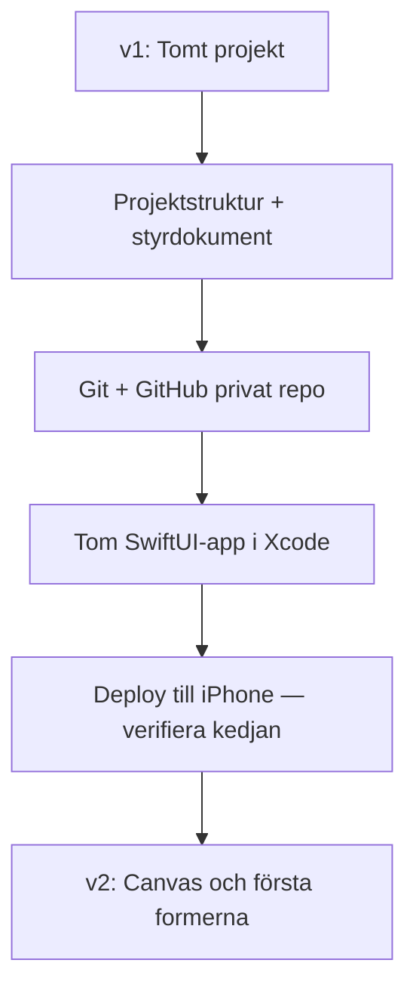

# ARKITEKTUR-MERMAID — Version v1
*Datum: 2026-05-14*

Aktuell arkitektur för MermaidCanvas-appen. Uppdateras vid varje deploy enligt `VERSIONSHANTERING.md`.

## Diagram

## Komponenter

| Komponent | Fil | Ansvar |
|---|---|---|
| _(ingen Swift-kod ännu — kommer i v2)_ | — | — |

## Anteckningar för v1

- Projektmapp: `/Users/kim/2e Mermaid Code/`
- Styrdokument på plats: `CLAUDE.md`, `VERSIONSHANTERING.md`, `ARKITEKTUR-MERMAID.md`, `README.md`
- iCloud-mapp för canvas-fil: `~/Library/Mobile Documents/com~apple~CloudDocs/ClaudeCanvas/`
- GitHub privat repo skapat
- Xcode-projektstomme skapas i `app/MermaidCanvas/`

## Planerat för v2

- Canvas-vy i SwiftUI med pan/zoom (Lucidchart-känsla)
- Verktygsmeny med tre former: cirkel, triangel, fyrkant
- Drag-ut-gest: hämta form från meny → släpp på canvas
- Form-storleksjustering
- Text *i* form
- Pilar mellan former med riktning
- Live-kompilering till mermaid-kod
- iCloud-fil-skrivning till `canvas.md`
- File-watcher som re-renderar canvas vid extern ändring (från Claude Code)
