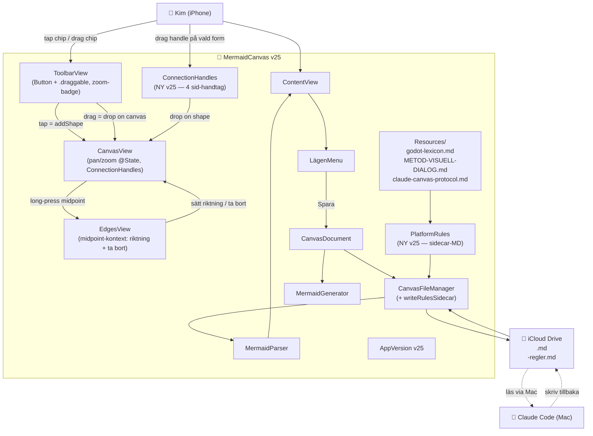

# ARKITEKTUR-MERMAID — Version v25
*Datum: 2026-05-16*

> **Status:** v25 fixar dragout-bugg, sänker zoom ännu mer, lägger till **connection-handtag** på sidor av former för att dra pilar, **edge-riktningsmeny** via long-press på midpoint, samt **auto-skriver en `<namn>-regler.md`-sidecar** bredvid varje canvas-fil när Kim sparar — så Claude Code direkt har plattformens regler när han läser canvasen från Mac:en.

---

## Ändringar från v24 — v25

**A. Drag-out-fix (root cause):**
- ToolbarView shape-chips var `Image + onTapGesture + draggable` i ScrollView → gesture-conflict på iPhone ⇒ varken tap eller drag fyrade.
- **Fix:** Byt till `Button { addShape } label: { ChipFace }` + `.draggable(type)`. Apple-mönster, fungerar både för tap (lägg i mitten) och drag-och-släpp (släpp på canvas).

**B. Zoom mildare + zoom-indikator:**
- `pow(value, 0.3)` → `pow(value, 0.2)` (cirka 1/5 känsligheten).
- Ny zoom-badge i toolbar visar `<NN>%` så Kim ser zoom-nivån. Tap på badge → reset till 100%.

**C. Connection-handtag på sidor av vald form:**
- `ConnectionHandles`-view ritar 4 små accent-cirklar med `arrow.up.right`-ikon (top/right/bottom/left) på vald form.
- Drag från handtag → rubber-band-linje följer fingret (`ConnectionRubberBand`-view, streckad accent-blå).
- Släpp över annan form → `model.addEdge(from:to:)` skapar pil direkt. Dubblettpilar (samma riktning) tillåts inte.
- Hit-testing via `ShapeGeometry.hitTest(point, shapes:, excludingId:)`.

**D. Edge-riktningsmeny:**
- Long-press på pil-midpoint öppnar `contextMenu` med fyra val:
  - **Pil åt ett håll →** (sätter `bidirectional = false`)
  - **Byt riktning ←** (`reverseEdge` — swappar from/to)
  - **Båda hållen ↔** (sätter `bidirectional = true`)
  - **Ta bort pil**
- Midpoint-handtaget visar `arrow.right` eller `arrow.left.arrow.right` som ikon beroende på riktning.

**E. Auto-sidecar för Claude Code:**
- Ny modul `Models/PlatformRules.swift` är central källa för regel-text per `spec_type`.
- Vid Spara (eller Spara Som) → `CanvasFileManager.writeRulesSidecar(rulesText:)` skriver `<canvas>-regler.md` bredvid huvudfilen.
- Sidecar-innehåll: **Del 1** = plattformsregler (godot-lexicon.md eller motsvarande), **Del 2** = `claude-canvas-protocol.md` (specifierar filformat).
- Resultat: när Kim refererar till en canvas från Mac:en har Claude Code direkt regelfilen i samma mapp.

**F. Ny resource: claude-canvas-protocol.md**
- Bundlad i appens Resources/. Specificerar filstruktur (frontmatter / mermaid-block / state-JSON), plattformer, round-trip-regler.

---

## Filöversikt (aktuell — v25)

| Område | Fil | Roll |
|---|---|---|
| **Version** | `Sources/AppVersion.swift` | Single source of truth: `v25` |
| **App-entry** | `Sources/MermaidCanvasApp.swift` | App-bootstrap |
| **Toplevel** | `Sources/ContentView.swift` | Toolbar + CanvasView + sheets, zoom-state-binding |
| **Models** | `Sources/Models/CanvasModel.swift` | Form/edge-lager, undo-stack, addEdge/reverseEdge/setBidi (NY i v25) |
| | `Sources/Models/ShapeNode.swift` | Form-data, Transferable för drag-out, textStyle, colorPackId |
| | `Sources/Models/ShapeCategory.swift` | 28 kategorier (5 lägen + godot 8 + note), färg-mapping |
| | `Sources/Models/SpecType.swift` | UI/Roadmap/Arkitektur/Flow/Godot/General |
| | `Sources/Models/EdgeConnection.swift` | Pilar, waypoints |
| | `Sources/Models/TextStyle.swift` | R1/R2/R3/Body |
| | `Sources/Models/ColorPack.swift` | 6 pastell-paket + "ingen färg" |
| | `Sources/Models/iPhoneFrameMath.swift` | iPhone-ramberäkning |
| | **NY** `Sources/Models/PlatformRules.swift` | Centralt regel-text per spec_type + sidecar-MD-genererare |
| **Canvas** | `Sources/Views/CanvasView.swift` | 3000×3000 canvas, pan/zoom@State, ConnectionHandles + RubberBand + EdgesView |
| | `Sources/Views/DotGridBackground.swift` | Prickrutnät (drawingGroup) |
| | `Sources/Views/iPhoneFrameOverlay.swift` | iPhone-ram (UI-läget) |
| | `Sources/Views/MarkerOverlay.swift` | Multi-select rectangle-drag |
| | `Sources/Views/CollapseBadge.swift` | Plus/minus i nedre höger på former med outgoing edges |
| | `Sources/Views/NoteBadge.swift` | Gul prick på former med anteckning |
| | `Sources/Views/Handles/SelectionHandles.swift` | Resize/rotation-handtag |
| **Toolbar/menyer** | `Sources/Views/ToolbarView.swift` | Primär + sekundär rad, glas-bubblor, drag-out (Button+draggable) |
| | `Sources/Views/LägenMenu.swift` | "Lägen"-meny (plattform-info + filhantering + version) |
| | `Sources/Views/NewCanvasSheet.swift` | Välj plattform vid Ny canvas (LÅS) |
| | `Sources/Views/PlatformRulesSheet.swift` | Visar regler-text för aktuell plattform |
| **Sheets** | `Sources/Views/EditShapeSheet.swift` | Namn/Visa-text/Textstil/Anteckning/Delete |
| | `Sources/Views/NoteMiniSheet.swift` | Mini-sheet, bara TextEditor |
| | `Sources/Views/MermaidCodeSheet.swift` | Visa filinnehåll |
| | `Sources/Views/PreviewSheet.swift` | Renderad förhandsvisning per spec_type |
| | `Sources/Views/ColorPackPopover.swift` | (alternativ popover, ej i toolbar nu) |
| | `Sources/Views/ColorPickerPopover.swift` | Legacy color-picker |
| **Persistens** | `Sources/Persistence/CanvasDocument.swift` | Frontmatter + mermaid + state-JSON |
| | `Sources/Persistence/CanvasFileManager.swift` | iCloud-fil-IO + writeRulesSidecar (NY i v25) |
| **Mermaid** | `Sources/Mermaid/MermaidGenerator.swift` | Skriv mermaid-block + state-JSON |
| | `Sources/Mermaid/MermaidParser.swift` | Läs state-JSON / fallback till mermaid |
| **Preview** | `Sources/Preview/UIRenderer.swift` | Dispatcher per spec_type |
| | `Sources/Preview/UIScreenRenderer.swift` | UI-läget |
| | `Sources/Preview/RoadmapRenderer.swift` | Roadmap-läget |
| | `Sources/Preview/ArchitectureRenderer.swift` | Arkitektur-läget |
| | `Sources/Preview/FlowRenderer.swift` | Flow-läget |
| | `Sources/Preview/GodotPreviewRenderer.swift` | Godot-läget |
| **Resources** | `Resources/godot-lexicon.md` | Godot-regler bundlat i app |
| | `Resources/METOD-VISUELL-DIALOG.md` | UI-läget-regler |
| | **NY** `Resources/claude-canvas-protocol.md` | Filformat-spec för Claude Code |

---

## Hur Claude Code blir "redo att använda"

1. Kim trycker **Lägen → Visa regler** i appen → läser plattformens regelfil.
2. Kim trycker **Spara** → MermaidCanvas skriver två filer i iCloud-mappen:
   - `<namn>.md` — canvas (frontmatter + mermaid + state-JSON)
   - `<namn>-regler.md` — plattformens regler + filformat-spec
3. Kim refererar canvasen på Mac:en (t.ex. "läs canvasen min-spel.md"). Claude Code:
   - Öppnar `min-spel.md` → tolkar state-JSON (auktoritativ) eller mermaid-block (fallback).
   - Öppnar `min-spel-regler.md` → vet exakt vilka former och pilar som är tillåtna för den plattformen.
   - Skriver tillbaka i `min-spel.md` (uppdaterar både mermaid-block och state-JSON).
4. Kim öppnar appen → CanvasFileManager poll-läser modification-date → laddar om från fil → ser Claudes ändringar.

---

## Diagram

---

## Att verifiera vid nästa session

- [ ] Pan/zoom är butter smooth (drawingGroup + @State + pow(0.2))
- [ ] Zoom-badge i toolbar visar procent — tap = reset
- [ ] Former-knapp → sekundär rad blixtsnabbt under, **tap = lägg i mitten, drag = drop på canvas**
- [ ] Vald form visar 4 accent-blå anslutnings-handtag på sidorna
- [ ] Drag från anslutnings-handtag → rubber-band-linje → drop på annan form skapar pil
- [ ] Long-press på pil-midpoint → meny med riktning + ta bort
- [ ] Lägen → Visa regler → ser godot-lexicon för godot-canvas
- [ ] Spara godot-canvas → bredvid finns `<namn>-regler.md` med godot-lexicon + protocol
- [ ] Claude Code kan öppna `<namn>-regler.md` på Mac:en och förstår filformat
