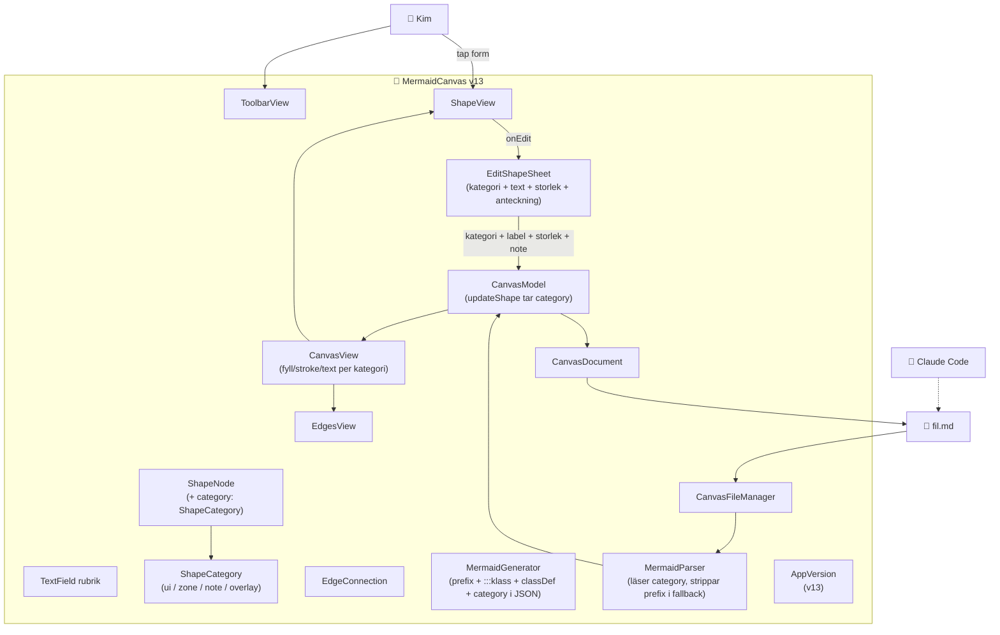

# ARKITEKTUR-MERMAID — Version v13
*Datum: 2026-05-15*

> **Status (när skriven):** kod skriven, build + deploy pågår. Vid nästa session: verifiera enligt VERSIONSHANTERING.md.

## Diagram

## Ändringar från v12

1. **Semantisk kategori per form (Lager 2 i METOD-VISUELL-DIALOG.md)**: ny `ShapeCategory`-enum (`ui` / `zone` / `note` / `overlay`) som egen fil. `ShapeNode` har nu `category: ShapeCategory` (default `.ui`).
2. **Kategori-väljare i EditShapeSheet**: ny section "Kategori" med segmented picker + hint-text per kategori.
3. **Färg per kategori i canvas**: `ShapeView` fyller form och stroke från `shape.category.fillColor` / `strokeColor`. Textfärg från `category.textColor`.
4. **Mermaid-export med semantik**: `MermaidGenerator` skriver nu prefix-id (`ui_N0`, `zone_N1`), `:::klass`-suffix per nod och `classDef`-rader per använd kategori. GitHub-rendering visar färgad mermaid.
5. **State-JSON innehåller `category`**: full round-trip av semantik. Parsern läser med default `.ui`.
6. **Fallback-parser hanterar `:::klass`-suffix och prefix-id**: när JSON saknas härleds kategori från `:::klass` eller från id-prefix.
7. **AppVersion bumpad till v13**: synlig som badge i status-bar.

## Komponenter — ändringar i v13

| Komponent | Fil | Ändring |
|---|---|---|
| ShapeCategory | `Sources/Models/ShapeCategory.swift` | **NY** — enum med fyra kategorier + färger + classDef-strängar |
| ShapeNode | `Sources/Models/ShapeNode.swift` | + `category: ShapeCategory` med default `.ui` |
| CanvasModel | `Sources/Models/CanvasModel.swift` | `updateShape(...)` tar `category:` |
| EditShapeSheet | `Sources/Views/EditShapeSheet.swift` | + section "Kategori" med segmented picker. `ShapeEdit` har `category`. |
| CanvasView | `Sources/Views/CanvasView.swift` | Fyll, stroke och textfärg per `shape.category` |
| MermaidGenerator | `Sources/Mermaid/MermaidGenerator.swift` | Prefix-id, `:::klass`, `classDef` per använd kategori, `category` i state-JSON |
| MermaidParser | `Sources/Mermaid/MermaidParser.swift` | Läser `category` från state-JSON. Fallback härleder kategori från `:::klass` eller prefix. |
| ContentView | `Sources/ContentView.swift` | Passar `category` mellan sheet och modell |
| AppVersion | `Sources/AppVersion.swift` | `v12` → `v13` |

## Planerat för v14 och framåt

- **MVP-3**: end-to-end-test — Kim ritar en HUD med kategorier, Claude genererar SwiftUI-komponenter från filen. **Kritisk grind** innan vi bygger mer canvas-finess.
- **MVP-4**: iPhone-ram + UI-subtyper (knapp, panel, mätare, ikon) inom `ui`-kategorin.
- **MVP-5**: roadmap-läge (`spec_type: roadmap`) med kategorier `feat`/`milestone`/`blocker`/`future`.
- **MVP-6**: canvas-finess (multiselect, undo, jump-links, pan/zoom, prickrutnät).
- **MVP-7**: arkitektur + flow-läge.
