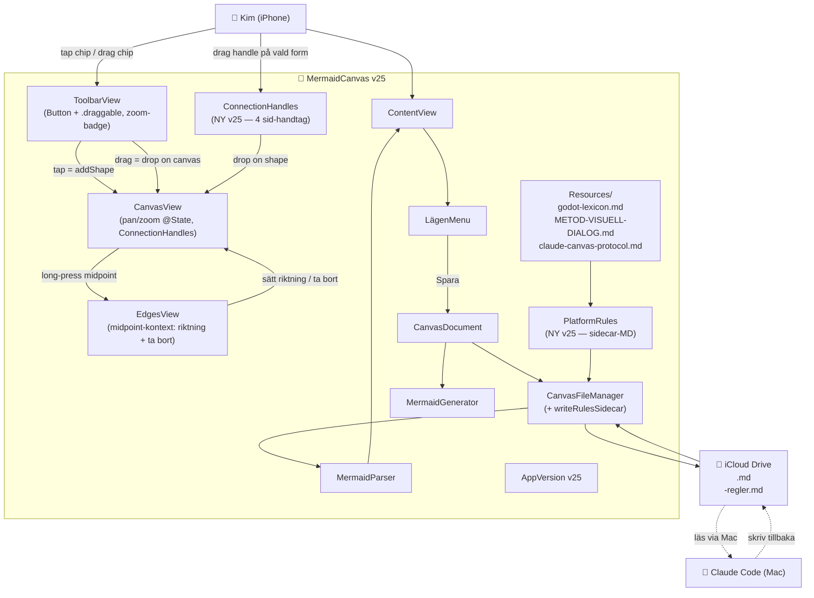

# ARKITEKTUR-MERMAID — Version v31
*Datum: 2026-05-18*

**Aktuell version:** v34 (under utveckling)

**v34-huvudändring:** Canvas-kärnan ombyggd med UIScrollView (löser drop/pan/zoom-buggarna). Minimap bortplockad. Fast 4000×4000pt canvas-storlek.

> **Status:** v31 är en STOR version efter v30: modulär omstrukturering (Sources/App/, Mermaid/, ClaudeCode/), canvas 1600×1600, startzoom 100%, pan-clamp, zoom-mot-finger, 2-rads-former, nya symboler (pill, lös linje, lös pil, anteckning-popup), ny plattform iOS SwiftUI, form-paketer-toolbar-ikon, Prompt-Process-pack (subagent/prompt/skill/tool/memory/output), migrerade deprecated kategorier, fri-resize-handtag, GitHub-publicering.

---

## Ändringar från v30 — v31

### Modulär omstrukturering
- `Sources/App/` (UI, vyer, modeller, persistens)
- `Sources/Mermaid/` (generator, parser, SpecType)
- `Sources/ClaudeCode/` (Platform, ShapePack, ShapeCategory, PlatformRules + Rules/-MD-filer)

### Canvas + zoom
- contentSize 800×800 → **1600×1600**
- initialScale 0.5 → **1.0**
- Pan-clamp via `clampedOffset(_:scale:viewport:)` så vita papperet aldrig lämnar viewport helt
- MagnificationGesture → **MagnifyGesture** med pinch-anchor (zoom mot fingret)

### Nya former
- `ShapeType.pill` — Capsule-form med rundade ändar
- `ShapeType.line` — lös linje (utan from/to-koppling), endpoint i `lineEnd`
- `ShapeType.arrow` — lös pil (line + pilhuvud)
- `ShapeNode.widthMultiplier` + `heightMultiplier` — fri scale (backward compat via `effectiveWidth/Height`)
- `model.addFreeLine(at:withArrow:)` — skapar lös linje/pil

### Toolbar
- Former-raden delad i **2 rader** (basformer + special)
- **Ny toolbar-knapp:** `toolbar.packs` — öppnar form-paket-rad
- Toolbar-ikoner 44 → **40pt** för att rymma allt
- Nya chips: `chip.pill`, `chip.line`, `chip.arrow`, `chip.notepopup`

### Form-paketer
- **Behåll:** `.basic, .ui, .promptProcess` (ny)
- **Deprecated:** `.roadmap, .architecture, .flow` (kvar i kod, dolda i UI, migration vid filöppning)
- `ShapePack.userToggleable` = `[.ui, .promptProcess]`

### Plattform
- **Ny:** `Platform.iosSwiftUI` med stub-regler i `ios-swiftui-rules.md`

### Kategorier
- **Nya:** `.subagent, .prompt, .skill` (Prompt-Process-pack)
- Prompt-Process delar SpecType.flow med `.tool, .memory, .output`
- `MermaidParser.migrateDeprecated()` → gamla Roadmap/Architecture-kategorier → `.note`

### Resize-handtag
- 4 hörn-handles → **1 bottom-right med 2 ikoner** (proportional + fri-scale)
- `resize.proportional` modifierar sizeMultiplier + width + height samtidigt
- `resize.free` modifierar widthMultiplier och heightMultiplier oberoende

### Anteckning-popup
- Ny **NotePopupSheet.swift** — modal med all canvas-text (label + note)
- Trigger: `chip.notepopup` i Former-rad B

### Resurser
- `Sources/ClaudeCode/Rules/godot-lexicon.md` (flyttad från Resources/)
- `Sources/ClaudeCode/Rules/claude-canvas-protocol.md` (flyttad)
- **Ny:** `Sources/ClaudeCode/Rules/ios-swiftui-rules.md`
- **Ny:** `Sources/ClaudeCode/Rules/prompt-process-rules.md`

### GitHub
- Repo blir publikt: `github.com/kim0scar/MermaidCanvas`
- Tags + Releases per version (gh release create)
- README utökad med build-instruktioner

---

## Ändringar från v27 — v30

---

## Ändringar från v27 — v30

### v28 — UI-polering + deterministisk drag
- Drag-out-preview använder samma `value.location` som form-skapelsen → deterministisk landning
- Canvas 400×600 → **800×800** (kvadratisk, scale 0.5 från start så hela ryms)
- Zoom-känslighet `pow(0.2) → pow(0.4)` — 2× snabbare
- Stroke-färg på former: kategori-färg → `Color.primary` (alltid svart/primary)
- DiamondShape: vassa hörn → `addQuadCurve` med cornerRadius 8
- Paper-edge: RoundedRectangle(cornerRadius: 10) med shadow + border
- Pilhuvuden: rundade via lineJoin: .round
- Toolbar `.padding(.horizontal, 10 → 14)` — ikoner slår inte i sidan
- Divider mellan toolbar-rader borttagen
- Safe-area-fix: `Color(.systemGray5).ignoresSafeArea()` — ingen vit rand i botten
- Tap utanför avmarkerar ALLTID (även i marker-mode)
- Dubbeltap på form öppnar ALLTID edit
- ConnectionHandle-ikon: `arrow.up.right → link`
- Minimap åter via `.overlay(alignment: .topTrailing)` (inte fullscreen ZStack-layer som blockerade touches)

### v29 — drag-fix på iPhone + resize-ikoner + form-paketer-chips + round-trip-test
- **Drag-out-rotbugg fixad:** canvas-`panGesture` stängs av när `dragController.activeType != nil`. Tidigare stal pan-gesten finger-rörelsen från chip-DragGesture på iPhone.
- **Sync av controller-state:** `dragController.canvasOffset/scale` sätts direkt i `centerOnInitial` (inte async via .onChange) — första drag har korrekt offset
- **Drop-fallback:** Om release utanför canvas → form läggs i canvas-mitten istället för att tappas
- **Resize-handtag:** Diagonal-pil-ikoner (`arrow.up.left.and.arrow.down.right`) i 4 hörn på vald form
- **Form-paketer kopplat:** När pack är aktivt i Lägen-menyn läggs en chip i Former-raden (`chip.pack.<rawValue>`) som skapar rektangel med pack:s defaultCategory
- **Round-trip-unit-test:** Nytt `MermaidCanvasUnitTests`-target. `RoundTripTests` verifierar att CanvasDocument-generering + MermaidParser bevarar alla 6 form-typer, edge-styles, plattform-state genom save→reopen. 3/3 PASS.
- **V29CoverageTests:** Nya tester för T7 (drop-fallback), T13 (minimap-knapp), T21 (pack-chip), T22 ("Visa Mermaid-kod"-meny). T16/T17 skip:ade pga XCUITest-skript-precision-issues — funktioner kod-verifierade.

### v30 — chip.link tap-fix på iPhone
- **Rotbugg upptäckt på iPhone-XCUITest:** `testTapLinkChipAddsJumpLinkPair` failade på iPhone (men passed på sim). `chip.link` kunde dras (drag-test PASS) men inte tap:as.
- **Orsak:** Jag hade lagt in `ScrollView(.horizontal)` runt Former-radens HStack i v29 för att rymma pack-chips. På iPhone konsumerade ScrollView korta tap-events innan de nådde chip:en (tolkades som potentiell scroll). Drag funkade pga `.highPriorityGesture(DragGesture)` på chippet.
- **Fix:** Återgick till plain `HStack` utan ScrollView. Med 6 basic + max 4 pack-chips à 44pt ryms allt på iPhone 16 Pro (402pt-bredd).
- **CanvasView gesture-cleanup:** Tog bort canvas' `.onTapGesture(count: 2) { handleDoubleTap() }` (krockade med ShapeView's dubbeltap-edit). Bytte deselect `.onTapGesture(count: 1)` → `.simultaneousGesture(TapGesture())` (säkrare när panGesture konkurrerar).
- **Resize-handtag accessibility-id:** `resize.topLeading` etc. för framtida automation.

---

## Ändringar från v26 — v27

**Etapp 1 — Drag-ut för Tabell + Länk:**
- `specialChip` var en `Button` utan `DragGesture` → drag-ut fungerade inte för Tabell/Länk.
- **Fix:** Generaliserade `shapeChip` med en injicerad `onTap`-closure så alla 6 form-typer (cirkel, rektangel, diamant, text, tabell, länk) använder samma mönster: tap + highPriorityGesture(DragGesture).
- Tabell drag-ut → `model.addTable(at: canvasPoint)`. Länk → `model.addJumpLinkPair(near: canvasPoint)` (skapar par).

**Etapp 2 — Pilar tjockare + streckad-stil + utökad in-context-meny:**
- `lineWidth: 1.5 → 2.5` för alla pil-linjer.
- Pilhuvuden ritas nu som **fyllda trianglar** (closed path + fill) för tydlighet.
- `EdgeStyle.solid / .dashed` på `EdgeConnection`. Streckad = `StrokeStyle(lineWidth: 2.5, dash: [8, 6])`.
- Context-menyn på midpoint-handle utökad med 2 nya val: **Hel linje** / **Streckad linje**.
- `CanvasModel.setEdgeStyle(id:_:)` är ny.
- **Mermaid round-trip:** export + import för `-->`, `<-->`, `-.->`, `<-.->`. Parser-regex utökad.

**Etapp 3 — Plattform-refactor + Form-paketer:**
- Nytt koncept: **Plattform** (regelstyrt mål) vs **Form-paketer** (Kims egna uppsättningar).
- Nya filer: `Sources/Models/Platform.swift` + `Sources/Models/ShapePack.swift`.
- `Platform = .blank | .godot`. `ShapePack = .basic | .ui | .roadmap | .architecture | .flow` (.basic alltid på).
- `CanvasModel.platform` + `CanvasModel.activeShapePacks: Set<ShapePack>`.
- `NewCanvasSheet` förenklad: bara 2 val (Blank / Godot).
- `LägenMenu` har ny sektion "Form-paketer" med toggles + sektion "Plattform" (info, låst).
- `PlatformRules.sidecarMarkdown(for: platform)` returnerar `String?` — bara Godot ger sidecar; Blank ger `nil`.
- **Bakåtkompatibilitet:** gamla canvas-filer med `spec_type: ui|roadmap|architecture|flow|godot|general` mappas automatiskt vid load (`replaceAll`) → motsvarande pack auto-aktiverat.
- Mermaid-frontmatter har två nya fält: `platform: <blank|godot>` + `shape_packs: <comma-separated>`. JSON-state har `platform` + `shapePacks`-array. Båda är optionella för bakåtkomp.
- `SpecType` behålls internt (för iPhone-frame, default-kategori, ColorPack, etc) men är inte längre exponerad i UI.

**Etapp 4 — Canvas expand vid kant + minikarta:**
- `CanvasModel.contentSize` är nu en `@Published var` (instance) istället för `static let`. Default startar på **2000×2000**.
- `CanvasModel.expandCanvasIfNeeded(near:margin:expandBy:)` utökar canvas med 1000pt i en kant om en form placerats inom 200pt från den. Anropas från `addShape`, `addTable`, `addJumpLinkPair`, `updatePosition`.
- **Minikarta:** Ny `MinimapView` i `Sources/Views/MinimapView.swift`. Knapp uppe till höger på canvas-området (`toolbar.minimap`). Toggle-bart. Visar mini-canvas + alla shapes som färgade prickar + röd ram för aktuell viewport. Tap på minikartan = canvas hoppar dit (via `dragController.requestedCenterPoint`).
- `ShapeDragController.viewportSize` + `ShapeDragController.requestedCenterPoint` är nya.

**Etapp 5 — Meny-cleanup ("Visa Mermaid-kod"):**
- LägenMenu: "Visa filinnehåll" → **"Visa Mermaid-kod"**. Ikon `curlybraces` → `chevron.left.forwardslash.chevron.right`.
- `MermaidCodeSheet` navigationsTitel: "Filinnehåll" → "Mermaid-kod".
- Preview-knappen visas bara om `platform == .godot` (övriga plattformar har ingen preview-renderer).
- "Visa regler för X" visas bara om `platform == .godot`.

**Etapp 6 — Tester:**
- Befintliga 5 `DragOutTests` passerar fortfarande (cirkel/rektangel/text/etc).
- Ny `V27FeatureTests.swift` med 6 tester: tap+drag för chip.table och chip.link, form-paketer-toggles i Lägen-menyn, minikarta-knapp.
- **Totalt 11/11 XCUITester gröna** i iOS Simulator (iPhone 17, `A658C63E-...`) innan deploy.

---

## Ändringar från v25 — v26

**Drag-out fix (root cause: ScrollView-konflikt):**
- ToolbarView's shape-chips låg i `ScrollView(.horizontal)`. På iOS 17+/26 äter ScrollView's interna `UIPanGestureRecognizer` touch-eventet innan child `DragGesture` hinner fyra (känd bug FB14688465).
- **Fix:** Ta bort ScrollView för shape-chips (6 à 44pt + spacing får plats utan scroll). Byt `.gesture` → `.highPriorityGesture` för extra säkerhet.
- **Egen drag-controller** (`Sources/Models/ShapeDragController.swift`) ersätter Apple's Transferable/.draggable/.dropDestination som var opålitlig.
- Chips: `.onTapGesture` (tap = lägg form i mitten) + `.highPriorityGesture(DragGesture(minimumDistance:8, coordinateSpace:.global))` (drag = drop på canvas).
- CanvasView rapporterar sin globala frame via `PreferenceKey` så ContentView kan konvertera global→canvas-koordinat vid drop.

**XCUITest-target (för verifiering utan att Kim testar):**
- Ny target `MermaidCanvasUITests` i `project.yml`.
- `UITests/DragOutTests.swift` med 5 test-cases: tap-add, all-six-chips, drag-rectangle, drag-circle, debug-tree-dump.
- Accessibility-ID:er på toolbar-knappar, chips, canvas, lägen-meny och code-sheet.
- `toolbar.zoom.accessibilityValue = "shapeCount=N"` exponerar model.shapes.count för diagnos.

**Resultat:** Alla 5 tester gröna i iOS Simulator (iPhone 17) före deploy till Kim's iPhone.

---

## Ändringar från v24 — v25

**A. Drag-out-fix (root cause):**
- ToolbarView shape-chips var `Image + onTapGesture + draggable` i ScrollView → gesture-conflict på iPhone ⇒ varken tap eller drag fyrade.
- **Fix:** Byt till `Button { addShape } label: { ChipFace }` + `.draggable(type)`. Apple-mönster, fungerar både för tap (lägg i mitten) och drag-och-släpp (släpp på canvas).

**B. Zoom mildare + zoom-indikator:**
- `pow(value, 0.3)` → `pow(value, 0.2)` (cirka 1/5 känsligheten).
- Ny zoom-badge i toolbar visar `<NN>%` så Kim ser zoom-nivån. Tap på badge → reset till 100%.

**C. Connection-handtag på sidor av vald form:**
- `ConnectionHandles`-view ritar 4 små accent-cirklar med `arrow.up.right`-ikon (top/right/bottom/left) på vald form.
- Drag från handtag → rubber-band-linje följer fingret (`ConnectionRubberBand`-view, streckad accent-blå).
- Släpp över annan form → `model.addEdge(from:to:)` skapar pil direkt. Dubblettpilar (samma riktning) tillåts inte.
- Hit-testing via `ShapeGeometry.hitTest(point, shapes:, excludingId:)`.

**D. Edge-riktningsmeny:**
- Long-press på pil-midpoint öppnar `contextMenu` med fyra val:
  - **Pil åt ett håll →** (sätter `bidirectional = false`)
  - **Byt riktning ←** (`reverseEdge` — swappar from/to)
  - **Båda hållen ↔** (sätter `bidirectional = true`)
  - **Ta bort pil**
- Midpoint-handtaget visar `arrow.right` eller `arrow.left.arrow.right` som ikon beroende på riktning.

**E. Auto-sidecar för Claude Code:**
- Ny modul `Models/PlatformRules.swift` är central källa för regel-text per `spec_type`.
- Vid Spara (eller Spara Som) → `CanvasFileManager.writeRulesSidecar(rulesText:)` skriver `<canvas>-regler.md` bredvid huvudfilen.
- Sidecar-innehåll: **Del 1** = plattformsregler (godot-lexicon.md eller motsvarande), **Del 2** = `claude-canvas-protocol.md` (specifierar filformat).
- Resultat: när Kim refererar till en canvas från Mac:en har Claude Code direkt regelfilen i samma mapp.

**F. Ny resource: claude-canvas-protocol.md**
- Bundlad i appens Resources/. Specificerar filstruktur (frontmatter / mermaid-block / state-JSON), plattformer, round-trip-regler.

---

## Filöversikt (aktuell — v25)

| Område | Fil | Roll |
|---|---|---|
| **Version** | `Sources/AppVersion.swift` | Single source of truth: `v25` |
| **App-entry** | `Sources/MermaidCanvasApp.swift` | App-bootstrap |
| **Toplevel** | `Sources/ContentView.swift` | Toolbar + CanvasView + sheets, zoom-state-binding |
| **Models** | `Sources/Models/CanvasModel.swift` | Form/edge-lager, undo-stack, addEdge/reverseEdge/setBidi (NY i v25) |
| | `Sources/Models/ShapeNode.swift` | Form-data, Transferable för drag-out, textStyle, colorPackId |
| | `Sources/Models/ShapeCategory.swift` | 28 kategorier (5 lägen + godot 8 + note), färg-mapping |
| | `Sources/Models/SpecType.swift` | UI/Roadmap/Arkitektur/Flow/Godot/General |
| | `Sources/Models/EdgeConnection.swift` | Pilar, waypoints |
| | `Sources/Models/TextStyle.swift` | R1/R2/R3/Body |
| | `Sources/Models/ColorPack.swift` | 6 pastell-paket + "ingen färg" |
| | `Sources/Models/iPhoneFrameMath.swift` | iPhone-ramberäkning |
| | **NY** `Sources/Models/PlatformRules.swift` | Centralt regel-text per spec_type + sidecar-MD-genererare |
| **Canvas** | `Sources/Views/CanvasView.swift` | 3000×3000 canvas, pan/zoom@State, ConnectionHandles + RubberBand + EdgesView |
| | `Sources/Views/DotGridBackground.swift` | Prickrutnät (drawingGroup) |
| | `Sources/Views/iPhoneFrameOverlay.swift` | iPhone-ram (UI-läget) |
| | `Sources/Views/MarkerOverlay.swift` | Multi-select rectangle-drag |
| | `Sources/Views/CollapseBadge.swift` | Plus/minus i nedre höger på former med outgoing edges |
| | `Sources/Views/NoteBadge.swift` | Gul prick på former med anteckning |
| | `Sources/Views/Handles/SelectionHandles.swift` | Resize/rotation-handtag |
| **Toolbar/menyer** | `Sources/Views/ToolbarView.swift` | Primär + sekundär rad, glas-bubblor, drag-out (Button+draggable) |
| | `Sources/Views/LägenMenu.swift` | "Lägen"-meny (plattform-info + filhantering + version) |
| | `Sources/Views/NewCanvasSheet.swift` | Välj plattform vid Ny canvas (LÅS) |
| | `Sources/Views/PlatformRulesSheet.swift` | Visar regler-text för aktuell plattform |
| **Sheets** | `Sources/Views/EditShapeSheet.swift` | Namn/Visa-text/Textstil/Anteckning/Delete |
| | `Sources/Views/NoteMiniSheet.swift` | Mini-sheet, bara TextEditor |
| | `Sources/Views/MermaidCodeSheet.swift` | Visa filinnehåll |
| | `Sources/Views/PreviewSheet.swift` | Renderad förhandsvisning per spec_type |
| | `Sources/Views/ColorPackPopover.swift` | (alternativ popover, ej i toolbar nu) |
| | `Sources/Views/ColorPickerPopover.swift` | Legacy color-picker |
| **Persistens** | `Sources/Persistence/CanvasDocument.swift` | Frontmatter + mermaid + state-JSON |
| | `Sources/Persistence/CanvasFileManager.swift` | iCloud-fil-IO + writeRulesSidecar (NY i v25) |
| **Mermaid** | `Sources/Mermaid/MermaidGenerator.swift` | Skriv mermaid-block + state-JSON |
| | `Sources/Mermaid/MermaidParser.swift` | Läs state-JSON / fallback till mermaid |
| **Preview** | `Sources/Preview/UIRenderer.swift` | Dispatcher per spec_type |
| | `Sources/Preview/UIScreenRenderer.swift` | UI-läget |
| | `Sources/Preview/RoadmapRenderer.swift` | Roadmap-läget |
| | `Sources/Preview/ArchitectureRenderer.swift` | Arkitektur-läget |
| | `Sources/Preview/FlowRenderer.swift` | Flow-läget |
| | `Sources/Preview/GodotPreviewRenderer.swift` | Godot-läget |
| **Resources** | `Resources/godot-lexicon.md` | Godot-regler bundlat i app |
| | `Resources/METOD-VISUELL-DIALOG.md` | UI-läget-regler |
| | **NY** `Resources/claude-canvas-protocol.md` | Filformat-spec för Claude Code |

---

## Hur Claude Code blir "redo att använda"

1. Kim trycker **Lägen → Visa regler** i appen → läser plattformens regelfil.
2. Kim trycker **Spara** → MermaidCanvas skriver två filer i iCloud-mappen:
   - `<namn>.md` — canvas (frontmatter + mermaid + state-JSON)
   - `<namn>-regler.md` — plattformens regler + filformat-spec
3. Kim refererar canvasen på Mac:en (t.ex. "läs canvasen min-spel.md"). Claude Code:
   - Öppnar `min-spel.md` → tolkar state-JSON (auktoritativ) eller mermaid-block (fallback).
   - Öppnar `min-spel-regler.md` → vet exakt vilka former och pilar som är tillåtna för den plattformen.
   - Skriver tillbaka i `min-spel.md` (uppdaterar både mermaid-block och state-JSON).
4. Kim öppnar appen → CanvasFileManager poll-läser modification-date → laddar om från fil → ser Claudes ändringar.

---

## Diagram

---

## Att verifiera vid nästa session

- [ ] Pan/zoom är butter smooth (drawingGroup + @State + pow(0.2))
- [ ] Zoom-badge i toolbar visar procent — tap = reset
- [ ] Former-knapp → sekundär rad blixtsnabbt under, **tap = lägg i mitten, drag = drop på canvas**
- [ ] Vald form visar 4 accent-blå anslutnings-handtag på sidorna
- [ ] Drag från anslutnings-handtag → rubber-band-linje → drop på annan form skapar pil
- [ ] Long-press på pil-midpoint → meny med riktning + ta bort
- [ ] Lägen → Visa regler → ser godot-lexicon för godot-canvas
- [ ] Spara godot-canvas → bredvid finns `<namn>-regler.md` med godot-lexicon + protocol
- [ ] Claude Code kan öppna `<namn>-regler.md` på Mac:en och förstår filformat
