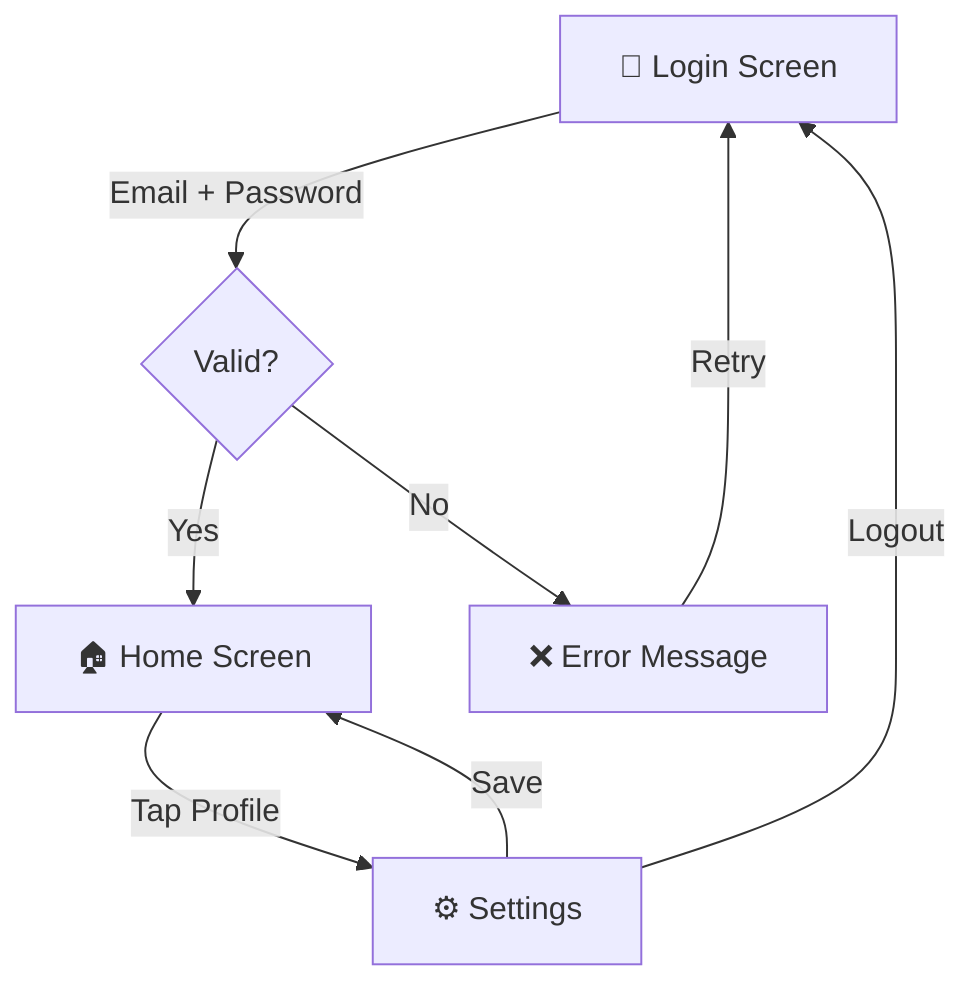
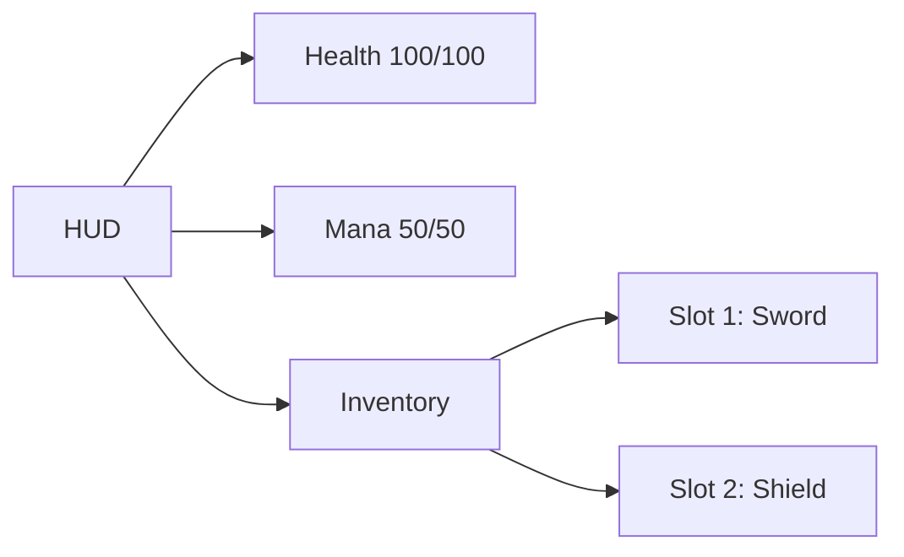
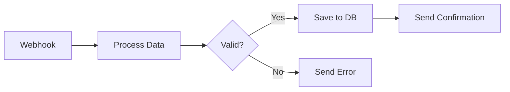
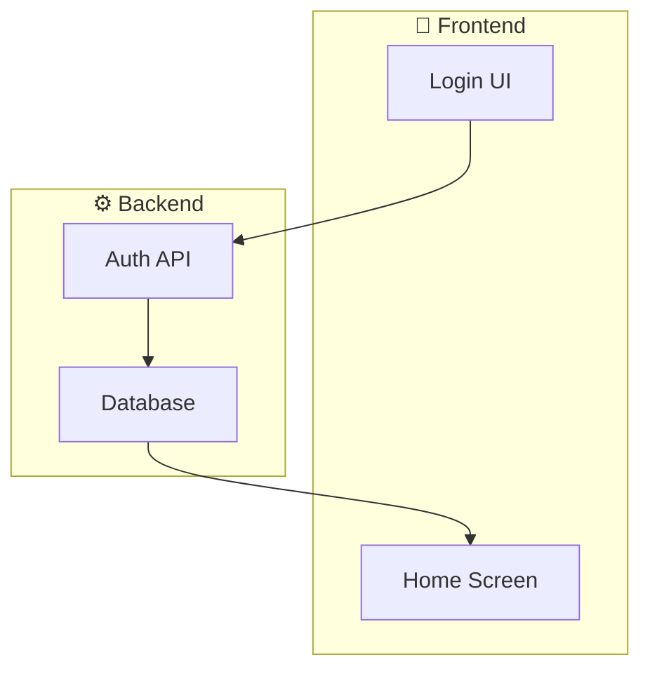
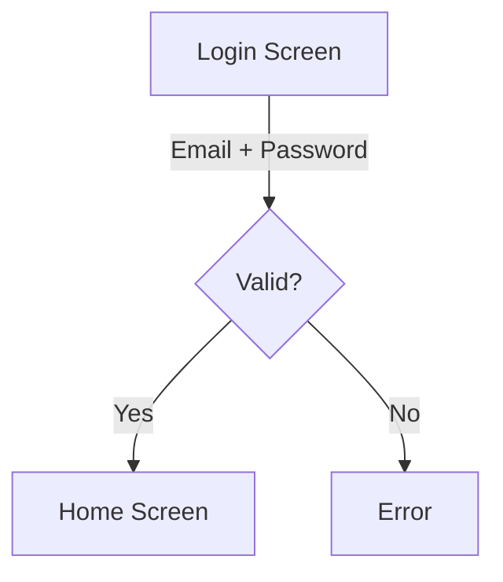

# MERMAID-FAKTA — blueprint för MermaidCanvas

Detta är faktaunderlaget Claude Code använder när den genererar eller parsar Mermaid-kod i `canvas.md` eller andra `.md`-filer kopplade till MermaidCanvas. Verifierad mot officiell dokumentation 2026-05-14; **om-verifierad + utökad 2026-06-18** (steg 7 — maskinell konformitetsgrind tillagd, se sektion **K**).

**Aktuell Mermaid-version**: 11.x-serien (verifierat mot `mermaid@11.15.0`). Huvudkälla: [mermaid.js.org](https://mermaid.js.org/).

---

## A. Diagramtyper och vad de används till

| Typ | Användning | Värde för MermaidCanvas |
|---|---|---|
| `flowchart` | Processer, beslutsträd, dataflöde | ⭐⭐⭐⭐⭐ Primär — täcker ~80% av Kims behov |
| `stateDiagram-v2` | Tillståndsmaskiner, UI-states, spel-states | ⭐⭐⭐⭐ Sekundär — bra för UI-flow |
| `classDiagram` | Datamodell, systemarkitektur | ⭐⭐⭐⭐ Bra för arkitektur |
| `sequenceDiagram` | Tidssekvenser mellan aktörer | ⭐⭐⭐ Nischad |
| `erDiagram` | Databasmodeller | ⭐⭐ Nischad |
| `c4Context` / `c4Container` | Systemarkitektur i flera nivåer | ⭐⭐⭐⭐ Bra för stora system |
| `mindmap` | Hierarkiska koncept | ⭐⭐⭐ Bra för UI-utforskning |
| `architecture-beta` | Cloud/system-översikter | ⭐⭐⭐⭐ Modernt alternativ |
| `gantt`, `timeline`, `pie`, `gitGraph` | Specialiserade | ⭐⭐ Nischade |

**Beslut för MermaidCanvas**: starta med `flowchart` som primärt format. Lägg till `stateDiagram-v2` och `classDiagram` när Kim ber om det.

---

## B. Vilken diagramtyp för Kims use cases

### B.1 UI-layouter / skärmflöden (Login → Home → Settings)
Primärt: `flowchart TD`. Alternativt: `stateDiagram-v2` om det är rena tillstånd snarare än skärmar.



### B.2 Spel-HUD / inventory
Primärt: `flowchart LR` med styling per nod-typ.



### B.3 n8n-stil automationer
Primärt: `flowchart LR` med tydligt avgränsade noder (trigger → process → action).



### B.4 Systemarkitektur
Primärt: `flowchart` för enkla. `c4Context` eller `classDiagram` när det blir större.

---

## C. Flowchart-syntax — komplett referens

### C.1 Noder och former

| Syntax | Form | Användning |
|---|---|---|
| `A[Text]` | Rektangel | Process / generisk box |
| `A(Text)` | Rundad rektangel | Mjuk process |
| `A([Text])` | Stadion | Start/slut |
| `A[[Text]]` | Subroutine | Anrop till annat |
| `A[(Text)]` | Cylinder | Databas |
| `A((Text))` | Cirkel | Slutpunkt eller markör |
| `A>Text]` | Asymmetrisk flagga | Anteckning |
| `A{Text}` | Romb | Beslut |
| `A{{Text}}` | Hexagon | Förberedelse |
| `A[/Text/]` | Parallellogram höger | Input/output |
| `A[\Text\]` | Parallellogram vänster | Alternativ I/O |
| `A[/Text\]` | Trapets | Manuell process |
| `A[\Text/]` | Inverterad trapets | Manuell input |

**Nytt i v11.3+** — generisk syntax `A@{ shape: name, label: "Text" }`. Stöder 30+ former (`rect`, `rounded`, `circle`, `diamond`, `cylinder`, `hexagon`, `document`, `data`, `triangle`, etc.). Mer flexibel men nyare — verifiera att rendering-biblioteket stöder det innan användning.

### C.2 Pilar och kanter

| Syntax | Resultat |
|---|---|
| `A --> B` | Standard pil |
| `A --- B` | Linje utan pil |
| `A -.-> B` | Streckad pil |
| `A -.- B` | Streckad linje |
| `A ==> B` | Tjock pil |
| `A === B` | Tjock linje |
| `A --text--> B` | Pil med etikett |
| `A -->|text| B` | Pil med etikett (alternativ syntax) |
| `A ~~~ B` | Osynlig länk (för layout) |

### C.3 Riktningar

- `flowchart TD` eller `flowchart TB` — top → bottom
- `flowchart BT` — bottom → top
- `flowchart LR` — left → right
- `flowchart RL` — right → left

### C.4 Subgrafer



### C.5 Styling

**Inline per nod:**
```
style A fill:#f9f,stroke:#333,stroke-width:2px,color:#000
```

**Klass:**
```
classDef errorNode fill:#d33,stroke:#333,color:#fff
class D,E errorNode
```

### C.6 Text i noder — viktiga regler
- **Multilinje**: `A["Rad 1<br/>Rad 2"]`
- **Specialtecken**: alltid quote om texten innehåller `()`, `{}`, `[]`, `:`, `;`, `"`
- **HTML-entiteter**: `#quot;` = `"`, `#35;` = `#`, `#59;` = `;`
- **Emojis**: fungerar direkt

### C.7 Kommentarer
```
%% Det här är en kommentar
A --> B
```

---

## D. Begränsningar och fallgropar

### D.1 Layout kan inte styras med koordinater
Mermaid använder Dagre eller ELK för automatisk layout. Du **kan inte** säga "nod X på position (100, 200)". Detta är **viktigt för MermaidCanvas**: när Kim drar en form till en specifik plats i appen sparar appen *internt* koordinaten, men i den genererade Mermaid-koden bestämmer Dagre/ELK var noden hamnar vid rendering.

Strategi: spara koordinater i en separat sektion (frontmatter eller JSON-kommentar) som appen läser, men låt Mermaid-koden själv vara layout-fri.

### D.2 Ordföljd påverkar layout
Mermaid:s layoutmotor är deterministisk men ordningskänslig. `A --> B --> C` ger annan layout än `C --> B --> A`.

### D.3 Tecken som måste escapas

| Tecken i text | Problem | Lösning |
|---|---|---|
| `(` `)` | Tolkas som rundad form | Quote: `A["Text (parens)"]` |
| `{` `}` | Tolkas som romb | Quote: `A["Text {braces}"]` |
| `;` | Radavgränsare | Quote eller `#59;` |
| `"` | Stänger texten | `#quot;` eller `\"` |
| `<` `>` | HTML-tolkning | Quote eller `&lt;`/`&gt;` |
| `end` | Reserverat ord (subgraph) | Quote: `A["end"]` |

**Regel för MermaidCanvas-appen**: ALLA labels som Kim skriver in i en form ska *alltid* wrappas i quotes `"..."` i den genererade Mermaid-koden. Säkrare att alltid quote än att försöka avgöra när det behövs.

### D.4 Vanliga parse-fel
- Saknad slutnod efter pil (`A -->`)
- Inkonsistent pil-syntax (`A -> B` är JS, inte Mermaid)
- Cirkulära referenser kan ge stökig auto-layout (men funkar)

---

## E. Rendering på iPhone (Swift)

Tre vägar. Verifiera bibliotekens status innan integration — de utvecklas snabbt.

### E.1 WKWebView + Mermaid.js (REKOMMENDERAT för MVP)
**Pros**: full Mermaid-support, matchar mermaid.live exakt, väldokumenterat.
**Cons**: laddar JS-motor, något långsammare start.

Minimal implementation:
```swift
import WebKit
import SwiftUI

struct MermaidWebView: UIViewRepresentable {
    let mermaidCode: String

    func makeUIView(context: Context) -> WKWebView {
        WKWebView()
    }

    func updateUIView(_ webView: WKWebView, context: Context) {
        let html = """
        <!DOCTYPE html><html><body style="margin:0;background:#fff">
        <script src="https://cdn.jsdelivr.net/npm/mermaid/dist/mermaid.min.js"></script>
        <pre class="mermaid">\(mermaidCode)</pre>
        <script>mermaid.initialize({startOnLoad:true,theme:'default'});</script>
        </body></html>
        """
        webView.loadHTMLString(html, baseURL: nil)
    }
}
```

För offline-stöd: bundla `mermaid.min.js` i appen istället för CDN.

### E.2 Native Swift-bibliotek
Det finns nystartade Swift-paket för Mermaid-rendering (t.ex. *BeautifulMermaidSwift*), men dessa är unga och täcker bara ett fåtal diagramtyper. **Verifiera versionen och stödda diagramtyper innan vi integrerar.**

### E.3 Egen renderer
Massivt jobb (hundratals timmar). Inte värt för MVP. Kanske långsiktigt om Kim vill ha realtids-canvas-redigering som matchar rendering 1:1.

**Rekommendation**: WKWebView + Mermaid.js i MVP. Byt till native bibliotek när ett moget sådant finns och Kim vill ha det.

---

## F. Parsing — Mermaid-text → datastruktur

**Status**: ingen officiell Swift-parser för Mermaid finns. Tre alternativ:

### F.1 Regex-baserad DIY-parser (MVP-vänlig)
Räcker långt för enkla flowcharts. Mönster:
- Nod: `(\w+)\s*([\[\(\{<])(.+?)([\]\)\}>])`
- Pil: `(\w+)\s*([\-=\.]+>?)\s*(?:\|(.+?)\|)?\s*(\w+)`

Begränsning: subgraphs och avancerad styling blir snabbt knepiga.

### F.2 Mermaid.js parser via WebView-bridge
Använd den officiella `@mermaid-js/parser` (JS) i samma WKWebView som renderar. Parsing → returnera AST som JSON via `postMessage`. Native, exakt — men kräver lite bridging-kod.

### F.3 Tree-sitter / PEG-parser
Större jobb men mer robust. För senare när MVP är klar.

**Rekommendation MVP**: DIY-regex för enkla flowcharts. Migrera till WebView-bridge när komplexitet ökar.

---

## G. Best practices för AI-genererad Mermaid

Detta är **regler för Claude Code** när jag genererar Mermaid-kod till `canvas.md`:

1. **Alltid quote labels med text**: `A["Login Screen"]` — aldrig `A[Login Screen]`. Skyddar mot specialtecken.
2. **Bara `-->`, `---`, `-.->`, `==>` för pilar**. Aldrig `->`, det är JS-syntax.
3. **Hex-färger i styling**: `fill:#0a8d0a`, aldrig `fill:green`.
4. **Max 15 noder per diagram** för läsbarhet. Vill Kim ha större, dela upp i subgraphs.
5. **Tydlig start och slut** i flowcharts — ankra med `[*]` (state) eller stadium-form `([Start])`.
6. **3-4 ord per label** max. Längre text i frontmatter eller separat sektion.
7. **Inga reserverade ord som node-ID** — undvik `end`, `subgraph`, `style`, `class`, `direction`.
8. **Konsistent riktning** per diagram (TD eller LR), inte blanda.
9. **Kommentera bara om det förklarar något icke-uppenbart**. Annars ren kod.

---

## H. Format för canvas.md

```markdown
---
mermaidcanvas:
  version: 1
  generator: MermaidCanvas/v1.x
  lastEdited: 2026-05-14T10:30:00Z
  projectName: "Login Flow"
  canvasState:
    nodes:
      - {id: A, x: 100, y: 50, w: 140, h: 60}
      - {id: B, x: 100, y: 180, w: 100, h: 100}
---

# Login Flow



## Anteckningar

Fri text Kim eller Claude Code kan lägga till mellan diagrammen.
```

### Designprinciper för filformatet
- **Mermaid-blocket är sanningskälla för struktur** (noder + relationer)
- **Frontmatter `canvasState` är hjälpdata för rendering** (koordinater, storlekar) — appen läser den för att visa exakt det Kim ritade
- **Om Claude Code ändrar Mermaid-blocket utan att uppdatera `canvasState`**: appen auto-layoutar nya/flyttade noder. Inte konflikt — bara förlust av Kims exakta positioner för de noder Claude rört.
- **En fil = ett projekt**. Flera filer för flera projekt under `iCloud Drive/ClaudeCanvas/`.

### iCloud-mappstruktur
```
~/Library/Mobile Documents/com~apple~CloudDocs/ClaudeCanvas/
├── canvas.md                  ← aktiv arbetsfil (default)
├── projects/
│   ├── login-flow.md
│   ├── spel-hud.md
│   └── automation-n8n.md
└── arkiv/
    └── gamla-versioner.md
```

---

## K. Maskinell konformitetsgrind (steg 7 — "validera mot RIKTIG mermaid")

De interna round-trip-testerna bevisar bara att appen kan läsa sin egen text. De säger INGET om
huruvida riktig mermaid (renderaren på mermaid.live) accepterar samma text. Steg 7 täpper luckan:

- **`scripts/mermaid-conformance.mjs`** — kör appens genererade mermaid genom **officiella `mermaid.parse()`** (samma grammatik som renderaren) ovanpå en jsdom-DOM. Exit 1 om något inte parsar.
- **`scripts/mermaid-fixtures/*.mmd`** — appens FAKTISKA generator-output (hela form-vokabulären), regenereras av `scripts/extract-mermaid-fixtures.sh` (kör `MermaidConformanceCorpusTests`).
- Kör: `npm install` (en gång) → `node scripts/mermaid-conformance.mjs`. Pre-commit-hooken kör den om `node_modules` finns.
- **Verktygsval (spike 2026-06-18):** `@probelabs/maid` förkastades — gav FALSKA fel (avslutande `;` på classDef, citat i cylinder `[("...")]`) → inte troget riktig mermaid. `mmdc` kräver 1,7 GB Chrome. `mermaid.parse()` + jsdom = officiell grammatik, lätt, inga falska fel. (`@mermaid-js/parser` saknar flowchart-grammatik → oanvändbart här.)
- **Regel:** appens mermaid får aldrig deployas utan att grinden är grön (CLAUDE.md regel 3 + 14).

### Nya `@{ shape: ... }`-syntaxen (v11.3.0+) — FRAMTIDA möjlighet
Mermaid 11.3 införde ~30 namngivna former via `id@{ shape: NAMN, label: "..." }` (t.ex. `tri`=triangel,
`hex`=hexagon, `cyl`=cylinder, `doc`=dokument, `docs`=staplade dokument, `lean-r`/`lean-l`=parallellogram,
`stadium`=pill, `diam`=diamant, `subproc`=subrutin). Appen använder idag KLASSISK syntax + `%% shape-type`
för former mermaid saknar (telefon/triangel/oktagon). `@{ shape: tri }` m.fl. kunde ge native former för
triangel/hexagon i framtiden — men kräver renderare ≥ v11.3 och får aldrig blandas med klassiska delimiters
på samma nod. Inget krav nu; noterat som uppgradering. (Källa: mermaid.js.org/syntax/flowchart.html.)

### Fallgropar grinden skyddar mot (bekräftade 2026-06-18)
- **`end` som nod-id/label** kraschar subgraph-parsningen → quota eller versalisera (`End`).
- **Citatlösa specialtecken** (`()[]{}` `#` `;` `|`) bryter parsern → quote alltid labeln (appen gör detta).
- **`%%`-kommentarer** måste stå på egen rad (inte inline) — då ignoreras de helt (appens `%%`-metadata är säker).
- **`o`/`x` direkt efter länk** (`A---oB`) tolkas som cirkel-/kryss-ände → mellanslag eller versal.
- **`:::klass` på subgraph** är opålitligt mellan versioner → använd `class id klass` (appen använder classDef + `:::` på noder, vilket är giltigt).

---

## Snabbreferens — vad Claude Code ALLTID ska komma ihåg

1. **Quote alla labels** — `A["..."]`
2. **Bara Mermaid-pilsyntax** — `-->` `---` `-.->` `==>`
3. **Hex-färger** — `#xxxxxx`
4. **Max 15 noder per diagram**
5. **Auto-layout — vi kontrollerar inte positioner i Mermaid-koden**
6. **`canvasState` i frontmatter är appens — rör inte om du inte måste**
7. **En fil per projekt** — flera diagrambläckor under `projects/`

---

## Källor

- [mermaid.js.org — officiell dokumentation](https://mermaid.js.org/)
- [mermaid.js.org/syntax/flowchart.html](https://mermaid.js.org/syntax/flowchart.html)
- [mermaid.js.org/config/configuration.html](https://mermaid.js.org/config/configuration.html)
- [github.com/mermaid-js/mermaid](https://github.com/mermaid-js/mermaid)
- WKWebView + Mermaid.js är beprövat mönster i iOS-communityt — sök "mermaid swift wkwebview" för exempel
