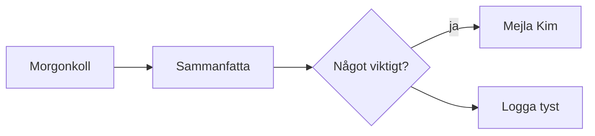

# N8N-FLODE-KONTRAKT — från ritat flöde till körbart n8n-workflow/skill

*Kontrakt för Claude Code. När Kim klistrar in (eller pekar på) en canvas-fil med
`spec_type: flow` gäller reglerna här — bygg utan att gissa.*

---

## När kontraktet gäller

- Filens frontmatter har `spec_type: flow`, ELLER
- Kim säger "bygg n8n-flödet" / "gör en skill av flödet" om en canvas-fil.

Läs alltid state-JSON först (autoritativ). Saknas den: mermaid-blocket +
`%%`-kommentarerna räcker (fr.o.m. v61 är mermaid-blocket självbärande).

---

## Nod-tolkning (category → n8n)

| Kategori | n8n-roll | Nodens `prompt` betyder |
|---|---|---|
| `input` | **Trigger-nod.** Webhook / Schedule / Manual / Chat | Trigger-konfig: "webhook", "varje morgon 07:00", "manuellt" etc. Saknas prompt → fråga INTE, använd Manual Trigger. |
| `agent` | AI-nod (LLM/Claude/AI Agent-nod) | System-prompten / uppdraget för AI-steget |
| `tool` | Action-nod (HTTP, Gmail, Sheets, etc.) | Vad verktyget ska göra — välj n8n-nod utifrån texten |
| `router` | IF / Switch-nod | Villkorslogiken i klartext |
| `memory` | Datalagring/kontext (Set, variabler, vector store) | Vad som ska sparas/återanvändas |
| `output` | Slutsteg (svar, notis, fil, mail) | Vart resultatet ska |
| `subagent` | Delegerat under-flöde (Execute Workflow) | Under-flödets uppdrag |
| `prompt` | Prompt-text som matas in i en agent-nod | Själva prompt-texten |
| `skill` | Återanvändbar kapacitet — se "Skill-bygge" nedan | Skillens syfte |

**Nodens namn** = `label` (`%% name:`). Använd det som n8n-nodens namn rakt av.

## Kant-tolkning

| Kant | Betydelse |
|---|---|
| `A --> B` | Sekvens: A körs före B |
| `router -->|"villkor"| B` | Villkorad gren — etiketten ÄR villkoret |
| Etikett `fel`/`error`/`misslyckas` | Error-gren (n8n error output) |
| Router-gren UTAN etikett | Default/else-grenen |
| `A -.-> B` | Sekundärt/async beroende (notis, logg) |

Byggordning = topologisk ordning från kanterna. Förgreningar efter router följer
gren-etiketterna.

## Container (subgraph)

En container runt noder = logisk grupp. Containerns `prompt` beskriver gruppens
syfte. Vid skill-bygge: containern = skillens avgränsning.

---

## Vad Claude ALDRIG gissar

1. **Credentials** — skapa platshållare (`{{ KIM_FYLLER_I }}`), lista dem i svaret.
2. **Exakta API-fält** som inte framgår av prompt-texten — välj rimlig default och
   markera med kommentar i workflowet.
3. Om flödet saknar `input`-nod: använd Manual Trigger och säg det till Kim.

Fråga Kim BARA om ett äkta vägval (två rimliga tolkningar med olika resultat).

## Bygget

- **n8n-workflow:** bygg via n8n-MCP (`n8n_workflow_create`). Nodpositioner i n8n:
  återanvänd canvas-positionerna (x,y) skalat ×1.5 — då känner Kim igen sin ritning.
  Aktivera INTE workflowet utan Kims ok.
- **Skill:** skapa `~/.claude/skills/<namn>/SKILL.md`. Skillens namn = filens
  `title` (kebab-case). Trigger-fraser = `input`-nodens prompt + title.
  Flödets steg blir skillens steg i samma topologiska ordning.

## Minimal exempel

→ n8n: Schedule Trigger (07:00) → AI-nod (sammanfatta) → IF ("ja"-gren → Gmail-nod
till Kim; default-gren → No-Op/logg). Credentials för Gmail = platshållare.

---

*Kontraktet utvecklas bakåtkompatibelt — nya kategorier/fält läggs till här i samma
commit som de införs i appen (samma regel som METOD-VISUELL-DIALOG.md).*
