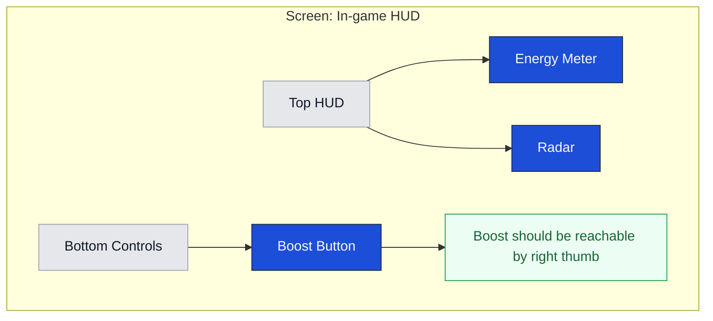
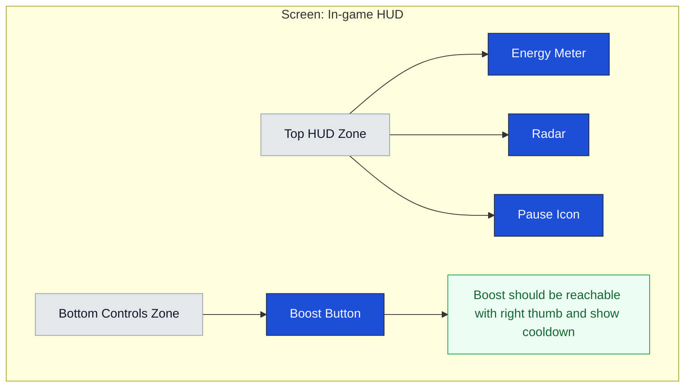

Mermaid - Perplexity


Absolut — här är en kort, sammanhållen produkt- och projektbeskrivning som du kan använda som avslutande sammanställning.

## Produktbeskrivning

**Arbetsnamn:** en iPhone-first visuell planeringsapp för Claude Code.

Appen är tänkt som ett extremt enkelt visuellt verktyg där användaren snabbt kan rita upp boxar, relationer, skärmlayouter, flöden och systemarkitektur direkt på iPhone, utan att behöva skriva Mermaid-kod manuellt.  Appen sparar strukturen som Markdown med Mermaid eller liknande textbaserad representation i iCloud Drive, så att samma fil kan läsas och vidareutvecklas av Claude Code som ett gemensamt styrdokument.[1]

Syftet är att skapa ett visuellt “översättningslager” mellan idé och implementation, så att användaren kan kommunicera tydligare med AI när appar, spel, n8n-flöden och andra system ska byggas.  Appen ska fungera som en kombination av snabb skissyta, arkitekturverktyg och extern arbetsminnesyta.

## MVP-steg

### MVP 1: Visuell fångst och export

Första versionen ska vara mycket enkel: några få former, pilar, textfält, färgkoder och möjlighet att spara/exportera till Markdown i iCloud.  Fokus ligger på att snabbt fånga idéer visuellt och skapa en stabil fil som Claude Code kan läsa.

### MVP 2: Claude Code-arbetsflöde

Nästa steg är att etablera ett tydligt arbetsflöde där Claude Code använder dessa filer som masterdokument för att tolka UI, flöden, moduler och beroenden i ett projekt.  Här definieras också regler för hur Claude ska läsa, uppdatera och svara tillbaka mot samma struktur.[1]

### MVP 3: Förfining och specialisering

När kärnvärdet är bevisat kan appen utvecklas med bättre mallar, olika diagramlägen, enklare versionslogik, kanske kollaps/expandering, och mer specialiserat stöd för till exempel spelarkitektur, n8n-flöden eller UI-specifikationer.  Först då bör mer avancerad tvåvägskommunikation eller djupare integration övervägas.[1]

## Konkreta användningsområden

- **UI-skisser för appar och spel:** snabbt rita upp knappar, mätare, layout, HUD och skärmstruktur för att visa Claude Code hur något ska byggas visuellt.
- **Projekt- och MVP-planering:** dela upp ett projekt i moduler, MVP-steg, beroenden och framtida versioner så att både du och AI:n ser den röda tråden.
- **n8n- och agentflöden:** visualisera input, output, routing, subagents, skills och automatiseringslogik i ett format som kan fungera som både arbetsyta och styrfil.
- **Kod- och filarkitektur:** visa hur mappar, moduler, system och beroenden hör ihop så att utvecklingen blir mer modulär, begriplig och lättare att felsöka.

## Vad som gör idén unik

Det unika är inte bara att appen är visuell, utan att den är byggd för att fungera som ett **gemensamt språk mellan människa och Claude Code**.  I stället för att bara vara ännu en ritapp blir den en AI-kompatibel arbetsyta där det visuella direkt kan användas som specifikation, plan, minnesstöd och styrdokument.[1]

Den är också unik genom att vara tänkt som ett **iPhone-first verktyg med mycket låg friktion**, snarare än en stor desktop-lösning med många funktioner.  Tanken är alltså inte att konkurrera med Lucidchart eller Excalidraw i bredd, utan att skapa ett personligt, snabbt och kognitivt anpassat verktyg för att fånga, strukturera och bygga vidare på idéer i stunden.[1]

## Varför detta är särskilt viktigt för en 2e-profil

För en person med 2e-profil — hög begåvning, ADHD, dyslexi, stark associativ förmåga och svårigheter med arbetsminne och röd tråd — blir ett sådant verktyg mer än produktivitet: det blir ett externt kognitivt stöd.  När tankarna går snabbt men verbal formulering, strukturering och sekventiell beskrivning är svårare, kan visuella modeller hjälpa till att avlasta arbetsminnet och skapa kontroll över komplexitet.

Det är särskilt värdefullt för någon som bygger med Claude Code utan traditionell utvecklarbakgrund, eftersom det minskar gapet mellan idé och teknisk implementation.  I stället för att behöva kunna “prata som en utvecklare” eller skriva perfekta specifikationer kan användaren kommunicera genom visuella strukturer som Claude Code sedan hjälper till att översätta till kod, arkitektur och arbetsflöden.

## Sammanfattad målbild

Det som ska byggas är alltså inte bara en enkel ritapp, utan ett personligt visuellt gränssnitt för att tänka, planera och kommunicera med AI.  Målet är att ge en 2e-användare utan utvecklarbakgrund bättre kontroll över appar, spel, n8n-flöden och andra system genom att göra det visuella till det gemensamma arbets- och styrspråket mellan människa och Claude Code.[1]

Om du vill kan jag också göra nästa version av detta som:
1. en mer formell **one-pager**,  
2. en **projektbrief för Claude Code**, eller  
3. en **svensk produktvision/roadmap** i mer professionell stil.

Källor
[1] Jag vill att det ska bygga på mermaid kod och sparas som en markdown fil i min iCloud så Claude Code och jag kan kommunicera, jag genom det visuella och inte skriva mermaid, och därmed att Code läser mermaid och skriver. Tänkte bygga i ips men är det fördelar att bygga i telegram? https://www.perplexity.ai/search/588a8adb-a2de-4623-8ae9-c68b38ff58dc


——


Ja — det är rätt tänkt att dela upp det i fyra **separata ingångar**, med olika gränssnitt, olika symbolik och olika exportlogik, men ändå med en gemensam filmodell i botten.  För din hjärna är det sannolikt mycket bättre än en enda “supercanvas”, eftersom varje ingång då kan vara mer begränsad, tydlig och anpassad till just sin typ av tänkande.[1]

Det betyder också att du ska bygga dem **en i taget**, där den visuella/UI-relaterade delen är rimligast att börja med eftersom den är mest konkret, snabbast att validera och redan ligger nära hur du spontant tänker i boxar, storlekar och placering.[2][3][1]

## Gemensam grund

Alla fyra delarna bör dela samma grundstruktur: en textbaserad masterfil i Markdown som Claude Code kan läsa, där varje diagramtyp har sin egen sektion, sin egen semantik och sina egna beroenden till andra filer eller delar av projektet.  Det viktiga här är att du inte bygger fyra helt separata system, utan fyra olika **vyer/ingångar** ovanpå samma idé: visuell struktur som styrdokument mellan dig och Claude Code.[4][1]

Jag skulle tänka detta som:

- Samma övergripande projektmapp.
- Samma grundprincip: visualisera → spara i Markdown → Claude Code läser → Claude Code bygger eller kommenterar tillbaka.
- Olika “modes” i appen, där varje mode har sin egen typ av nod, relation och metadata.[1]

## 1. Visuell UI-ingång

Detta är den första och enklaste delen att bygga.  Syftet här är att du snabbt ska kunna rita upp skärmar, HUD, knappar, mätare, paneler, menyer och layoutzoner på iPhone så att Claude Code förstår vad som ska ligga var och vad som hör ihop.[3][2][1]

### Vad den ska göra

- Låta dig skapa en “skärm”.
- Placera ut enkla element som:
  - knapp,
  - panel,
  - mätare,
  - joystick/styrzon,
  - textområde,
  - ikon/platsmarkör.
- Ge varje element:
  - namn,
  - ungefärlig storlek,
  - position,
  - färg/kategori,
  - kort notering om funktion.[1]

### Vad som gör den särskild

Här handlar det inte om perfekt design eller Figma-nivå, utan om **lågfidelity-wireframing för AI-kommunikation**.  Du ska kunna säga “den här mätaren ska vara här, den här knappen ska vara stor, detta hör till samma HUD-zon”, utan att skriva långa förklaringar.[2][3]

### Egna funktioner för denna ingång

- Rutnät eller enkla snap-zoner.
- Storleksdragning.
- Färgkodning per elementtyp.
- Lager/zoner, t.ex. “Top HUD”, “Bottom Controls”, “Overlay”.
- Möjlighet att markera beroenden eller interaktioner mellan element.[1]

### Export

Exporten blir en `ui-spec.md` eller liknande, med Mermaid + metadata.  Där kan Claude Code sedan läsa:[1]
- skärmnamn,
- layoutzoner,
- elementlista,
- relationer/interaktioner,
- UX-notes.

Detta är den bästa startpunkten.

## 2. MVP- och roadmap-ingång

Den andra delen bör vara en planeringsingång för själva projektet eller spelet, där du ser vad som ingår i MVP1, MVP2, MVP3 och vilka beroenden som finns mellan systemen.  Här är syftet inte layout, utan struktur över tid och versionslogik.[5][4]

### Vad den ska göra

- Låta dig skapa block som representerar:
  - feature,
  - system,
  - milestone,
  - framtida idé,
  - risk/blocker.
- Låta dig gruppera dem i:
  - MVP1,
  - MVP2,
  - MVP3,
  - senare/backlog.
- Visa beroenden mellan block.[4][5]

### Vad som gör den särskild

Det här blir din visuella “röda tråd” för projektet.  För en 2e-profil är det avgörande att se vad som är *nu*, vad som är *sen*, och vad som *hänger ihop* utan att allt flyter ihop i huvudet.

### Egna funktioner för denna ingång

- Färger för status: nu, senare, blockerad, beroende, färdig.
- Symboler för typ: gameplay, UI, tech, content, polish.
- Möjlighet att visa “måste före” och “kan vänta”.
- Möjlighet att dölja framtida nivåer och bara visa aktuell MVP.[4]

### Export

Denna bör spara till t.ex. `roadmap.md` eller `mvp-plan.md`, där Claude Code kan läsa in scope och föreslå:
- vad som ska byggas först,
- vad som kan vänta,
- vilka delar som bör stubbas nu för framtida modularitet.[5]

## 3. Fil- och kodarkitektur-ingång

Detta är delen som hjälper dig att förstå hur projektet faktiskt är uppbyggt tekniskt, trots att du inte är utvecklare.  Här är fokus inte UI eller roadmap, utan var saker ligger, hur moduler hänger ihop, och hur filstruktur och ansvar är organiserade.[1]

### Vad den ska göra

- Låta dig skapa block för:
  - mappar,
  - filer,
  - moduler,
  - scenes/views,
  - managers/services,
  - assets/data.
- Visa relationer som:
  - contains,
  - uses,
  - depends_on,
  - owns,
  - loads.[1]

### Vad som gör den särskild

Den här ingången översätter utvecklarvärlden till något du kan se visuellt.  I stället för att Git, mappar, moduler och arkitektur är “osynliga” blir de synliga som en karta.[1]

### Egna funktioner för denna ingång

- Trädvy eller modulvy.
- Färgkodning för filtyp eller ansvarsområde.
- Möjlighet att markera “rör inte”, “refaktorera senare”, “kärnmodul”.
- Enkel visualisering av vilka delar som påverkas om en modul ändras.

### Export

Denna bör skapa t.ex. `architecture.md` eller `project-structure.md`, som Claude Code kan använda som styrdokument för modulär utveckling, refaktorering och bättre filplacering.[1]

Det här är sannolikt inte första delen du bygger, men den blir mycket värdefull senare.

## 4. n8n- och agentflödes-ingång

Den fjärde ingången är för workflows, agentflöden, input/output och subagents, alltså det som ligger närmast n8n-logik.  Här är modellen mer processuell: steg, transformationer, routing, beslut, minne, output.[6]

### Vad den ska göra

- Låta dig skapa noder för:
  - input,
  - agent,
  - skill,
  - router,
  - memory,
  - API/tool,
  - output.
- Definiera input/output mellan noder.
- Visa sekvenser, parallella steg och fallback-flöden.[6]

### Vad som gör den särskild

Detta är där din idé om “Claude Code som n8n för tänkande och byggande” blir mest konkret.  Du kan då se hela agentlogiken visuellt på samma sätt som du i n8n ser vanliga automationer.[6]

### Egna funktioner för denna ingång

- Standardnod för `input -> process -> output`.
- Ikoner för agent, tool, memory och user.
- Markering av obligatorisk input/output.
- Möjlighet att visa vilken del som körs av människa, Claude Code eller extern tjänst.
- Eventuellt färdiga mallar för typiska flöden: Telegram → router → agent → Notion, eller iPhone app → Markdown → Claude Code → kod.[6]

### Export

Denna bör exportera till t.ex. `flow_main.md`, `agent-system.md` eller `workflow.md`, där Claude Code kan läsa det som ett processkontrakt och generera eller uppdatera riktiga n8n-flöden, prompts eller subagentupplägg.[6]

## Rekommenderad byggordning

Jag skulle sätta byggordningen så här:

| Ordning | Del | Varför |
|---|---|---|
| 1 | Visuell UI-ingång | Mest konkret, snabbast att testa, närmast din dagliga frustration. [2][3] |
| 2 | MVP/roadmap-ingång | Hjälper dig hålla röd tråd och planera större projekt. [4] |
| 3 | n8n/agentflöde-ingång | Starkt värde, men kräver att språk och struktur satt sig först. [6] |
| 4 | Fil-/kodarkitektur-ingång | Väldigt värdefull, men lättare när du redan har börjat arbeta med de andra tre. [1] |

Det viktiga är att du inte försöker bygga alla fyra samtidigt.  Varje ingång ska kännas som ett litet, begripligt verktyg med tydligt syfte, inte som ett modulmonster.

## En enkel övergripande modell

Om man förenklar hela produkten kan du tänka så här:

- **UI mode** = “Hur ska detta se ut på skärmen?”
- **Roadmap mode** = “Vad bygger vi nu och senare?”
- **Architecture mode** = “Hur är projektet uppbyggt?”
- **Flow mode** = “Hur rör sig data/agentlogik genom systemet?”

Det är samma produkt, men fyra olika tankelägen.  För just din 2e-profil är det sannolikt mycket bättre än att tvinga allt in i samma canvas, eftersom varje läge då blir tydligare, mindre överbelastande och lättare att använda när du snabbt behöver fånga något.[4]

Vill du att jag nu gör nästa steg som en **konkret produkt-spec för just del 1, den visuella UI-ingången**, med skärmar, verktyg, datamodell och exportformat?

Källor
[1] Ja det vill jag,  skissa en konkret produkt-spec för denna app — MVP, datamodell, exportformat till Markdown/Mermaid och hur Claude Code ska läsa och skriva tillbaka till filen. Gör den så pass specifik och genomtänkt att det blir underlag också för ...

...r vi kan kommunicera tvåvägs och iterera  os bygge av appar som program och spel med allt vi pratat om. Så det innehåller en kravspecifikation och tekniskt arkitektur för min app och förståelse för Claude Code till den som du sagt dvs allt som behövs https://www.perplexity.ai/search/7070860a-bc3f-497e-9fe2-144f4a3b51b4
[2] Men går det använda Mermaid som ett språk för att prata UI med Claude Code om man har ett diagram verktyg som lucid chatt och istället använda cirkel fyrkant och andra figurer, fyllda med färger osv, för att faktiskt rita upp layout - väldigt enkelt ...

...r och detaljer. Det skulle kunna vara ett effektivt sätt om man har en mermaid editor och man delar på en markdownfil med Claude Code där båda skriver sina förslag osv. Är det ens möjligt? För då går det även göra flödesscheman och där rita upp saker https://www.perplexity.ai/search/dffe5c76-f13a-4f87-bfef-a9abda92fd5f
[3] Det är exakt så jag vill använda det. När jag gör en app så vill jag inte bara säga ”dessa fyra knappar ska finnas” och försöka förklara var utan kan jag så snabbt och enkelt på min iPhone dra ut boxar som jag gör till rätt storlek och skriver i dem,...

...r snabb iteration då jag och Claude Code kan dela en markdown fil med mermaid som vi kommunicerar genom. Skapa mig detta språket och få med det du sagt så jag kan testa detta och se hur användbart det och så det blir som en blueprint för oss med allt https://www.perplexity.ai/search/0b79df31-3006-4e29-8125-e954aae81cd8
[4] Jag vill att du skriver en kort sammanställning av vad jag vill bygga typ:
- iOS appen beskrivning av den, vad gör den och syfte 
- MVP steg 
- ett par konkreta användnings områden 
- vad som gör det unikt och varför det är särskilt och kanske mest behov för en 2e individ som bygger med Claude Code utan utvecklar bakgrund med ADHD dyslexi och hög begåvning 140gf 

Så jag har en sammanställning lite som skulle kunna vara en projekt plan och produkt beskrivning som avslutning https://www.perplexity.ai/search/7abef050-648a-45f7-9478-de4c44681fb8
[5] Ja du förstår exakt vad jag vill åstadkomma och musiken har jag redan skapat på ett betalkonto i Suno som ger mig exakt den viben jag är ute efter, som är super avkopplande positiv, så det du sagt behöver jag. Jag vill dashboard dvs kontroller med in...

...et behöver sitta perfekt. Skapa det nu i filer som jag ger Code i rätt ordning dvs efter varje steg för att bygga detta. Ta även ett dokument som roadmap att få över till efter allt annat är byggt så vi ser vad du tycker kan finnas med för slutspelet https://www.perplexity.ai/search/24fa6288-9e73-43c3-b5d3-20de6a48a0ac
[6] Exakt hur fungerar mermaid kod för att rita upp flödesscheman? När jag jobbar i Claude Code och Cowork vill jag få bättre kontroll precis som i n8n och med sub agents kunna dela upp processen med tydlig input och output för varje ”del” (NOD i n8) som...

...h hur - det känns som det inte funkar för mer avancerade projekt. Alternativt att jag bygger upp hela schemat innan med en separat agent i mermaid? Kolla upp exakt vad jag kan göra och hur allt fungerar och exakt hur jag kan komma igång med min metod https://www.perplexity.ai/search/bace7b75-e313-448e-af57-92f406e03937
x§

——

Bra, nu pratar vi om precis rätt sak: **språket** först, appen sen.  

Jag delar upp svaret i:

1. Vad Mermaid + Claude faktiskt kan och inte kan för UI-layout.  
2. Vad det betyder för ditt “iPhone‑canvas‑språk”.  
3. Förslag på METODDOKUMENT.md (lexikon/översättningstabell).  
4. Förslag på MERMAID.md och lager/idéer.  
5. Hur detta blir MVP1 för UI‑ingången + basen för de andra tre delarna.

***

## 1. Vad Mermaid och Claude kan (och inte kan) för UI‑layout

### Det Mermaid är bra på

Mermaid flowcharts och de nyare architecture‑diagrammen beskriver:

- Noder (med text inuti) och länkar mellan dem.[1][2]
- Olika former: rektanglar, rundade rektanglar, cirklar, diamanter (beslut), osv.[3][1]
- Klass‑ och stilregler (classDef) för färger, border, textfärg osv, så att du kan säga “alla UI‑element = blå, alla kommentarer = gröna”.[4][1][3]
- Gruppning i subgraphs och regioner; du kan t.ex. ha en “Screen” som innehåller andra noder.[5][1]

Claude Code kan läsa den här texten, se noderna, deras etiketter, vilka som är ihopkopplade och vilka klasser/färger du har definierat, och därifrån förstå: “detta är en skärm, detta är en knapp, detta är bara en kommentar”.[6]

### Begränsningar för exakt layout

Det Mermaid **inte** gör (i alla fall i maj 2026) är:

- Den ger dig inte pixel‑exakta koordinater per form. Layouten styrs av en layoutmotor som placerar noder automatiskt utifrån flöde/riktning (t.ex. top‑down, left‑right), inte som ett CAD/Figma‑verktyg.[1][3][4]
- Överlapp är inte ett förstaklass‑koncept – layouten försöker i regel *undvika* att noder överlappar varandra.[7]
- Avstånd och millimeterprecision är inte en del av modellen. Du kan styra riktning, gruppering och ibland relativ ordning, men inte “20 px från vänsterkant”.[4][1]

Claude Code ser alltså **semantiken** (noder, relationer, grupper, klasser), inte en exakt pixelliknande layout. För riktig pixelprecision behövs ett annat format (som Excalidraw‑JSON eller ett eget).[8][9]

### Vad det betyder för dig

Alltså: ditt Mermaid‑baserade UI‑språk kan:

- säga “den här zonen är Top HUD”, “denna knapp är i höger hörn”, “denna mätare hör till skeppets energi”;  
- skilja på “det här är ett riktigt UI‑element” vs “det här är en kommentar”;  
- visa vilka element som hör ihop och hur skärmen är indelad i zoner.

Men det kan **inte** tala om exakt pixelplacering, eller att två cirklar överlappar varandra på ett bestämt sätt. Det gör att språket bör sikta på **layout‑zoner och semantik**, inte Figma‑precision.[10][6]

***

## 2. Konsekvens: ditt “iPhone-canvas-språk” måste vara low‑fidelity, men tydligt

För UI‑ingången ska Mermaid vara:

- ett **blueprint‑språk** för skärmens zoner, elementtyper, relationer och ungefärlig placering (“top‑left”, “bottom HUD”, “overlay”),  
- inte ett pixel‑perfekt designformat.

Det är helt okej – Claude Code kan:

- läsa blueprinten,  
- para ihop varje nod med en SwiftUI‑komponent,  
- och sedan i kod gå ner på mer exakt layout (padding, spacers, stacks, osv).[6]

### Överlapp, färger och “lager”

Eftersom Mermaid inte har inbyggd z‑ordning och overlapping, kan vi modellera så här:

- **Överlapp/lager** får representeras logiskt: t.ex. en nodtyp “OverlayElement” eller klass `overlay`.  
- **Färger** används semantiskt, inte bara estetiskt:  
  - blå = riktiga UI‑element,  
  - gröna = kommentarer/förklaringar,  
  - grå = zoner/ramar.[1][4][6]
- **Text i cirklar/rektanglar** är fullt möjligt – det är själva poängen med noder.[3][1]

Claude Code kommer inte se att två noder “ligger ovanpå” varandra visuellt, men det kan se att de båda är `overlay` och därför ska renderas i en overlay‑ZStack i koden.

### Grid och alignment

Grid, snapping och exakta avstånd är *appens* ansvar, inte Mermaids.[4][1]

- I din iOS‑app kan du ha en enkel grid/snap (t.ex. 8‑punkts‑raster) så att saker hamnar på snygga platser för dig visuellt.  
- När du exporterar till Mermaid använder du zoner/klasser/etiketter för att tala om “top-left”, “center”, “bottom-right”, etc., inte exakta koordinater.[6]

Det gör att Mermaid‑texten blir stabil, läsbar och AI‑vänlig, medan grid‑känslan är för dig i UI:t.

***

## 3. METODDOKUMENT.md – ditt lexikon och kontrakt

Ja, du behöver ett separat metod‑/språk‑dokument – och det är **MVP1**: METODDOKUMENT.md.[11][6]

Det dokumentet ska innehålla:

### a) Syfte

- En kort förklaring av varför språket finns: “Mermaid‑UI‑blueprint mellan <ditt namn> och Claude Code”.[6]

### b) Formen och symbolerna

- Vilka former som används för vad:
  - rektangel = UI‑element.
  - rundad rektangel = container/zon.
  - cirkel = tap‑område/knapp.
  - diamant = logik/tillstånd, inte visuellt element.[10][1]

### c) Färger och klasser

- En tabell över klasser/färger:
  - `classDef ui ...` → riktiga element som ska byggas.  
  - `classDef zone ...` → layoutzoner (top hud, bottom hud…).  
  - `classDef note ...` → förklarande noder som *inte* ska översättas till UI.  
- Tydligt: “Alla noder med class note är bara kommentarer.”[1][4][6]

### d) Skärmram / iPhone‑frame

- Hur en “skärm” representeras:
  - antingen en överordnad subgraph per skärm (`subgraph Screen: HUD`),  
  - eller en särskild nodtyp `Screen` som alla zoner/element knyts till.[5][1][6]

### e) Naming‑regler

- T.ex. prefix:
  - `ui:` = verkliga UI‑element,  
  - `zone:` = layoutzoner,  
  - `note:` = kommentarer,  
  - `dev:` = tekniska notes.  

Claude Code kan då lätt filtrera: “allt som börjar med ui: och har klass ui är riktiga komponenter”.[6]

### f) Text vs. förklaring

- Regel:  
  - Text **inne i** `ui`‑noder = text som ska dyka upp på skärmen.  
  - Text **i note‑noder** eller i Markdown‑paragrafer utanför ```mermaid```‑blocket = förklaringar, inte UI.[12][13][6]

### g) Versions- och beroendedel

- Kort stycke om:
  - hur diagrammet hänger ihop med andra filer (t.ex. `roadmap.md`, `architecture.md`),  
  - att “Mermaid är blueprint, kod är implementation” – ändringar ska helst börja i blueprinten.[14][6]

METODDOKUMENT.md är alltså kontraktet mellan dig och Claude Code: “så här ska du läsa mina Mermaid‑scheman”.[6]

***

## 4. MERMAID.md – själva blueprint-filen

Din MERMAID.md (eller `ui-spec.md`) blir:

- En Markdownfil i iCloud Drive,  
- med:
  - metodreferens + kort naturlig text,  
  - ett eller flera ```mermaid```‑block (ett per skärm eller per aspekt).[15][6]

Ett förenklat upplägg:

```md
# Echowake HUD – UI blueprint

Se METODDOKUMENT.md för full semantik.


```

Claude Code kan då:

- läsa vilka `ui`‑element som finns,  
- se deras zon,  
- se vilka notes som hör till vilken komponent,  
- och bygga SwiftUI‑kod eller spel‑HUD i linje med det.[6]

***

## 5. MVP1 för UI‑ingången och basfunktionalitet för de andra tre delarna

### MVP1 – konkret

MVP1 blir alltså:

1. **METODDOKUMENT.md**  
   - Lexikon för former, färger, klasser, prefix, ram, notes vs. UI, koppling till andra filer.[6]

2. **ui-spec.md (MERMAID.md)**  
   - En första blueprint för en verklig skärm (t.ex. din HUD i spelet).[16][10]

3. **Claude Code‑kontrakt**  
   - En kort sektion i `CLAUDE.md` som säger: “När du ser ui-spec.md, följ METODDOKUMENT.md, utgå från att `ui`‑noder är riktiga komponenter, `note` är kommentarer, osv – och bygg UI därefter.”[15][6]

4. **En enkel iOS‑UI (om du vill få med det i MVP1)**  
   - Ett läge där du:
     - ser en iPhone‑ram på canvasen,
     - kan dra ut zoner/element enligt dina klasser,
     - exporterar till den definierade Mermaid‑strukturen.[15][6]

Du kan initialt hoppa över “egen app” och bara jobba i en befintlig Mermaid‑editor + TextEditor på iPhone (MDash, MermaidEditor) för att validera språket innan du lägger kraft på SwiftUI‑implementeringen.[17][18][19]

### Övriga tre delar och vad som är bas

**Basfunktionalitet (gäller alla fyra):**

- Markdown + Mermaid-filer i iCloud Drive.[15]
- METODDOKUMENT.md som beskriver symbolik, färger, klasser.[11][6]
- Claude Code‑kontrakt i CLAUDE.md för hur filerna ska läsas.[15][6]

**Specifikt per del:**

- **UI‑delen:** UI‑element, zoner, skärmram, notes om layout/UX.[10][6]
- **Roadmap‑delen:** MVP‑block, features, beroenden, status, versioner (andra typer av noder/classes).[11]
- **Arkitektur‑delen:** mappar, moduler, scenes, tjänster och hur de beror på varandra.[6]
- **Flow‑delen (n8n/agents):** nodtyper för input/agent/tool/output, IO‑kontrakt, routerlogik, parallellismer.[14]

Alla delar bygger på **samma modell**: visuella noder + Mermaid + metod‑lexikon + Claude Code‑kontrakt.[6]

***

Om du vill kan jag i nästa steg:

- skriva ett konkret **METODDOKUMENT.md‑skelett** för UI‑delen (på svenska),  
- plus en första `ui-spec.md` med ett HUD‑exempel,  
som du kan lägga i en iCloud‑mapp och testa direkt med Claude Code innan någon iOS‑kod ens är skriven.

Källor
[1] Flowcharts Syntax | Mermaid https://mermaid.ai/open-source/syntax/flowchart.html
[2] Mermaid | Diagramming and charting tool https://mermaid.js.org
[3] Mermaid: How to create diagrams and charts in Markdown https://david-mohr.com/blog/mermaid-create-diagrams-in-markdown
[4] Configuration https://mermaid.js.org/intro/syntax-reference.html
[5] 6. Tips and tricks - FAIR Cookbook - ELIXIR https://fairplus.github.io/the-fair-cookbook/content/recipes/help/tips-tricks.html
[6] Ja det vill jag,  skissa en konkret produkt-spec för denna app — MVP, datamodell, exportformat till Markdown/Mermaid och hur Claude Code ska läsa och skriva tillbaka till filen. Gör den så pass specifik och genomtänkt att det blir underlag också för ...

...r vi kan kommunicera tvåvägs och iterera  os bygge av appar som program och spel med allt vi pratat om. Så det innehåller en kravspecifikation och tekniskt arkitektur för min app och förståelse för Claude Code till den som du sagt dvs allt som behövs https://www.perplexity.ai/search/7070860a-bc3f-497e-9fe2-144f4a3b51b4
[7] Wireframes in mermaid · Issue #1184 https://github.com/mermaid-js/mermaid/issues/1184
[8] HyLiMo: A Hybrid Live-Synchronized Modular Diagramming Editor as IDE
  Extension for Technical and Scientific Publications https://arxiv.org/html/2403.13711v1
[9] An Exploratory Study of ML Sketches and Visual Code Assistants https://arxiv.org/html/2412.13386v1
[10] Men går det använda Mermaid som ett språk för att prata UI med Claude Code om man har ett diagram verktyg som lucid chatt och istället använda cirkel fyrkant och andra figurer, fyllda med färger osv, för att faktiskt rita upp layout - väldigt enkelt ...

...r och detaljer. Det skulle kunna vara ett effektivt sätt om man har en mermaid editor och man delar på en markdownfil med Claude Code där båda skriver sina förslag osv. Är det ens möjligt? För då går det även göra flödesscheman och där rita upp saker https://www.perplexity.ai/search/dffe5c76-f13a-4f87-bfef-a9abda92fd5f
[11] Jag vill att du skriver en kort sammanställning av vad jag vill bygga typ:
- iOS appen beskrivning av den, vad gör den och syfte 
- MVP steg 
- ett par konkreta användnings områden 
- vad som gör det unikt och varför det är särskilt och kanske mest behov för en 2e individ som bygger med Claude Code utan utvecklar bakgrund med ADHD dyslexi och hög begåvning 140gf 

Så jag har en sammanställning lite som skulle kunna vara en projekt plan och produkt beskrivning som avslutning https://www.perplexity.ai/search/7abef050-648a-45f7-9478-de4c44681fb8
[12] Include diagrams in your Markdown files with Mermaid https://github.blog/developer-skills/github/include-diagrams-markdown-files-mermaid/
[13] Creating Mermaid diagrams https://docs.github.com/en/get-started/writing-on-github/working-with-advanced-formatting/creating-diagrams
[14] Exakt hur fungerar mermaid kod för att rita upp flödesscheman? När jag jobbar i Claude Code och Cowork vill jag få bättre kontroll precis som i n8n och med sub agents kunna dela upp processen med tydlig input och output för varje ”del” (NOD i n8) som...

...h hur - det känns som det inte funkar för mer avancerade projekt. Alternativt att jag bygger upp hela schemat innan med en separat agent i mermaid? Kolla upp exakt vad jag kan göra och hur allt fungerar och exakt hur jag kan komma igång med min metod https://www.perplexity.ai/search/bace7b75-e313-448e-af57-92f406e03937
[15] Jag vill att det ska bygga på mermaid kod och sparas som en markdown fil i min iCloud så Claude Code och jag kan kommunicera, jag genom det visuella och inte skriva mermaid, och därmed att Code läser mermaid och skriver. Tänkte bygga i ips men är det fördelar att bygga i telegram? https://www.perplexity.ai/search/588a8adb-a2de-4623-8ae9-c68b38ff58dc
[16] Det är exakt så jag vill använda det. När jag gör en app så vill jag inte bara säga ”dessa fyra knappar ska finnas” och försöka förklara var utan kan jag så snabbt och enkelt på min iPhone dra ut boxar som jag gör till rätt storlek och skriver i dem,...

...r snabb iteration då jag och Claude Code kan dela en markdown fil med mermaid som vi kommunicerar genom. Skapa mig detta språket och få med det du sagt så jag kan testa detta och se hur användbart det och så det blir som en blueprint för oss med allt https://www.perplexity.ai/search/0b79df31-3006-4e29-8125-e954aae81cd8
[17] MDash - MD & Mermaid Editor - App Store - Apple https://apps.apple.com/us/app/mdash-md-mermaid-editor/id6758559893
[18] MDash - MD & Mermaid Editor - App Store https://apps.apple.com/se/app/mdash-md-mermaid-editor/id6758559893
[19] MermaidEditor - App Store - Apple https://apps.apple.com/ca/app/mermaideditor/id1581312955


___


Ja — flera av dina önskade funktioner hör hemma i appens **egna canvas/UI-lager** och inte i Mermaid-formatet, medan några få går att mappa ganska direkt till Mermaid eller till ett separat metodlager.  Det smartaste är därför att redan nu dela upp allt i tre nivåer: **canvasfunktioner**, **Mermaid-export**, och **metod/lexikon**, så att du inte försöker pressa in sådant i Mermaid som Mermaid inte är byggt för.[1][2][3]

## Vad som hör till canvasen

Det mesta i din lista är fullt rimlig **appfunktionalitet**, även om det inte finns som egen funktion i Mermaid: multiselect med markeringsruta, flytta flera objekt samtidigt, fria textlådor, ångra, ny canvas med spara/förkasta, stor eller oändlig canvas, pinch-zoom, enhandzoom, pan, prickrutnät, färgväljare, rotation, resize-handtag, anteckningsfält per form, och iPhone-ram som specialform.  Allt detta bör därför behandlas som UI-beteende i appen, medan exporten bara tar med den del som faktiskt behövs för att Claude Code ska förstå strukturen.[4][5]

Även länksymbol-paret för att hoppa mellan två punkter på en stor canvas är mycket vettigt, men det är också en canvasnavigationsfunktion snarare än en Mermaid-standard.  Du kan däremot exportera den som metadata, till exempel `jump_link_id: 4`, så att länkarna finns bevarade i filen även om själva klicknavigeringen sker i appen.[4]

## Vad Mermaid klarar väl

Mermaid flowcharts klarar noder med text i, olika former, subgraphs, länkar mellan former, etiketter på länkar och klassbaserad styling med färger för fyllning, kantlinje och textfärg.  Det betyder att former med text, färgkodade typer, zoner, beroendelinjer, förklaringsnoder och enkel riktning mellan flera objekt passar bra att exportera till Mermaid.[2][6][1]

För raka “svängda” linjer finns visst stöd genom olika kurvstilar och renderers; exempelvis nämns `curve: 'stepAfter'` och även `defaultRenderer: "elk"` som sätt att få mer ortogonala eller renare dragningar, men det är inte samma sak som full manuell kontroll över varje böjpunkt som i Lucidchart.  Om du vill kunna lägga egna brytpunkter på linjer bör det därför ses som en canvasfunktion i din app, medan Mermaid-exporten får bli en förenklad representation av relationen.[7][8][1]

## Vad Mermaid är svagt på

Exakt placering, pixelprecision, garanterad avståndstrogen layout, stabil överlappning mellan objekt och full manuell edge-routing är fortfarande inte Mermaids styrka eftersom diagrammen renderas via automatiska layoutmotorer.  Mermaid kan också ge onödiga edge-korsningar eller inkonsekvent subgraph-layout, vilket bekräftas i öppna issues och diskussioner.[8][9][10][1][2]

Det betyder att saker som “två cirklar överlappar exakt”, “denna label ligger 20 px från högerkanten”, eller “den här linjen går exakt runt formen via dessa tre brytpunkter” inte ska vara en del av din kärnmodell om du vill att Claude Code ska kunna tolka det robust.  För just detta behöver du i stället ett separat metodlager som översätter dina canvasdrag till semantiska regler som “overlay”, “top-right”, “inside screen frame”, “annotation only”, eller “group move only”.[2][8][4]

## Kollaps och expandering

Din idé med plus/minus på en nod som kollapsar alla efterföljande sammanhängande former är stark, men detta är ännu inte något man tryggt kan förlita sig på som inbyggd Mermaid-funktion för flowcharts.  Det finns förslag och diskussioner om expand/collapse för subgraphs, men det verkar fortfarande vara ett önskemål snarare än något etablerat standardsätt du bör basera MVP:n på.[11][12]

Därför bör kollaps/expand också vara en funktion i appens egen canvasmodell först.  Exporten kan spara en egenskap som `collapsed_branch_from: node_12`, men själva beteendet bör appen äga tills det finns robust, bred Mermaid-stöd för detta.[12][11]

## Tabellen du behöver

Ja, du behöver nästan säkert ett separat **METODDOKUMENT.md** med en översättningstabell, eftersom inte allt bör eller kan ligga i själva Mermaid-koden.  Det dokumentet bör definiera vad som är verkliga UI-element, vad som är kommentarer, vad färger betyder, vilka former som mappar till vilka komponenttyper, hur iPhone-ramen representeras, vad överlapp betyder semantiskt och vilka canvasfunktioner som inte exporteras 1:1 till Mermaid.[5][4]

En enkel uppdelning kan vara:

| Lager | Exempel | Sparas i Mermaid? |
|---|---|---|
| Basfunktioner | Zoom, pan, ångra, ny canvas, multiselect, resize, rotate | Nej, detta är appbeteende. [4] |
| Semantik | `ui`, `zone`, `note`, `overlay`, `jump_link`, `table` | Ja, helt eller delvis via Mermaid + metadata. [4][2] |
| Metodregler | “Grön text = kommentar”, “iPhone-frame = skärm”, “note exporteras inte som UI” | Nej, detta hör hemma i METODDOKUMENT.md. [4] |

## Kommentartext kontra riktig skärmtext

Det du säger om att viss text bara ska förklara och inte hamna i appen är helt centralt, och här är ett metoddokument nästan obligatoriskt.  Den tydligaste modellen är att skilja på minst två texttyper: **displaytext** som ska finnas i själva UI:t, och **notestext** som bara är för dig och Claude Code.[2][4]

Det går att lösa genom klassning i Mermaid, till exempel att alla `note`-noder eller alla objekt med grön stil är förklaringar och aldrig ska byggas som synlig UI-text.  Det är mycket säkrare än att försöka låta Claude gissa vilken text som är “på riktigt” och vilken som bara är förklaring.[1][4][2]

## Klickbara länkar och navigation

Mermaid flowcharts stödjer klickdirektiv på noder, alltså att en nod kan ha en länk eller callback, men detta gäller i första hand noder och inte fritt definierade canvas-portaler eller kanter på samma sätt som i en ritapp.  Så din idé om två länkikoner som paras ihop och teleportera vyn från en plats till en annan bör ses som en appfunktion, även om den kan få en textuell representation i filen.[13][14]

Det finns alltså stöd för klickbara noder, men inte ett färdigt “pair these two wormholes on the infinite canvas”-koncept i Mermaid.  Där är du inne på ett område där din egen app faktiskt tillför något verkligt nytt.[15][13]

## Tabeller och specialobjekt

En vanlig tabell som ritobjekt är inte något naturligt förstaklassobjekt i Mermaid flowcharts.  Om du vill ha tabeller på canvasen bör appen sannolikt behandla dem som egna objekt med rader/kolumner, och exporten får antingen förenkla dem till en grupp/subgraph eller spara dem i metadata vid sidan av Mermaid-blocket.[3][6][4]

Samma sak gäller exakt iPhone-skärm som form.  Mermaid kan representera en skärm semantiskt via en container eller subgraph, men inte på ett designverktygsnivå “device frame”-sätt.[16][4][2]

## Basfunktionalitet vs fyra delar

Basfunktionalitet som bör vara gemensam för alla fyra ingångar är: oändlig canvas, zoom/pan, prickrutnät, skapa/flytta/rotera/ändra storlek på objekt, anteckningar per objekt, färgval, länkar mellan objekt, multiselect, undo, spara till iCloud Drive och visa/exportera kod.  Det är den gemensamma motorn.[4]

Specifikt för **UI-delen** hör iPhone-ram, text som display vs kommentar, overlay-semantik, layoutzoner och relation till skärmens kanter hemma.  Specifikt för **roadmap-delen** hör statusfärger, MVP-nivåer, beroenden över tid och kollaps av grenar.  Specifikt för **arkitekturdelen** hör filtyper, moduler, mappar och systemansvar.  Specifikt för **flow/n8n-delen** hör IO-punkter, grenning, agent-/tool-symbolik och processlogik.[17][5][4]

## Praktisk slutsats för MVP

Det smartaste MVP-upplägget i maj 2026 är sannolikt detta: bygg inte “full Lucidchart för iPhone”, utan bygg först **språket och filtreringen**.  Det innebär:[2][4]
- ett **METODDOKUMENT.md** som definierar reglerna,[4]
- en **MERMAID.md / ui-spec.md** som innehåller den verkliga blueprinten,[4]
- och en mycket enkel canvas där du kan skapa objekt, zoner, notes, färger, länkar och exportera detta deterministiskt.[4]

De mer avancerade funktionerna i din lista bör delas upp så här:
- **MVP1:** objekt, text, notes, färger, länkar, iPhone-frame, zoom/pan, multiselect, undo, export till Mermaid + metadata.[4]
- **MVP2:** bättre linjer med manuella brytpunkter, jump-links, table-object, collapse/expand i appen.
- **MVP3:** tvåvägslager mellan dig och Claude Code, där Claude kan skriva tillbaka i samma fil eller i ett separat AI-lager.[18][4]

Ja, jag tycker alltså att det du föreslår är rätt riktning — men med den viktiga avgränsningen att **Mermaid ska bära semantik och struktur, medan din app ska bära precision, interaktion och navigering**.[1][2]

Vill du att jag nu omvandlar hela denna funktionslista till en strikt uppdelad kravspec i tre kolumner: **Basfunktion**, **UI-del specifikt**, **Senare version**, så att den blir direkt användbar i ett Claude Code-projekt?

Källor
[1] Diagram Syntax | Mermaid https://mermaid.js.org/intro/syntax-reference.html
[2] Flowcharts Syntax | Mermaid https://mermaid.ai/open-source/syntax/flowchart.html
[3] Creating Mermaid diagrams https://docs.github.com/en/get-started/writing-on-github/working-with-advanced-formatting/creating-diagrams
[4] Ja det vill jag,  skissa en konkret produkt-spec för denna app — MVP, datamodell, exportformat till Markdown/Mermaid och hur Claude Code ska läsa och skriva tillbaka till filen. Gör den så pass specifik och genomtänkt att det blir underlag också för ...

...r vi kan kommunicera tvåvägs och iterera  os bygge av appar som program och spel med allt vi pratat om. Så det innehåller en kravspecifikation och tekniskt arkitektur för min app och förståelse för Claude Code till den som du sagt dvs allt som behövs https://www.perplexity.ai/search/7070860a-bc3f-497e-9fe2-144f4a3b51b4
[5] Jag vill att du skriver en kort sammanställning av vad jag vill bygga typ:
- iOS appen beskrivning av den, vad gör den och syfte 
- MVP steg 
- ett par konkreta användnings områden 
- vad som gör det unikt och varför det är särskilt och kanske mest behov för en 2e individ som bygger med Claude Code utan utvecklar bakgrund med ADHD dyslexi och hög begåvning 140gf 

Så jag har en sammanställning lite som skulle kunna vara en projekt plan och produkt beskrivning som avslutning https://www.perplexity.ai/search/7abef050-648a-45f7-9478-de4c44681fb8
[6] Blog - Use Mermaid syntax to create diagrams - draw.io https://www.drawio.com/blog/mermaid-diagrams
[7] How to make the flow lines in mermaid flowchart to exact ... https://stackoverflow.com/questions/70970766/how-to-make-the-flow-lines-in-mermaid-flowchart-to-exact-90-degrees
[8] Unnecessary crossing of edges between nodes #6476 https://github.com/mermaid-js/mermaid/issues/6476
[9] Mermaid Subgraphs Laid Out Inconsistently https://stackoverflow.com/questions/71803509/mermaid-subgraphs-laid-out-inconsistently
[10] Maintain the order of the nodes in Flowchart · Issue #815 https://github.com/mermaid-js/mermaid/issues/815
[11] click/hover to Expand or collapse subgraphs/par · Issue #5508 · mermaid-js/mermaid https://github.com/mermaid-js/mermaid/issues/5508
[12] Expanded and Closed versions of Flowchart subgraphs · Issue #4879 · mermaid-js/mermaid https://github.com/mermaid-js/mermaid/issues/4879
[13] Add Support for Clickable Links in State Diagram Nodes ... https://github.com/mermaid-js/mermaid/issues/6314
[14] Mermaid click directive works in flowcharts but not graphs https://forum.obsidian.md/t/mermaid-click-directive-works-in-flowcharts-but-not-graphs/19799
[15] mermaid - How to add interactive links on flowchart edges? https://stackoverflow.com/questions/76646284/how-to-add-interactive-links-on-flowchart-edges
[16] Grouping Mermaid nodes in Subgraphs - Waylon Walker https://waylonwalker.com/mermaid-subgraphs/
[17] Exakt hur fungerar mermaid kod för att rita upp flödesscheman? När jag jobbar i Claude Code och Cowork vill jag få bättre kontroll precis som i n8n och med sub agents kunna dela upp processen med tydlig input och output för varje ”del” (NOD i n8) som...

...h hur - det känns som det inte funkar för mer avancerade projekt. Alternativt att jag bygger upp hela schemat innan med en separat agent i mermaid? Kolla upp exakt vad jag kan göra och hur allt fungerar och exakt hur jag kan komma igång med min metod https://www.perplexity.ai/search/bace7b75-e313-448e-af57-92f406e03937
[18] Jag vill att det ska bygga på mermaid kod och sparas som en markdown fil i min iCloud så Claude Code och jag kan kommunicera, jag genom det visuella och inte skriva mermaid, och därmed att Code läser mermaid och skriver. Tänkte bygga i ips men är det fördelar att bygga i telegram? https://www.perplexity.ai/search/588a8adb-a2de-4623-8ae9-c68b38ff58dc
[19] Meta-Interpretive LEarning with Reuse https://www.mdpi.com/2227-7390/12/6/916
[20] Interactive visualization of genealogical graphs https://ieeexplore.ieee.org/document/1575761
[21] From Mermaids to Menocchio: Truths and Divergence in Politically Tempestuous Times https://www.journals.uchicago.edu/doi/10.1086/SCJ5001033
[22] Facilitating Graph Interpretation via Interactive Hierarchical Edges https://www.semanticscholar.org/paper/c654e0196feebdde9af3edde166424341c0cbcaa
[23] Efficient Visual Navigation https://www.semanticscholar.org/paper/99f5a43d35f756d8db5084c12d104fd5ba6fea1b
[24] A Customizable SVG Graph Visualization Engine https://www.semanticscholar.org/paper/891e55b00d551aa96af9b4206335806ffb140e4e
[25] Efficient visual navigation of hierarchically structured graphs https://www.semanticscholar.org/paper/e5e2e37b39798355274afbf8353d47b042f52176
[26] Efficient visual navigation: a study by the example of hierarchically structured graphs https://www.semanticscholar.org/paper/2f3d44045829852f5b3e14d46913cec57f3a1c4f
[27] Mermaid Chart: Subgraphs in the Visual Editor https://www.youtube.com/watch?v=ZovjIyZhN4k
[28] How to add grouping or outline box in mermaid flowchart https://stackoverflow.com/questions/77439516/how-to-add-grouping-or-outline-box-in-mermaid-flowchart
[29] Please help with this mermaid diagram... thanks https://www.reddit.com/r/ObsidianMD/comments/18vojlo/please_help_with_this_mermaid_diagram_thanks/
[30] Mermaid Diagrams as Code in Notion - Luke Merrett https://lukemerrett.com/using-mermaid-flowchart-syntax-in-notion/
[31] Has GPT chat almost created a plugin for drawing flowchart with the ... https://forum.obsidian.md/t/has-gpt-chat-almost-created-a-plugin-for-drawing-flowchart-with-the-mouse/64777
[32] Is there a list of supported mermaid diagram types ... https://forum.obsidian.md/t/is-there-a-list-of-supported-mermaid-diagram-types-anywhere/62721
[33] Self-edges/loops look very awkward in state diagrams #6336 https://github.com/mermaid-js/mermaid/issues/6336
[34] FlowLearn: Evaluating Large Vision-Language Models on Flowchart
  Understanding https://arxiv.org/pdf/2407.05183.pdf
[35] Interactive Diagrams for Software Documentation https://arxiv.org/html/2407.21621v1
[36] Beyond End-to-End VLMs: Leveraging Intermediate Text Representations for
  Superior Flowchart Understanding https://arxiv.org/pdf/2412.16420.pdf
[37] Mermaid js flow chart - Full list of available options to style ... https://stackoverflow.com/questions/74894540/mermaid-js-flow-chart-full-list-of-available-options-to-style-a-node
[38] Introducing Architecture Diagrams in Mermaid https://mermaid.ai/blog/posts/mermaid-supports-architecture-diagrams
[39] Mermaid Grammar (FlowChart) https://www.rumbarum.kr/post/mermaid-flowchart-manual
[40] Rendering icons in mermaid architecture diagram https://stackoverflow.com/questions/79123430/rendering-icons-in-mermaid-architecture-diagram
[41] Flowcharts, Sequence Diagrams, and More | DevToys Web Pro https://devtoys.pro/te/blog/mermaid-diagrams-guide
[42] Custom icons for Mermaid diagrams in Docusaurus https://www.simonpainter.com/mermaid-icons/
[43] Flowcharts - Basic Syntax | Mermaid https://emersonbottero.github.io/mermaid-docs/syntax/flowchart.html
[44] Can a URL link be added in the stateDiagram? · Issue #6304 https://github.com/mermaid-js/mermaid/issues/6304
[45] Build with Code: Text-to-Diagram with Mermaid Syntax https://mermaid.ai/web/products/code/
[46] History of Mermaid.js: Diagrams as Code to 85K Stars (2026) https://www.taskade.com/blog/history-of-mermaid
[47] Mermaid diagrams | What's New at Tines https://www.tines.com/whats-new/mermaid-diagrams/
[48] Untitled boolean in Mermaid Config Schema - JS.ORG https://mermaid.js.org/config/schema-docs/config-defs-flowchart-diagram-config-properties-htmllabels.html
[49] How to combine multiple child nodes with labels in a single ... https://stackoverflow.com/questions/77708316/how-to-combine-multiple-child-nodes-with-labels-in-a-single-statement
[50] Flowchart rendered differently depending on whether "htmlLabels" is enabled or not · Issue #1572 · mermaid-js/mermaid https://github.com/mermaid-js/mermaid/issues/1572
[51] Mermaid Live Editor: Online FlowChart & Diagrams Editor https://mermaid.live
[52] Visual Studio 2026: Mermaid Chart Rendering in ... https://www.linkedin.com/posts/akshayvbora_visual-studio-just-got-even-better-the-activity-7381002855094136833-8QWN
[53] mermaid/docs/syntax/flowchart.md at master · mermaid-js/mermaid https://github.com/mermaid-js/mermaid/blob/master/docs/syntax/flowchart.md


_____


Här är en kompakt blueprint som Claude Code kan bygga appen utifrån, med tydlig MVP‑indelning, funktionskategorisering och två färdiga Markdown-filer: ett **protokolldokument** och ett **UI‑spec‑exempel**.

***

## 1. Namn och roll för protokolldokumentet

Jag föreslår att du kallar styrdokumentet för:

**`Visual-Spec-Protocol.md`**

Roll:

- Det är **inte** en fil som du eller Claude redigerar varje gång, utan ett **kontrakt** som beskriver:
  - vilka former, färger och klasser som betyder vad,
  - hur Mermaid används (subset + begränsningar),
  - hur Claude Code ska tolka `.md`‑filerna som appen skapar.[1][2][3]

Alla projektfiler (som `ui-spec.md`, `roadmap.md`, `architecture.md`, `flow-main.md`) “lyder under” det här protokollet.[1]

***

## 2. Funktionslista, kategoriserad och MVP‑indelad

### 2.1 Tabell: Canvas-/appfunktioner

Dessa är rena iOS/UI‑funktioner, inte Mermaid.

| Funktion | Kategori | MVP-nivå | Komplexitet | Not |
|---|---|---|---|---|
| Oändlig canvas | Bas (alla ingångar) | MVP1 | Medel | Pan + virtuell koordinatyta. |
| Panorera canvas med ett finger | Bas | MVP1 | Låg | Standard scroll/pan. |
| Pinch‑zoom med två fingrar | Bas | MVP1 | Medel | Använd UIKit/SwiftUI gesture. |
| Enhand‑zoom (dubbeltryck + drag) | Bas | MVP2 | Medel/Hög | Nice-to-have. |
| Prickrutnät (ljusgråa prickar) | Bas | MVP1 | Låg | Endast visuellt, ingen export. |
| Dra ut former (boxar, cirklar, zoner) | Bas/UI | MVP1 | Medel | Grund för alla lägen. |
| Ändra storlek med handtag | Bas/UI | MVP1 | Medel | Per form. |
| Rotera med ikon/gest | Bas/UI | MVP2 | Medel | Behöver visuell kontroll. |
| Multiselect med markeringsruta | Bas | MVP2 | Medel | Markera, flytta grupp. |
| Flytta flera figurer samtidigt | Bas | MVP2 | Låg | Bygger på multiselect. |
| Ångra senaste draget | Bas | MVP1 | Medel | Undo-stack. |
| Ny blank canvas + spara/förkasta prompt | Bas | MVP1 | Medel | Projekt-/filhantering. |
| Visa Mermaid-kod (meny) | Bas | MVP1 | Låg | Läser genererad text. |
| Färgval via ikon (8 fördefinierade färger) | Bas | MVP1 | Medel | Kopplas till klasser/semantik. |
| Länksymbol-par som teleporterar vyn | Bas/Navigering | MVP2 | Medel | Canvas-only; metadata i fil. |
| Tabellobjekt att dra ut | UI/Arkitektur | MVP2 | Medel/Hög | Egen typ, exporteras som grupp/metadata. |
| iPhone-ram som specialform | UI | MVP1 | Låg/Medel | Semantiskt “Screen”. |
| Canvas oändlig + minimap (ev. senare) | Bas | MVP3 | Hög | Inte nödvändigt i första version. |

### 2.2 Tabell: Semantik och Mermaid-export

Detta är det som **måste** mappas till Mermaid eller metadata.

| Funktion/koncept | Var den lever | MVP | Not |
|---|---|---|---|
| Node-typer (`ui`, `zone`, `note`, `overlay`) | Visual-Spec-Protocol + ui-spec.md | MVP1 | Mappas till Mermaid-noder med `classDef`. [2][3][1] |
| Text i former som “displaytext” | ui-spec.md | MVP1 | Text i `ui`‑noder = UI‑text. |
| Text i notes/kommentarer | ui-spec.md | MVP1 | `note`‑noder eller Markdown utanför ` ```mermaid ````. |
| Zoner (top HUD, bottom controls, etc.) | ui-spec.md | MVP1 | Representeras som zon-noder eller subgraphs. [2][5][1] |
| Beroendelinjer mellan former | ui-spec.md | MVP1 | Vanliga Mermaid‑edges (`A --> B`). [2] |
| Grenar från en nod till flera | ui-spec.md | MVP1 | Stöds direkt (en nod kan ha flera edges). [2][6] |
| Riktning på linjer | ui-spec.md | MVP1 | `-->`, `-->`, `-.->` osv. [2][7] |
| “Överlapp” som semantik (overlay) | Protocol + ui-spec.md | MVP1 | Märks med klass `overlay` – Claude bygger ZStack/overlay. |
| Klick-länkar (hoppa mellan skärmar) | ui-spec.md | MVP2 | Kan använda click‑direktiv eller metadata; canvas-länkpar styr navigation. [8][9] |
| Kollaps/expand logik | Protocol + app | MVP2 | Appen hanterar, Mermaid får metadata (t.ex. `collapsed_from`). [10][11] |
| Tabeller i export | ui-spec.md/metadata | MVP2 | Inte egen Mermaid-typ; antingen grupp eller separat block. [12][13] |

### 2.3 Tabell: Fyra ingångar vs bas

| Funktion | Bas (alla) | UI-ingång | Roadmap | Arkitektur | Flow/agents |
|---|---|---|---|---|---|
| Canvas, pan, zoom, undo | ✔ | ✔ | ✔ | ✔ | ✔ |
| Färgval, klasser | ✔ | ✔ | ✔ | ✔ | ✔ |
| Notes/kommentarer per form | ✔ | ✔ | ✔ | ✔ | ✔ |
| iPhone-ram + skärmlayout |  | ✔ |  |  |  |
| MVP-block, statusfärger |  |  | ✔ |  |  |
| Fil-/mapp/ modul-former |  |  |  | ✔ |  |
| IO-noder, agent/tool/route |  |  |  |  | ✔ |
| Jump-links på canvasen | ✔ | ✔ | ✔ | ✔ | ✔ |
| Kollaps/expand-gren | ✔ | ✔ | ✔ | ✔ | ✔ |

***

## 3. `Visual-Spec-Protocol.md` – färdig text

Nedan är ett komplett förslag som du kan lägga direkt i projektet. Claude Code ska läsa detta innan den tolkar några `*-spec.md`‑filer.

```markdown
# Visual Spec Protocol

Detta dokument definierar det visuella specifikationsspråket som används mellan **[ditt namn]** och **Claude Code** för att beskriva UI, flöden, arkitektur och roadmap i form av Markdown-filer med Mermaid-diagram.

Syftet är att göra detta till ett stabilt, textbaserat kontrakt som:
- jag kan skapa visuellt i iOS-appen
- Claude Code kan läsa och agera på
- är oberoende av exakt pixellayout

Mermaid används som **low-fidelity blueprint**, inte som pixelperfekt design.

---

## 1. Filtyper

Följande filtyper kan finnas i ett projekt:

- `ui-spec.md` – skärm- och UI-layout.
- `roadmap.md` – MVP-nivåer, features, beroenden.
- `architecture.md` – mappar, moduler, scener, tjänster.
- `flow-main.md` – agent- och automationsflöden.

Alla filer följer reglerna i detta dokument.

---

## 2. Grundstruktur i en *-spec.md

Varje fil får innehålla:

1. En valfri YAML-frontmatter med metadata (titel, typ, datum).
2. En eller flera ```mermaid```-block.
3. Vanlig Markdown-text som kommentarer, förklaringar eller beslut.

Exempel:

```yaml
***
title: Echowake HUD
spec_type: ui
last_updated: 2026-05-14
***
```


Markdown-text utanför ```mermaid```-block är **alltid** kommentarer/förklaringar och ska inte direkt renderas som UI-objekt.

---

## 3. Node-prefix och semantik

Alla noder i Mermaid ska använda tydliga prefix i sina ID eller etiketter.

### 3.1 Prefix

- `ui_` – verkliga UI-element som ska synas i appen/spelet.
- `zone_` – layoutzoner som innehåller UI-element.
- `note_` – kommentarer/förklaringar, inte UI.
- `dev_` – tekniska notes (implementation, constraints).
- `link_` – navigations-/jump-länkar på canvasen.
- `tbl_` – tabell-liknande objekt (kan förenklas i export).

Exempel:

```mermaid
ui_energy[Energy Meter]
zone_top[Top HUD Zone]
note_boost[Boost should be reachable with right thumb]
```

Claude Code:
- tolkar `ui_*` som riktiga komponenter
- tolkar `zone_*` som layoutgrupper
- ignorerar `note_*` och `dev_*` när UI genereras (men kan använda texter som förklaringar).

---

## 4. Node-klasser och färger

Mermaid används med `classDef` för att ge noder semantisk styling.

### 4.1 Klassnamn

- `ui` – UI-element (knappar, mätare, text, ikoner).
- `zone` – layoutzoner (top HUD, sidebar, bottom controls).
- `note` – kommentarer, krav, UX-regler.
- `overlay` – element som logiskt ligger “ovanpå” andra (modal, tooltip, HUD-överlägg).
- `status_*` – projektstatus (roadmap-filer: t.ex. `status_now`, `status_next`, `status_later`).
- `module` – arkitektur-moduler (architecture-filen).
- `io`, `agent`, `tool`, `router` – nodtyper i flow/agent-filer.

### 4.2 Färgkonventioner (kan justeras i appen men semantiken gäller)

Exempel för UI:

```mermaid
classDef ui fill:#1d4ed8,stroke:#1e293b,color:#f9fafb;
classDef zone fill:#e5e7eb,stroke:#9ca3af,color:#111827;
classDef note fill:#ecfdf3,stroke:#16a34a,color:#166534;
classDef overlay fill:#0f172a,stroke:#38bdf8,color:#e0f2fe;
```

Claude Code använder **klassnamnen**, inte hex-färgerna, för att avgöra semantik.

---

## 5. Textregler

Det finns två huvudtyper av text:

1. **Displaytext** – text som ska visas i UI:t.
2. **Kommentartext** – text som bara förklarar, inte ska visas i UI.

Regler:

- Text **inuti en `ui`-nod** är displaytext och ska normalt synas på skärmen.
- Text **inuti en `note`-nod** är kommentartext, inte UI.
- Markdown-paragrafer utanför ```mermaid``` är också kommentarer/förklaringar.

Exempel:

```mermaid
ui_boost[Boost]

note_boost[Boost should trigger within 100 ms and have cooldown]
```

Claude Code får inte behandla `note_*`-text som UI-text, men får gärna använda den för att styra implementationen.

---

## 6. Layout- och zonlogik

Mermaid har ingen pixelprecision. Layoutmotorn placerar noder automatiskt och ger inte garanterad kontroll över exakta koordinater eller överlapp. Därför gäller:

- Zoner används för att ange **var** något ligger relativt skärmen, inte exakt var i pixlar.
- `zone_*` representerar logiska områden: `zone_top_hud`, `zone_bottom_controls`, `zone_sidebar` osv.
- `overlay` klass innebär att elementet ska ligga ovanpå i ett overlay-lager (t.ex. SwiftUI ZStack).

Exempel:

```mermaid
subgraph Screen_HUD["Screen: In-game HUD"]
  zone_top[Top HUD]:::zone
  zone_bottom[Bottom Controls]:::zone

  ui_energy[Energy Meter]:::ui
  ui_radar[Radar]:::ui
  ui_boost[Boost Button]:::ui

  zone_top --> ui_energy
  zone_top --> ui_radar
  zone_bottom --> ui_boost
end
```

Claude Code:
- använder zoner för att välja region (t.ex. top overlay, bottom controls),
- använder node-klasser för att välja komponenttyp,
- ska inte förvänta sig exakta koordinater från Mermaid.

---

## 7. Linjer, riktning och flöde

Mermaid flowcharts används för att:

- visa struktur (vilka element hör ihop med vilken zon)
- visa logiska beroenden och flöden.

Det stöder:
- en nod med flera utgående edges (grenning)
- enkla pilar (`-->`, `-.->`, etc.)

Det garanterar **inte**:
- perfekt ortogonala 90°-svängar,
- fullständig kontroll över varje brytpunkt.

Appens canvas kan visa snyggare linjer och manual routing, men exporten får en förenklad relation:

```mermaid
ui_menu[Main Menu]:::ui --> ui_level_select[Level Select]:::ui
ui_level_select --> ui_ingame[In-game HUD]:::ui
```

Claude Code ska fokusera på **relationen**, inte på den exakta kurvan.

---

## 8. Jump-links och navigation

Jump-länkar i canvasen representeras som särskilda `link_*`-noder eller metadata, t.ex.:

```mermaid
link_1["Jump: HUD <-> Pause Menu"]:::note
```

Appen implementerar själva canvas-navigeringen (teleportera vyn mellan två punkter). Claude Code får använda detta som extra info, men behöver inte återskapa navigeringen i koden.

---

## 9. Kollaps/expand

Kollaps/expand av grenar hanteras av appen. Mermaid saknar stabil standard för interaktiv kollaps av subgraphs i alla målmiljöer.

Om en gren kollapsas vid en nod kan detta markeras med metadata i Markdown, t.ex.:

```md
<!-- collapsed_from: ui_branch_root -->
```

Claude Code behöver inte implementera interaktiv kollaps i sin rendering, men bör inte ta bort noder bara för att de är markerade som kollapsade i canvasen.

---

## 10. Begränsningar i Mermaid

Vid tolkning av `*-spec.md` ska Claude Code utgå från följande begränsningar:

- Mermaid ger inte pixelprecision eller garanterad exakta koordinater.
- Överlappande noder och exakt layering styrs inte i Mermaid – använd `overlay`-klass som semantisk signal.
- Edge-routing (hur linjer svänger) är automatiserad och kan ge onödiga korsningar.
- Expand/collapse för subgraphs är inte en standardiserad interaktiv funktion i alla miljöer.
- Tabeller är inte förstaklassobjekt i flowcharts och behöver förenklas eller hanteras via metadata.

All utveckling ska alltså läsa Mermaid som **semantisk blueprint**, inte som exakta visuella instruktioner.

---

## 11. Samarbete och versioner

När både människa och Claude Code ändrar samma `*-spec.md` gäller:

- Claude Code ska följa detta protokoll vid alla ändringar.
- Om Claude lägger till nya noder, ska den:
  - använda rätt prefix (`ui_`, `zone_`, `note_`, etc.)
  - tilldela lämplig klass (`ui`, `zone`, etc.)
  - inte ändra befintliga node-ID:n om det inte är avsiktlig refaktorering.
- Appen kan visa skillnader mellan versioner (diff), men det ligger utanför detta protokoll.

Detta dokument ändras sällan. Om det uppdateras ska det göras med tydliga versionsnoteringar.

---
```

***

## 4. Exempel på `ui-spec.md` för Claude och appen

Ett minimalt exempel som följer protokollet – använd detta som startfil i projektet.

```markdown
---
title: Example HUD Screen
spec_type: ui
last_updated: 2026-05-14
---

Detta är ett exempel på hur en HUD-skärm beskrivs enligt Visual Spec Protocol.


```

Claude Code kan nu:

- läsa nodtyper, zoner och notes,
- generera SwiftUI‑kod där `ui_`‑noder motsvarar komponenter,
- använda `note_*`‑noder som implementationstips men inte som UI‑element.[2][1]

***

## 5. Samredigering och “lager” mellan dig och Claude

Du har två rimliga modeller:

1. **En fil, versioner + diff i appen**  
   - `ui-spec.md` är sanningskällan.  
   - Appen sparar senaste “egen version” och kan visa diff mot aktuell fil när Claude ändrat den.  
   - Claude ändrar alltid samma fil och följer Visual-Spec-Protocol.

2. **Separata lagerfil(er)**  
   - Grundfil: `ui-spec-base.md` (din version).  
   - AI-lager: `ui-spec-ai.md` (Claude förslag).  
   - Appen kan visa båda och låta dig “merga” dem.

Protokollet ovan funkar med båda. Det viktiga är att du i Claude-projektet skriver in tydligt hur den ska läsa/skiva: t.ex. “Arbeta alltid mot `ui-spec.md` och håll dig till Visual-Spec-Protocol.md”.[4][1]

***

Det här är nu en komplett blueprint som:

- kategoriserar funktioner,
- delar upp dem efter MVP-svårighet,
- beskriver exakt hur Mermaid får användas,
- och ger färdiga Markdown-filer som Claude Code kan använda som startpunkt.[3][5][6][2][1]

Nästa steg om du vill är att jag skriver en **CLAUDE.md** specifikt för detta projekt (på svenska) där jag:
- instruerar Claude Code exakt hur den ska tolka `Visual-Spec-Protocol.md`,
- hur den ska använda `ui-spec.md` när den genererar SwiftUI‑kod,
- och hur den ska hantera ändringar utan att förstöra din struktur.

Källor
[1] Ja det vill jag,  skissa en konkret produkt-spec för denna app — MVP, datamodell, exportformat till Markdown/Mermaid och hur Claude Code ska läsa och skriva tillbaka till filen. Gör den så pass specifik och genomtänkt att det blir underlag också för ...

...r vi kan kommunicera tvåvägs och iterera  os bygge av appar som program och spel med allt vi pratat om. Så det innehåller en kravspecifikation och tekniskt arkitektur för min app och förståelse för Claude Code till den som du sagt dvs allt som behövs https://www.perplexity.ai/search/7070860a-bc3f-497e-9fe2-144f4a3b51b4
[2] Flowcharts Syntax | Mermaid https://mermaid.ai/open-source/syntax/flowchart.html
[3] Diagram Syntax | Mermaid https://mermaid.js.org/intro/syntax-reference.html
[4] Jag vill att det ska bygga på mermaid kod och sparas som en markdown fil i min iCloud så Claude Code och jag kan kommunicera, jag genom det visuella och inte skriva mermaid, och därmed att Code läser mermaid och skriver. Tänkte bygga i ips men är det fördelar att bygga i telegram? https://www.perplexity.ai/search/588a8adb-a2de-4623-8ae9-c68b38ff58dc
[5] Creating Mermaid diagrams https://docs.github.com/en/get-started/writing-on-github/working-with-advanced-formatting/creating-diagrams
[6] Unnecessary crossing of edges between nodes #6476 https://github.com/mermaid-js/mermaid/issues/6476
[7] Grouping Mermaid nodes in Subgraphs - Waylon Walker https://waylonwalker.com/mermaid-subgraphs/
[8] How to combine multiple child nodes with labels in a single ... https://stackoverflow.com/questions/77708316/how-to-combine-multiple-child-nodes-with-labels-in-a-single-statement
[9] Flowcharts, Sequence Diagrams, and More | DevToys Web Pro https://devtoys.pro/te/blog/mermaid-diagrams-guide
[10] Add Support for Clickable Links in State Diagram Nodes ... https://github.com/mermaid-js/mermaid/issues/6314
[11] Mermaid click directive works in flowcharts but not graphs https://forum.obsidian.md/t/mermaid-click-directive-works-in-flowcharts-but-not-graphs/19799
[12] click/hover to Expand or collapse subgraphs/par · Issue #5508 · mermaid-js/mermaid https://github.com/mermaid-js/mermaid/issues/5508
[13] Expanded and Closed versions of Flowchart subgraphs · Issue #4879 · mermaid-js/mermaid https://github.com/mermaid-js/mermaid/issues/4879
[14] Blog - Use Mermaid syntax to create diagrams - draw.io https://www.drawio.com/blog/mermaid-diagrams


_________


# Fyrdelad produktspecifikation för den visuella iPhone-appen

Den här specifikationen beskriver appens fyra huvuddelar ovanpå en gemensam kärna: en iPhone-first canvas som sparar Markdown-filer med Mermaid och relaterad metadata i iCloud Drive, så att samma filer kan användas som gemensamt arbetsunderlag mellan användaren och Claude Code. Syftet är att göra det visuella till ett stabilt styrspråk för planering, arkitektur och byggande, särskilt för en 2e-profil med ADHD, dyslexi, associativt tänkande och behov av att avlasta arbetsminnet.[1][2][3]

## Gemensam produktmodell

Appen består av två lager: ett canvaslager för ritande, navigering, markering, zoom, färgval, anteckningar och andra interaktioner, och ett specifikationslager där relevant struktur exporteras till Markdown med Mermaid och kompletterande metadata. Mermaid ska därför användas som semantisk blueprint snarare än som pixelperfekt designformat, eftersom flowcharts stöder noder, relationer, subgraphs och klassbaserad styling men inte garanterad exakt placering, överlapp eller full manuell edge-routing.[2][3][4][5][6]

### Gemensamt arbetsflöde med iCloud Drive och Claude Code

1. Användaren öppnar appen på iPhone och väljer en av fyra ingångar beroende på vad som ska tänkas igenom: UI, roadmap, arkitektur eller flow.[3]
2. Användaren ritar visuellt på canvasen med former, text, färger, linjer och anteckningar.[2][3]
3. Appen sparar resultatet som en projektspecifik Markdown-fil i iCloud Drive, till exempel `ui-spec.md`, `roadmap.md`, `architecture.md` eller `flow-main.md`.[1][2]
4. Claude Code läser samma fil i projektmappen och använder `Visual-Spec-Protocol.md` som tolkningskontrakt för hur noder, färger, notes och relationer ska förstås.[1][2]
5. Claude Code implementerar kod, föreslår förbättringar eller skriver tillbaka ändringar i samma fil eller i ett separat AI-lager, beroende på vald versionsmodell.[2][1]
6. Appen visar sedan skillnaden mellan användarens version och AI:ns uppdatering, antingen som diff i samma fil eller som parallella lager/filer för jämförelse.[2]

### Gemensamma filer

- `Visual-Spec-Protocol.md` — styrdokumentet som definierar hur alla specifikationsfiler ska tolkas.[2]
- `ui-spec.md` — skärmar, HUD, menyer, zoner och layout.[7][2]
- `roadmap.md` — MVP-steg, funktionspaket, beroenden och status.[3]
- `architecture.md` — mappar, moduler, tjänster, scenes och ansvar.[2]
- `flow-main.md` — agentflöden, input/output, routing och verktygskedjor.[8]

### Exempel på vardagligt samspel med Claude Code

Ett typiskt arbetsflöde är att användaren på iPhone snabbt ritar en ny HUD eller appskärm, sparar `ui-spec.md` i iCloud Drive och sedan ber Claude Code läsa filen och implementera första versionen i SwiftUI eller i spelkoden. Ett annat arbetsflöde är att användaren först ritar roadmap och beroenden för ett projekt, låter Claude Code bryta ned detta i moduler och därefter använder arkitektur- och flow-filerna för att stegvis bygga systemet utan att tappa den röda tråden.[8][3][1][2]

## 1. UI-delen

### Syfte

UI-delen finns för att göra skärmar, layouter, HUD-element och interaktioner begripliga för både användaren och Claude Code utan att användaren behöver beskriva allt i långa textinstruktioner. Den är tänkt som första byggbara del eftersom den ligger närmast hur användaren redan spontant tänker i boxar, placeringar, skärmzoner och visuell överblick.[9][7][3][2]

### Vad användaren ska kunna göra

- Välja en iPhone-skärm eller annan enhetsram som canvas-kontekst.[2]
- Dra ut former som knappar, paneler, cirklar, fria textrutor, overlay-element och zoner.[3][2]
- Skriva text i alla former, men utan förifylld text från start.[3]
- Lägga in en separat anteckning per form som kan öppnas och stängas via ikon, där ikonen markeras när anteckning finns.[3]
- Färglägga former och texter via ett begränsat färgsystem som också har semantisk betydelse i protokollet.[3][2]
- Koppla ihop element med linjer och beroenden, inklusive grenande relationer från ett element till flera andra.[4][3]
- Visa och exportera den faktiska Mermaid-koden som genereras från den visuella modellen.[2]

### Viktiga UI-specifika regler

UI-specen ska beskriva zoner och relationer, inte pixelprecision, eftersom Mermaid inte ger stabil kontroll över exakta koordinater, överlapp eller manuellt definierade brytpunkter på samma sätt som Lucidchart. Därför ska till exempel “överlappar” uttryckas semantiskt genom klasser som `overlay`, medan exakt pan, zoom, rotation, snap, handtag och jump-links är appfunktioner och inte kärnsemantik i Mermaid.[5][6][4][3][2]

### Typiska objekt i UI-delen

- `zone_top_hud`, `zone_bottom_controls`, `zone_sidebar`.[2]
- `ui_button`, `ui_meter`, `ui_icon`, `ui_panel`, `ui_text`, `ui_overlay`.[2]
- `note_*` för UX-förklaringar som inte ska byggas som synlig UI-text.[3][2]

### Exempel på prompt till Claude Code

"Läs `Visual-Spec-Protocol.md` och `ui-spec.md`. Tolka alla `ui_*`-noder som verkliga SwiftUI-komponenter, alla `zone_*`-noder som layoutregioner och alla `note_*`-noder som förklaringar. Implementera först en körbar skärm med enkel layoutlogik, och bevara namn och struktur så att filen fortsatt kan användas som gemensam blueprint."[1][2]

## 2. Roadmap-delen

### Syfte

Roadmap-delen finns för att ge en visuell röd tråd över vad som ska byggas nu, senare och kanske mycket senare, så att projekt inte kollapsar under sin egen komplexitet. För en 2e-profil med stark associativ förmåga men svårigheter att hålla ordning på versioner, scope och beroenden är detta särskilt viktigt.[3]

### Vad användaren ska kunna göra

- Skapa block för funktioner, system, versioner, blockers, idéer och framtida moduler.[3]
- Dela in dessa i MVP1, MVP2, MVP3 och backlog/vision.[3]
- Knyta beroenden mellan block så att det går att se vad som måste göras före något annat.[3]
- Färgmärka status, till exempel nu, nästa, senare, blockerad och klar.[3]
- Kollapsa eller expandera grenar i canvasen för att minska kognitiv belastning, även om detta i första hand behöver hanteras av appen och inte av Mermaid själv.[10][11][3]

### Typiska objekt i roadmap-delen

- `feat_*` för features.[3]
- `milestone_*` för versioner eller leveranspunkter.[3]
- `blocker_*` för hinder eller saknade beroenden.[3]
- `future_*` för sådant som inte ska med i aktuell MVP.[3]

### Exempel på användning med Claude Code

Användaren kan först rita vad som faktiskt måste finnas i MVP1, spara `roadmap.md`, och därefter be Claude Code bryta ned endast dessa delar i konkreta uppgifter eller filer istället för att försöka bygga hela visionen på en gång. Det ger ett tydligt filter mot scope creep och gör att AI:n arbetar mot det som är aktuellt i stället för att dras med i alla framtidsidéer samtidigt.[1][3]

### Exempel på prompt till Claude Code

"Läs `roadmap.md` enligt `Visual-Spec-Protocol.md`. Identifiera vilka noder som tillhör MVP1 och vilka beroenden de har. Föreslå därefter en byggordning med minsta möjliga tekniska grund som fortfarande gör framtida expansion möjlig."[1][3]

## 3. Arkitekturdelen

### Syfte

Arkitekturdelen finns för att översätta osynlig teknikstruktur till en visuell karta som användaren faktiskt kan förstå och styra, även utan traditionell utvecklarbakgrund. Detta stödjer målet att bygga modulär kod och behålla kontroll över vad som hör hemma var när projekten växer.[2]

### Vad användaren ska kunna göra

- Rita mappar, filer, moduler, scener, tjänster, datalager och komponentgrupper som visuella block.[2]
- Visa relationer som `contains`, `uses`, `depends_on`, `loads` och `owns`.[2]
- Markera kärnmoduler, experimentella delar, sådant som inte får röras och sådant som behöver refaktoreras senare.[2]
- Se vilka delar som påverkas om en modul eller tjänst ändras.[2]

### Typiska objekt i arkitekturdelen

- `folder_*`, `file_*`, `module_*`, `service_*`, `scene_*`, `data_*`.[2]
- `note_*` för implementationstips och avgränsningar.[2]

### Exempel på användning med Claude Code

Användaren kan rita projektets struktur i `architecture.md`, låta Claude Code jämföra den med faktisk filstruktur och sedan be modellen antingen skapa saknade delar eller föreslå en refaktorering som bättre följer arkitekturkartan. Detta gör fil- och modulvärlden mycket mindre abstrakt och hjälper användaren att förstå konsekvenserna av ändringar innan de görs.[1][2]

### Exempel på prompt till Claude Code

"Läs `architecture.md` enligt `Visual-Spec-Protocol.md`. Jämför arkitekturkartan med nuvarande projektstruktur. Lista avvikelser, föreslå en modulär målstruktur och flytta inte filer utan att först beskriva konsekvenserna."[1][2]

## 4. Flow- och agentdelen

### Syfte

Flow-delen finns för att visualisera processer, automationskedjor, agentflöden och input/output på samma sätt som n8n gör för vanliga automationer, men i ett format som också Claude Code kan läsa och vidareutveckla. Det är här idén om ett visuellt styrspråk för AI-samarbete blir som mest direkt användbar.[8]

### Vad användaren ska kunna göra

- Skapa noder för input, agent, tool, router, memory, output, mänsklig handling och extern tjänst.[8]
- Visa sekvens, villkor, parallella grenar, fallback-flöden och återkopplingsloopar.[8]
- Definiera vad som går in i varje steg och vad som förväntas komma ut ur det.[8]
- Visa när en människa ska godkänna, justera eller komplettera ett steg innan nästa steg körs.[8]

### Typiska objekt i flow-delen

- `input_*`, `agent_*`, `tool_*`, `router_*`, `memory_*`, `output_*`.[8]
- `note_*` för kontrakt, regler eller felhantering.[8][2]

### Exempel på användning med Claude Code

Användaren kan skapa `flow-main.md` som visar hur data går från iPhone-appen till Markdown i iCloud, vidare till Claude Code, därefter till kodgenerering och tillbaka till en uppdaterad specifikationsfil. Claude Code kan sedan använda detta för att bygga n8n-liknande arbetskedjor, skapa subagenter eller dela upp implementationen i tydliga input/output-steg i stället för att försöka lösa allt i ett enda långt sammanhang.[1][8]

### Exempel på prompt till Claude Code

"Läs `flow-main.md` enligt `Visual-Spec-Protocol.md`. Tolka varje `input_*`, `agent_*`, `tool_*`, `router_*` och `output_*` som ett steg i en exekverbar process. Föreslå sedan hur flödet kan implementeras som kod, scripts eller arbetsrutin utan att förlora de definierade IO-kontrakten."[1][8]

## Produktvärde

Det verkliga värdet i appen är att samma visuella arbetsyta kan användas både för att tänka, för att fånga idéer i stunden och för att styra hur Claude Code bygger vidare på dem i riktiga projektfiler i iCloud Drive. För användaren innebär detta ett externt arbetsminne och ett gemensamt språk med AI:n, vilket är särskilt värdefullt när muntlig och linjär textbeskrivning är svårare än visuell strukturering.[1][3]

## Rekommenderad byggordning

1. Bygg först den gemensamma canvasmotorn och UI-delen, eftersom den är mest konkret och snabbast att testa mot verkliga skärmar.[7][9][2]
2. Lägg därefter till roadmap-delen, så att projektets scope och beroenden kan styras innan kodbasen växer för mycket.[3]
3. Bygg sedan arkitekturdelen för att stödja modulär fil- och tjänstestruktur.[2]
4. Avsluta med flow-delen, som blir starkast när de andra tre redan finns och kan kopplas ihop till ett komplett människa–AI-system.[8]

Källor
[1] Jag vill att det ska bygga på mermaid kod och sparas som en markdown fil i min iCloud så Claude Code och jag kan kommunicera, jag genom det visuella och inte skriva mermaid, och därmed att Code läser mermaid och skriver. Tänkte bygga i ips men är det fördelar att bygga i telegram? https://www.perplexity.ai/search/588a8adb-a2de-4623-8ae9-c68b38ff58dc
[2] Ja det vill jag,  skissa en konkret produkt-spec för denna app — MVP, datamodell, exportformat till Markdown/Mermaid och hur Claude Code ska läsa och skriva tillbaka till filen. Gör den så pass specifik och genomtänkt att det blir underlag också för ...

...r vi kan kommunicera tvåvägs och iterera  os bygge av appar som program och spel med allt vi pratat om. Så det innehåller en kravspecifikation och tekniskt arkitektur för min app och förståelse för Claude Code till den som du sagt dvs allt som behövs https://www.perplexity.ai/search/7070860a-bc3f-497e-9fe2-144f4a3b51b4
[3] Jag vill att du skriver en kort sammanställning av vad jag vill bygga typ:
- iOS appen beskrivning av den, vad gör den och syfte 
- MVP steg 
- ett par konkreta användnings områden 
- vad som gör det unikt och varför det är särskilt och kanske mest behov för en 2e individ som bygger med Claude Code utan utvecklar bakgrund med ADHD dyslexi och hög begåvning 140gf 

Så jag har en sammanställning lite som skulle kunna vara en projekt plan och produkt beskrivning som avslutning https://www.perplexity.ai/search/7abef050-648a-45f7-9478-de4c44681fb8
[4] Flowcharts Syntax | Mermaid https://mermaid.ai/open-source/syntax/flowchart.html
[5] Diagram Syntax | Mermaid https://mermaid.js.org/intro/syntax-reference.html
[6] Unnecessary crossing of edges between nodes #6476 https://github.com/mermaid-js/mermaid/issues/6476
[7] Men går det använda Mermaid som ett språk för att prata UI med Claude Code om man har ett diagram verktyg som lucid chatt och istället använda cirkel fyrkant och andra figurer, fyllda med färger osv, för att faktiskt rita upp layout - väldigt enkelt ...

...r och detaljer. Det skulle kunna vara ett effektivt sätt om man har en mermaid editor och man delar på en markdownfil med Claude Code där båda skriver sina förslag osv. Är det ens möjligt? För då går det även göra flödesscheman och där rita upp saker https://www.perplexity.ai/search/dffe5c76-f13a-4f87-bfef-a9abda92fd5f
[8] Exakt hur fungerar mermaid kod för att rita upp flödesscheman? När jag jobbar i Claude Code och Cowork vill jag få bättre kontroll precis som i n8n och med sub agents kunna dela upp processen med tydlig input och output för varje ”del” (NOD i n8) som...

...h hur - det känns som det inte funkar för mer avancerade projekt. Alternativt att jag bygger upp hela schemat innan med en separat agent i mermaid? Kolla upp exakt vad jag kan göra och hur allt fungerar och exakt hur jag kan komma igång med min metod https://www.perplexity.ai/search/bace7b75-e313-448e-af57-92f406e03937
[9] Det är exakt så jag vill använda det. När jag gör en app så vill jag inte bara säga ”dessa fyra knappar ska finnas” och försöka förklara var utan kan jag så snabbt och enkelt på min iPhone dra ut boxar som jag gör till rätt storlek och skriver i dem,...

...r snabb iteration då jag och Claude Code kan dela en markdown fil med mermaid som vi kommunicerar genom. Skapa mig detta språket och få med det du sagt så jag kan testa detta och se hur användbart det och så det blir som en blueprint för oss med allt https://www.perplexity.ai/search/0b79df31-3006-4e29-8125-e954aae81cd8
[10] click/hover to Expand or collapse subgraphs/par · Issue #5508 · mermaid-js/mermaid https://github.com/mermaid-js/mermaid/issues/5508
[11] Expanded and Closed versions of Flowchart subgraphs · Issue #4879 · mermaid-js/mermaid https://github.com/mermaid-js/mermaid/issues/4879


# Fyrdelad produktspecifikation för den visuella iPhone-appen

Den här specifikationen beskriver appens fyra huvuddelar ovanpå en gemensam kärna: en iPhone-first canvas som sparar Markdown-filer med Mermaid och relaterad metadata i iCloud Drive, så att samma filer kan användas som gemensamt arbetsunderlag mellan användaren och Claude Code.[cite:95][cite:99][cite:104] Syftet är att göra det visuella till ett stabilt styrspråk för planering, arkitektur och byggande, särskilt för en 2e-profil med ADHD, dyslexi, associativt tänkande och behov av att avlasta arbetsminnet.[cite:1][cite:105]

## Gemensam produktmodell

Appen består av två lager: ett canvaslager för ritande, navigering, markering, zoom, färgval, anteckningar och andra interaktioner, och ett specifikationslager där relevant struktur exporteras till Markdown med Mermaid och kompletterande metadata.[cite:104][cite:105][cite:95] Mermaid ska därför användas som semantisk blueprint snarare än som pixelperfekt designformat, eftersom flowcharts stöder noder, relationer, subgraphs och klassbaserad styling men inte garanterad exakt placering, överlapp eller full manuell edge-routing.[cite:13][cite:86][cite:118]

### Gemensamt arbetsflöde med iCloud Drive och Claude Code

1. Användaren öppnar appen på iPhone och väljer en av fyra ingångar beroende på vad som ska tänkas igenom: UI, roadmap, arkitektur eller flow.[cite:105]
2. Användaren ritar visuellt på canvasen med former, text, färger, linjer och anteckningar.[cite:104][cite:105]
3. Appen sparar resultatet som en projektspecifik Markdown-fil i iCloud Drive, till exempel `ui-spec.md`, `roadmap.md`, `architecture.md` eller `flow-main.md`.[cite:95][cite:99][cite:104]
4. Claude Code läser samma fil i projektmappen och använder `Visual-Spec-Protocol.md` som tolkningskontrakt för hur noder, färger, notes och relationer ska förstås.[cite:104][cite:99]
5. Claude Code implementerar kod, föreslår förbättringar eller skriver tillbaka ändringar i samma fil eller i ett separat AI-lager, beroende på vald versionsmodell.[cite:99][cite:104]
6. Appen visar sedan skillnaden mellan användarens version och AI:ns uppdatering, antingen som diff i samma fil eller som parallella lager/filer för jämförelse.[cite:104]

### Gemensamma filer

- `Visual-Spec-Protocol.md` — styrdokumentet som definierar hur alla specifikationsfiler ska tolkas.[cite:104]
- `ui-spec.md` — skärmar, HUD, menyer, zoner och layout.[cite:104][cite:101]
- `roadmap.md` — MVP-steg, funktionspaket, beroenden och status.[cite:105]
- `architecture.md` — mappar, moduler, tjänster, scenes och ansvar.[cite:104]
- `flow-main.md` — agentflöden, input/output, routing och verktygskedjor.[cite:102]

### Exempel på vardagligt samspel med Claude Code

Ett typiskt arbetsflöde är att användaren på iPhone snabbt ritar en ny HUD eller appskärm, sparar `ui-spec.md` i iCloud Drive och sedan ber Claude Code läsa filen och implementera första versionen i SwiftUI eller i spelkoden.[cite:95][cite:99][cite:104] Ett annat arbetsflöde är att användaren först ritar roadmap och beroenden för ett projekt, låter Claude Code bryta ned detta i moduler och därefter använder arkitektur- och flow-filerna för att stegvis bygga systemet utan att tappa den röda tråden.[cite:1][cite:102][cite:105]

## 1. UI-delen

### Syfte

UI-delen finns för att göra skärmar, layouter, HUD-element och interaktioner begripliga för både användaren och Claude Code utan att användaren behöver beskriva allt i långa textinstruktioner.[cite:101][cite:103][cite:104] Den är tänkt som första byggbara del eftersom den ligger närmast hur användaren redan spontant tänker i boxar, placeringar, skärmzoner och visuell överblick.[cite:1][cite:101][cite:105]

### Vad användaren ska kunna göra

- Välja en iPhone-skärm eller annan enhetsram som canvas-kontekst.[cite:104]
- Dra ut former som knappar, paneler, cirklar, fria textrutor, overlay-element och zoner.[cite:104][cite:105]
- Skriva text i alla former, men utan förifylld text från start.[cite:105]
- Lägga in en separat anteckning per form som kan öppnas och stängas via ikon, där ikonen markeras när anteckning finns.[cite:105]
- Färglägga former och texter via ett begränsat färgsystem som också har semantisk betydelse i protokollet.[cite:104][cite:105]
- Koppla ihop element med linjer och beroenden, inklusive grenande relationer från ett element till flera andra.[cite:13][cite:105]
- Visa och exportera den faktiska Mermaid-koden som genereras från den visuella modellen.[cite:104]

### Viktiga UI-specifika regler

UI-specen ska beskriva zoner och relationer, inte pixelprecision, eftersom Mermaid inte ger stabil kontroll över exakta koordinater, överlapp eller manuellt definierade brytpunkter på samma sätt som Lucidchart.[cite:13][cite:86][cite:118] Därför ska till exempel “överlappar” uttryckas semantiskt genom klasser som `overlay`, medan exakt pan, zoom, rotation, snap, handtag och jump-links är appfunktioner och inte kärnsemantik i Mermaid.[cite:104][cite:105]

### Typiska objekt i UI-delen

- `zone_top_hud`, `zone_bottom_controls`, `zone_sidebar`.[cite:104]
- `ui_button`, `ui_meter`, `ui_icon`, `ui_panel`, `ui_text`, `ui_overlay`.[cite:104]
- `note_*` för UX-förklaringar som inte ska byggas som synlig UI-text.[cite:104][cite:105]

### Exempel på prompt till Claude Code

"Läs `Visual-Spec-Protocol.md` och `ui-spec.md`. Tolka alla `ui_*`-noder som verkliga SwiftUI-komponenter, alla `zone_*`-noder som layoutregioner och alla `note_*`-noder som förklaringar. Implementera först en körbar skärm med enkel layoutlogik, och bevara namn och struktur så att filen fortsatt kan användas som gemensam blueprint."[cite:104][cite:99]

## 2. Roadmap-delen

### Syfte

Roadmap-delen finns för att ge en visuell röd tråd över vad som ska byggas nu, senare och kanske mycket senare, så att projekt inte kollapsar under sin egen komplexitet.[cite:1][cite:105] För en 2e-profil med stark associativ förmåga men svårigheter att hålla ordning på versioner, scope och beroenden är detta särskilt viktigt.[cite:1][cite:105]

### Vad användaren ska kunna göra

- Skapa block för funktioner, system, versioner, blockers, idéer och framtida moduler.[cite:105]
- Dela in dessa i MVP1, MVP2, MVP3 och backlog/vision.[cite:105]
- Knyta beroenden mellan block så att det går att se vad som måste göras före något annat.[cite:105]
- Färgmärka status, till exempel nu, nästa, senare, blockerad och klar.[cite:105]
- Kollapsa eller expandera grenar i canvasen för att minska kognitiv belastning, även om detta i första hand behöver hanteras av appen och inte av Mermaid själv.[cite:10][cite:12][cite:105]

### Typiska objekt i roadmap-delen

- `feat_*` för features.[cite:105]
- `milestone_*` för versioner eller leveranspunkter.[cite:105]
- `blocker_*` för hinder eller saknade beroenden.[cite:105]
- `future_*` för sådant som inte ska med i aktuell MVP.[cite:105]

### Exempel på användning med Claude Code

Användaren kan först rita vad som faktiskt måste finnas i MVP1, spara `roadmap.md`, och därefter be Claude Code bryta ned endast dessa delar i konkreta uppgifter eller filer istället för att försöka bygga hela visionen på en gång.[cite:105][cite:99] Det ger ett tydligt filter mot scope creep och gör att AI:n arbetar mot det som är aktuellt i stället för att dras med i alla framtidsidéer samtidigt.[cite:1][cite:105]

### Exempel på prompt till Claude Code

"Läs `roadmap.md` enligt `Visual-Spec-Protocol.md`. Identifiera vilka noder som tillhör MVP1 och vilka beroenden de har. Föreslå därefter en byggordning med minsta möjliga tekniska grund som fortfarande gör framtida expansion möjlig."[cite:105][cite:99]

## 3. Arkitekturdelen

### Syfte

Arkitekturdelen finns för att översätta osynlig teknikstruktur till en visuell karta som användaren faktiskt kan förstå och styra, även utan traditionell utvecklarbakgrund.[cite:60][cite:104] Detta stödjer målet att bygga modulär kod och behålla kontroll över vad som hör hemma var när projekten växer.[cite:60][cite:104]

### Vad användaren ska kunna göra

- Rita mappar, filer, moduler, scener, tjänster, datalager och komponentgrupper som visuella block.[cite:104]
- Visa relationer som `contains`, `uses`, `depends_on`, `loads` och `owns`.[cite:104]
- Markera kärnmoduler, experimentella delar, sådant som inte får röras och sådant som behöver refaktoreras senare.[cite:104]
- Se vilka delar som påverkas om en modul eller tjänst ändras.[cite:104]

### Typiska objekt i arkitekturdelen

- `folder_*`, `file_*`, `module_*`, `service_*`, `scene_*`, `data_*`.[cite:104]
- `note_*` för implementationstips och avgränsningar.[cite:104]

### Exempel på användning med Claude Code

Användaren kan rita projektets struktur i `architecture.md`, låta Claude Code jämföra den med faktisk filstruktur och sedan be modellen antingen skapa saknade delar eller föreslå en refaktorering som bättre följer arkitekturkartan.[cite:104][cite:99] Detta gör fil- och modulvärlden mycket mindre abstrakt och hjälper användaren att förstå konsekvenserna av ändringar innan de görs.[cite:60][cite:104]

### Exempel på prompt till Claude Code

"Läs `architecture.md` enligt `Visual-Spec-Protocol.md`. Jämför arkitekturkartan med nuvarande projektstruktur. Lista avvikelser, föreslå en modulär målstruktur och flytta inte filer utan att först beskriva konsekvenserna."[cite:104][cite:99]

## 4. Flow- och agentdelen

### Syfte

Flow-delen finns för att visualisera processer, automationskedjor, agentflöden och input/output på samma sätt som n8n gör för vanliga automationer, men i ett format som också Claude Code kan läsa och vidareutveckla.[cite:102][cite:95] Det är här idén om ett visuellt styrspråk för AI-samarbete blir som mest direkt användbar.[cite:95][cite:102]

### Vad användaren ska kunna göra

- Skapa noder för input, agent, tool, router, memory, output, mänsklig handling och extern tjänst.[cite:102]
- Visa sekvens, villkor, parallella grenar, fallback-flöden och återkopplingsloopar.[cite:102]
- Definiera vad som går in i varje steg och vad som förväntas komma ut ur det.[cite:102]
- Visa när en människa ska godkänna, justera eller komplettera ett steg innan nästa steg körs.[cite:102]

### Typiska objekt i flow-delen

- `input_*`, `agent_*`, `tool_*`, `router_*`, `memory_*`, `output