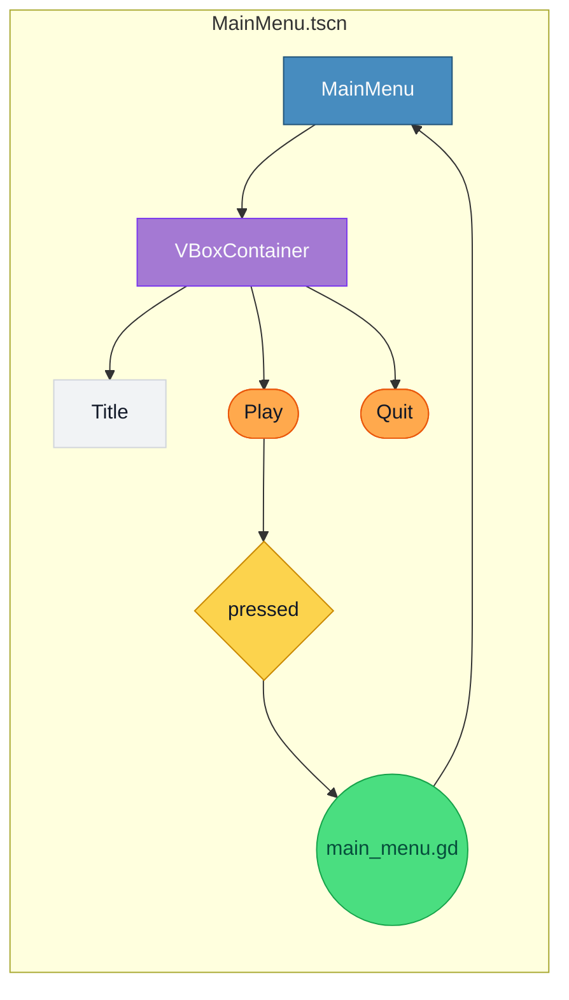

# godot-lexicon.md — Godot-läget i MermaidCanvas

Detta är **kontraktet** för Godot-läget: vilka former och regler som finns, hur de översätts till `.tscn`/`.gd`, och vad som **inte** är tillåtet.

> Princip: Mermaid-diagrammet är semantisk scene-blueprint. Pixelperfekt design hör inte hit — bara struktur, hierarki och signaler.

---

## Tillåtna kategorier (8 + note)

| Kategori | idPrefix | Mermaid-form (rekommenderad) | Godot-nod | Färg |
|---|---|---|---|---|
| **godot_scene** | `godot_scene_` | rektangel | `Control` / `Node2D` som scene-root (.tscn) | Godot-blå #478CBF |
| **godot_control** | `godot_control_` | rektangel | `Control` (generisk UI-bas) | grå #6B7280 |
| **godot_container** | `godot_container_` | rektangel | `VBoxContainer` / `HBoxContainer` / `MarginContainer` / `PanelContainer` | lila #A479D3 |
| **godot_panel** | `godot_panel_` | rektangel | `Panel` | beige #E9ECEF |
| **godot_button** | `godot_button_` | rundad rektangel | `Button` | orange #FFA94D |
| **godot_label** | `godot_label_` | text-form | `Label` | ljus grå #F1F3F5 |
| **godot_signal** | `godot_signal_` | romb (diamond) | signal-koppling (ej egen nod) | gul #FCD34D |
| **godot_script** | `godot_script_` | cirkel | GDScript-fil (.gd) attached to a node | grön #4ADE80 |
| **note** | `note_` | text-form | INTE i exporten — bara dokumentation | grön #ecfdf3 |

---

## Regler i Godot-läget

### Hierarki
- **Exakt en `godot_scene`** per fil. Den är roten i .tscn.
- Alla andra noder **måste ha en parent-edge** till `godot_scene` eller annan godot-nod. Lösa noder ignoreras i exporten.
- `godot_container` ska ha minst ett barn — annars varning.

### Edges = parent/child eller signal
- `-->` mellan två godot-noder = **parent → child** i scene-trädet (förstaste pilen avgör hierarkin).
- `-->` från `godot_signal` till en godot-nod = **signal connect**: `node.signal_name.connect(target_handler)`.
- `==>` (kritisk väg) = inte tillåten i Godot-läget. Använd vanlig pil.

### Signal-konvention
- `godot_signal`-formens **label** är signal-namnet (t.ex. "pressed", "value_changed", "timeout").
- Edge från `godot_button` → `godot_signal` betyder att knappen *avsänder* signalen.
- Edge från `godot_signal` → `godot_script` betyder att skriptet *lyssnar*.

### Script-konvention
- `godot_script`-formens **label** = filnamn (t.ex. `main_menu.gd`).
- `note`-fältet på scriptet = kort beskrivning av vad scriptet gör.
- Edge från `godot_script` → annan nod = scriptet är *attached* till den noden.

---

## INTE tillåtet i Godot-läget

| Förbjudet | Varför |
|---|---|
| `godot_*`-noder utan parent till scene-roten | Lösa noder hör inte hemma i en .tscn |
| Flera `godot_scene`-noder per fil | En fil = en scene |
| `==>` blockerande pil | Inte ett Godot-koncept |
| Råa hex-färger utanför kategorifärgerna | Använd kategori → får orkestrerat tema i Godot |
| `text`-form med Godot-roll | Text bor i `godot_label` |
| `note`-form med edges till godot-noder | Notes är dokumentation, ingen runtime-konsekvens |
| Label > 40 tecken i nod | Lång text → flytta till `note`-fältet |

---

## Mermaid-blocket i Godot-läget

Vad genereras i ```mermaid```-blocket:



---

## Sidecar-metadata (state-JSON)

Förutom Mermaid-blocket sparas allt i `<!-- mermaidcanvas-state ... -->`:

```json
{
  "specType": "godot",
  "canvas": { "width": 3000, "height": 3000, "unit": "pt" },
  "nodes": [
    { "id": "godot_scene_N0", "label": "MainMenu", "category": "godot_scene", ... },
    { "id": "godot_container_N1", "label": "VBoxContainer", "category": "godot_container", "godotProperties": { "container_type": "VBoxContainer", "anchor": "full_rect" } },
    ...
  ],
  "edges": [...]
}
```

`godotProperties`-fältet utvidgas över tid — t.ex. `anchor`, `size_flags`, `theme_variation`. Allt är optional och bara *hints* för exportören.

---

## Exportregler — .tscn

Ord-för-ord:
1. Hitta `godot_scene`-noden → blir scene-root.
2. BFS från root via parent-edges → bygger scene-träd.
3. Per nod, generera `[node name="..." type="..." parent="..."]`-sektion.
4. Per signal-edge (button → signal → target), generera `[connection signal="..." from="..." to="..." method="..."]`.
5. Per `godot_script`-nod attached till en nod, lägg till `script = ExtResource("scripts/<name>.gd")`.
6. Spara filen som `<scene_label>.tscn` på samma plats som markdown-filen.

---

## Exportregler — .gd

Per `godot_script`-nod:
- Skapa fil `<label>.gd` (t.ex. `main_menu.gd`).
- Initial-content: `extends <node_type>` + stub-funktioner för varje signal som skriptet lyssnar på.
- Exempel:
  ```gdscript
  extends Control

  func _on_play_pressed() -> void:
      # TODO: implementera
      pass
  ```

---

## Beslut för exportör-bygget

| Fråga | Default-val |
|---|---|
| Var sparas .tscn/.gd? | Bredvid markdown-filen, med samma basnamn |
| Versionering? | Varje export skriver över. Git tar versionshistoriken. |
| Tema? | Default Godot-tema. Egen tema-stöd i framtid via metadata. |
| Plattform? | Godot 4.x (4.3+ rekommenderat). |

---

## Vad som kommer i nästa iteration

Efter att första Godot-export funkar:
- Anchor / size_flags per `godot_control`
- Theme-overrides
- AnimationPlayer
- AutoLoad (singletons)
- Resource-filer (.tres)
- Signal-parametertyper
