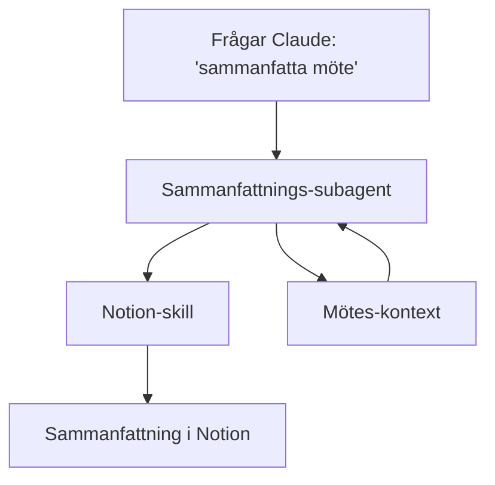

# Prompt-Process — Form-paket-regler (v31)

Form-paketet `Prompt-Process` är till för att rita Claude/AI-agent-flöden (likt n8n) med 6 kategorier som kopplas ihop med pilar.

## Tillåtna kategorier

| Kategori | Form | Färg (fill) | Användning |
|---|---|---|---|
| `subagent` | Rektangel | violett `#7c3aed` | Delegerad uppgift till annan Claude-instans via `Agent`-tool |
| `prompt` | Rektangel | emerald `#10b981` | Text-input till LLM (system-/user-/assistant-prompt) |
| `skill` | Rektangel | orange `#f97316` | Färdig skill (`~/.claude/skills/<name>/SKILL.md`) |
| `tool` | Rektangel | orange `#fb923c` | MCP-tool eller funktion som agenten anropar |
| `memory` | Rektangel | violett `#8b5cf6` | Persistent state mellan steg (filer, DB, kontext) |
| `output` | Rektangel | röd `#ef4444` | Slutpunkt — resultat-format till användare |

## Mermaid classDef

```
classDef subagent fill:#7c3aed,stroke:#5b21b6,color:#f9fafb
classDef prompt   fill:#10b981,stroke:#059669,color:#f9fafb
classDef skill    fill:#f97316,stroke:#c2410c,color:#f9fafb
classDef tool     fill:#fb923c,stroke:#c2410c,color:#f9fafb
classDef memory   fill:#8b5cf6,stroke:#6d28d9,color:#f9fafb
classDef output   fill:#ef4444,stroke:#b91c1c,color:#f9fafb
```

## Flödesmönster (typiska)

1. **Linjär:** `prompt → subagent → output`
2. **Med skill:** `prompt → skill → output`
3. **Tool-loop:** `prompt → subagent → tool → memory → subagent → output`
4. **Forking:** `prompt → subagent → [output_a, output_b]`

## Kopplingsregler

- En `prompt` ska alltid ha minst en utgående pil
- En `subagent` kan ha flera ingående och utgående pilar
- En `tool` är "leaf" — den anropas men returnerar via pil tillbaka
- En `memory` är en stateful nod som kan både läsas och skrivas till
- En `output` är terminal — inga utgående pilar förväntade

## Exempel-canvas → mermaid



## Vad Claude Code ser

När en canvas sparas i denna mode skrivs sidecar `prompt-process-rules.md` bredvid filen. Claude Code läser den för att förstå kategoriseringen och navigera flödet.
