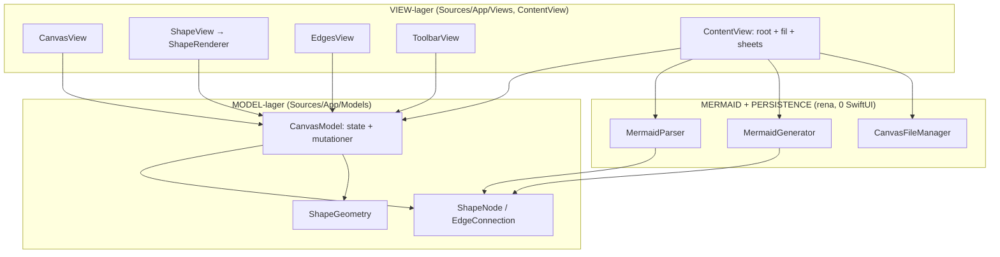

# ARKITEKTUR-MERMAID — Version 1.5.3 (redigerings-menyn rik + konsekvent + "se din text")
*Datum: 2026-06-30*

> **1.5.3 — inga lager-/modul-ändringar.** Fix 3+4 (Kims sim-bekräftade fynd): live-text-baren
> hade bara storlek+justering. Nu: `FormattingBar` får färg-paket-popup (`showColor`) + lista
> påslagen i live → samma rika meny i BÅDA lägen (storlek·justering·lista·indrag·färg·Klar, ingen
> scroll). OCH tangentbords-undvikning: den redigerade formen lyfts ovanför tangentbordet
> (`ZoomableCanvas.Coordinator` keyboardWillShow → contentInset + scrollRectToVisible; utbruten till
> `ZoomableCanvas+ScrollAssist.swift`, R5 358→339). `colorPackId` round-trippar redan (ingen ny
> bärare). 47 unit · arch · conformance/render 3/3 gröna. Nedan = 1.5-arkitekturen (oförändrad struktur).

> **1.5.2 — inga lager-/modul-ändringar (hotfix).** Mac-appen frös (huvudtråden i evig SwiftUI-
> omritnings-loop, 94% CPU → ikonen gick ej att klicka). Rot: `ZoomableCanvasMac.syncViewport()`
> avvek från iOS-tvillingen — skrev `@Published` utan likhetskoll OCH synkront från `updateNSView`
> varje ritning. Fix: spegla iOS-guards (skriv bara vid ändring) + async-defer. `deploy-mac.sh`
> härdad att fånga skenande CPU (en hängd app slank förbi förut). Bevisat: CPU 0%, popup öppnas,
> canvas renderar; 47 unit gröna. Nedan = 1.5-arkitekturen (oförändrad struktur).

> **1.5.1 — inga lager-/modul-ändringar.** Governance-reset (Kims order): underflöden/Visio-drill
> PARKERAT bakom `FeatureFlags.underflodenEnabled=false` (entry + dubbel-ram gömda; modell + round-trip
> orörda) → ROADMAP.md; PRODUKT.md scope-realign; regel 3b skärpt. Skriv-läge-fixar (Kims se-appen-fynd):
> Fix 1 autocorrect AV i form-text (`.autocorrectionDisabled()` HÖGT på ShapeView-ZStack — direkt på
> TextField:en kraschade SwiftUI env-diffing på iOS 26.4); Fix 2 röj skräpet (en Aa-glyf i `FormattingBar`,
> markerings-handtag gömda i skrivläge via `!isEditingText` i `CanvasView+Selection`, balanserad rad).
> 209 unit · arch · conformance/render 3/3. Nedan = 1.5-arkitekturen (oförändrad struktur).

> **1.5 — redigerings-menyn rätt (Kims v1.4-test: "massa fel" i skriv-läget):** Inga lager-/modul-
> ändringar. **Del A (en rad medan man skriver):** `CanvasModel.isEditingText` gatar `ToolbarView`s
> topp-sekundärrad → bara EN rad (keyboard-baren) vid inline-redigering; `FormattingBar` utan
> ScrollView, varje ikon poppar undermeny uppåt; svajp-grabber stänger sekundärrad. **Del B (storleks-
> galleri):** `TextStyle` 5 nivåer (Jätterubrik 40→Brödtext 14); `TextSizeGallery`-popover ritar varje
> i SIN storlek; generator-CSS extraherad → `MermaidGenerator+TextCSS` (UI-fri). **Del C (fet/kursiv/
> understruken):** 3 Bool på `ShapeNode` (state-JSON-only) + toggles i galleriet + `.italic/.underline`
> + additiv vikt. Sim-verifierat: en rad vid skrivning · galleri i verklig storlek · B/I/U syns.
> 209 unit · conformance 3/3 · render 3/3 · round-trip förlustfri. Per-ord rik text = v1.6.

> **1.4 — buggar + anteckning-pratbubbla + polish (Kims v1.3-test):** Inga lager-/modul-ändringar.

> **1.4 — buggar + anteckning-pratbubbla + polish (Kims v1.3-test):** Inga lager-/modul-ändringar.
> **Buggar:** mörkt läge — ny adaptiv `Color.appChipBackground` + fast ljus rityte-bakgrund
> (`ZoomableCanvas`) → mörk ram + alltid vit rityta; cirkel-radbrytning (`textHorizontalInset .circle`
> proportionell); punktlista syns (`FormattingBar.showListsAndIndent` döljer listor/indrag i keyboard-
> läget, visas när formen är markerad). **Anteckning → pratbubbla:** `NoteCard` = gul `SpeechBubble`
> med svans + vik-ikon (inget kryss), bara note-redigering direkt; NoteBadge-glyf → `bubble.left.fill`;
> visa/dölj alla på markering (multi-select-rad → openCards). **Polish:** kompakt `FormattingBar`
> (listor/justering → 1 ikon + popup); dra-in-grabber (`ToolbarView+Grabber`); markeringsknapp åter;
> mindre luft; 8 numrerade färgpaket (`ColorPack.pickerVisible`, ids stabila); minus-badge ut från gröna +.
> INGEN ny bärare. 205 unit · conformance 3/3 · render 3/3. Rik text (markera ord) = v1.5.

> **1.3 — redigeringsytan som fundament (Lucidchart-känsla):** Inga lager-/modul-ändringar (bara
> View-lagrets interna struktur). **Aldrig fast:** `ShapeView.onChange(of: isSelected)` nollar
> inline-redigeringen → ej markerad ⇒ ej redigering (tap-utanför/markera-annan/fokus-loss; sim-
> verifierat). **Anteckning = EN väg:** `NoteMiniSheet` raderad; långtryck "Anteckning" → NoteCard
> på canvasen (en skriv-väg, konsekvent ångra). **EN formateringsmeny:** ny delad `FormattingBar`
> (`Views/Formatting/`) renderas BÅDE som verktygsfältets textstil-rad OCH ovanför tangentbordet vid
> inline-redigering (Apple Notes-mönstret) → kan aldrig glida isär; `ToolbarView+TextStylesRow`
> 166→49 rad. EditShapeSheet slutar vara formateringsyta (värden bevaras via draft). **Rensat:**
> bluff-"Fet"-knappen + död kod (`ColorPickerPopover`, `ColorPackPopover`). Plus 4 interaktionsfixar
> (emoji-rutnät, kollaps-badge z-order, `toSide` mål-ankare + full regel-15, orthogonal routing).
> Inga nya bärare i redigerings-svepet. 205 unit · conformance 3/3 · render 3/3. Fas 2 (individuell
> text per rad: rubrik+fet+justering) = v1.4.

> **1.3 — redigeringsytan som fundament (Lucidchart-känsla):** Inga lager-/modul-ändringar (bara
> View-lagrets interna struktur). **Aldrig fast:** `ShapeView.onChange(of: isSelected)` nollar
> inline-redigeringen → ej markerad ⇒ ej redigering (tap-utanför/markera-annan/fokus-loss; sim-
> verifierat). **Anteckning = EN väg:** `NoteMiniSheet` raderad; långtryck "Anteckning" → NoteCard
> på canvasen (en skriv-väg, konsekvent ångra). **EN formateringsmeny:** ny delad `FormattingBar`
> (`Views/Formatting/`) renderas BÅDE som verktygsfältets textstil-rad OCH ovanför tangentbordet vid
> inline-redigering (Apple Notes-mönstret) → kan aldrig glida isär; `ToolbarView+TextStylesRow`
> 166→49 rad. EditShapeSheet slutar vara formateringsyta (värden bevaras via draft). **Rensat:**
> bluff-"Fet"-knappen + död kod (`ColorPickerPopover`, `ColorPackPopover`). Plus 4 interaktionsfixar
> (emoji-rutnät, kollaps-badge z-order, `toSide` mål-ankare + full regel-15, orthogonal routing).
> Inga nya bärare i redigerings-svepet. 205 unit · conformance 3/3 · render 3/3. Fas 2 (individuell
> text per rad: rubrik+fet+justering) = v1.4.

> **1.2 — UI/UX-städning (topprad + meny):** Inga lager-/modul-ändringar (bara View-lagrets interna
> struktur). Toppraden: 9→6 knappar+zoom-info → overflow borta (`LayoutOverflowTests` bevisar). Formpaket
> smälte in i Former som segment-flikar (`ToolbarView+ShapesRow`: Grundformer/Paket/Mallar + verktygsrad);
> `.packs` ur `SecondaryToolbarRow`. Marker-knapp → dubbelklick på tom canvas (`CanvasView`, count:2 före
> count:1) + hint + "Klar"-knapp. Zoom = ren info (behåller `.isButton`+diagnostik; reset → menyn). `LägenMenu`
> fick `Section`-rubriker (Skapa/Fil/Kod & export/Visa/Om appen) + "Funktionsöversikt"; Notis-chip → "Alla
> anteckningar" i menyn. Format/bärare orörda. 205 unit + UITest-svit · conformance 3/3 · render 3/3.

> **1.0 — skarp release (EN enda version, aldrig två):** version dubbel→ren `1.0` (AppVersion.version
> driver både app-etikett OCH bundle; bygg-räknaren slopad). Klassisk Apple-ikon (flödesnoder, indigo→violett).
> Färgmeny: avklippning lagad (`strokeBorder`), markeringsverktyg åter som synlig knapp i toppen, harmoniserad
> pastell-palett. **Två-lager-fundamentet bevisat + härdat:** AI-ramverket (`frameworkText`) bäddas nu in i VARJE
> exportfil (självförklarande för en främmande AI) + maskinellt embed-test + `BEVIS-TVÅLAGER.md`. 204 tester ·
> conformance 3/3 · render 3/3.

> **build v93 — kontroll-genomgång (MB Steg 1):** 16-ytors UI-audit (138 funktioner, sub-agents +
> adversariell verifiering). 21 fynd härdade inom befintliga filer (ingen ny modul, inga lager-ändringar):
> undo-snapshot på text-/färg-/pil-handtag, legend följer med vid import, låst barn står still i container,
> a11y-labels, döda kodbitar bort, dubbeltryck konsekvent i markeringsläge. 203 tester · conformance 3/3 ·
> render 3/3. Fynd-logg: `KONTROLL-FYND.md`. Funktionskarta: `FUNKTIONSKarta.md`.

> **v1.1 "Visio hoppa-in (underflöden)":** Kims "galen idé" byggd — en form kan ÄGA ett helt
> underflöde en nivå djupare (drill-down, skiljt från kollaps/container). Kontextmeny "Skapa
> underflöde"/"Hoppa in →"; brödsmule-bar (🏠 + "← Ut", tappbar — anti-vilse för 2e); dubbel
> inre ram = formen har underflöde; vy centreras vid in/ut. Data: `ShapeNode.subCanvas` (inline-
> ägt, nil default → befintlig round-trip orörd). Carriage: serialiseras via ShapeNodes egen
> Codable i state-JSON → **byte-exakt round-trip** inkl. nästlade UUID:n + multi-nivå. Sparandet
> viker drill-stacken non-destruktivt till roten (`rootForSave`) → autosave skriver aldrig ett
> underflöde som rot. Nya filer: `SubCanvas.swift`, `CanvasModel+Drill.swift`, `DrillBreadcrumbBar.swift`.
> 199 tester (navigation + round-trip gröna), render 3/3.

> **🎉 v1.0 "Pil-linjeformer + naken emoji + namn helt på canvasen":** **Pil-linjeform**
> (Rak/Böjd/Vinklad) i ny "Form på linjen"-meny — bärs NATIVT i mermaid via `linkStyle <i>
> interpolate` (bevisat: parsar + renderar i riktig mermaid.live, inte bara i appen) +
> `%% e<i> lineShape` + state-JSON; hand-böj vinner; container/iPhone aldrig hinder.
> **Naken emoji** (ShapeType `.emoji`, bara glyfen, byts fritt; round-trippar via label +
> `%% shape-type: emoji`). **Namn + anteckning helt på canvasen** (dubbeltryck → inline-kortet,
> även för ny/tom form). R5-utbrytningar: `MermaidGenerator+Edges.swift`, `MermaidParser+EdgeMeta.swift`.
> 197 tester, bijektion + round-trip per lineShape + emoji gröna, render 3/3 med linkStyle.

> **v87 (v0.9-forts.):** **OSX-app via Mac Catalyst** (Kims "lätt?" → ja; bygger+kör på Mac,
> nu universal iPhone+iPad+Mac). **"Fyra prickarna igen"** — 4 connection-handtag (ett per
> sida), pil går ut från vald sida (ej närmast). **Inline-redigering på canvasen** — namn +
> anteckning skrivs direkt i läs-lappen. (Mac: long-press → högerklick automatiskt via Catalyst.)
> KVAR (kräver Kims input): Fas 2 export-legend (gated) · Visio-drill "hoppa in" (scope) ·
> multi-fil-import (utforskande) · färg-UI-bygg (vagt).

> **v86 (v0.9-forts.) "V79-svep (byggbara delar)":** Facit-täckningsgrind
> (`AppCapabilitiesCoverageTests` — bijektion generator↔facit) + ärlig regel 15 (pekade
> förr på ett test som inte fanns). Facit-menyn "Hur funkar appen" redesignad (färg=
> överlevnad, riktiga glyfer, sök, sticky copy). **JPG-export** (PNG/JPG-val). **Import-
> mallen fixad** (lärde ut `<--` som kraschar mermaid → nu `frameworkText()`, alltid aktuell).
> **Snabb-mallar** (AI-Skill/UI/Arkitektur). **Snabb-navigeringsknapp** (centrera på innehåll).
> KVAR (kräver Kims input/scoping): Fas 2 export-legend (gated), edge-routing-ombyggnad,
> inline-canvas-text, + mega-projekt (OSX, Visio-drill, multi-fil-import). 197 tester gröna.

## Vad v0.9/v85 innehöll (föregående)

> **v0.9 "AI-ramverk som aldrig blir inaktuellt + Mermaid-vs-app-vy":** `AppCapabilities.swift`
> = SINGLE SOURCE OF TRUTH för "vad appen kan visa → vad en AI får använda i mermaid".
> Uttömmande `shape(_:)`-switch (ny ShapeType kompilerar inte utan rad) + `features`-lista
> driver BÅDE in-app-vyn **"Mermaid vs app-funktioner"** (LägenMenu, Kim ser native vs app-egna
> + bärare) OCH en copy-paste-bar **AI-ramvers-text** (`frameworkText()`, alltid genererad ur
> koden → kan aldrig bli stale). **CLAUDE.md regel 15** (icke förhandlingsbar): varje ändring
> måste hålla export↔import-round-trip + AppCapabilities aktuell; `AppCapabilitiesTests` +
> uttömmande switch tvingar currency. Milstolpe-etikett **v0.9** (bygg v85) visas i menyn.
> Verifierat: 193 unit-tester, arch-check, render-grind 3/3, round-trip stabil.

## Vad v84 innehöll (föregående — V79-feedback-svep, 7 features)

> **v84 "V79-feedback-svep (7 features)":** På Kims /goal byggdes 7 klara features ur
> V79-feedbacken (3 scoping-agenter kartlade först): **🔒 lås form** (hänglås — kan ej
> dras/storleksändras, round-trippar `%% locked`), **3 lager** (underst/mellan/överst —
> `ShapeNode.zLayer`, zIndex ±0,3, round-trippar `%% z`), **↪️ redo** (ångra åt båda håll),
> **"Spara Mermaid inom container"** (subset → ren mermaid-fil), **beroendepil-meny i
> kategorier** (Riktning/Stil-undermenyer), **container fri-resize nere höger**, **markera-
> flera ut ur huvudmenyn** (→ Lägen-menyn). Lås+lager round-trippar även på container (4 nya
> tester). Resten av V79-listan = idébank 💡#9–11 (OSX-app, Visio-drill, edge-routing, m.m.).
> Nya filer: `CanvasView+Selection.swift`, `Toolbar/ToolbarView+History.swift` (R5-utbrytningar).
> Verifierat: 191 unit-tester, arch-check, konformitet + render-grind 3/3, round-trip stabil.

## Vad v83 innehöll (föregående — pill-fix + fundament-verifiering)

> **v83 "pill-fix + fundament-verifiering":** Pill-formen rättad (140×60 var för platt →
> 138×74 proportionerlig kapsel; Kims fynd: ful oval-ikon). Fundamentet BEVISAT: scenario 39
> ritar alla basformer med text + kategori-färger, dumpar exakt mermaid (`-uitest-dump-doc`),
> renderar i RIKTIG mermaid (headless Chrome) och jämför mot app — native-former
> (cirkel/pill/rektangel/romb/cylinder) IDENTISKA (typ+text+färg); egna former visas som
> närmaste native men text+färg matchar exakt + identitet via `%%` → re-import exakt. Roten
> städad (stale fynd → arkiv/). 188 tester, render-grind 3/3, round-trip stabil.

## Vad v82 innehöll (föregående — fil-glyfer + UI-mall)

> **v82 "fil-glyfer + UI-mall (steg 8 del 2 + steg 9)":** Fil-former (MD/Excel) får
> igenkännings-glyf på canvasen (`ShapeCategory.fileGlyphSymbol` → `doc.text`/`tablecells`
> i ShapeRenderer). **UI-mall:** Mallar-menyn borttagen → iPhone 15/16 Pro som chips under
> UI-paketet; modellnamnet ritas UTANPÅ ramen (skärmytan fri); phoneFrame får bara
> proportionell resize. **phoneFrame-som-container:** ny `ShapeType.actsAsContainer`
> (container || phoneFrame) → former på skärmen blir barn (childOfContainerId), följer med
> vid flytt, round-trippar via state-JSON. **Byte-stabilitet:** state-JSON serialiseras med
> `.sortedKeys` (deterministisk ordning — tog bort flaky idempotens-test + onödig fil-diff).
> Verifierat: 188 unit-tester, arch-check, konformitet + render-grind 3/3, round-trip 3/3 stabil.

## Vad v81 innehöll (föregående — export-bild + render-grind)

> **v81 "Exportera som bild + render-trogen grind (steg G+H)":** Ny app-funktion
> **"Exportera som bild"** — PNG av enbart den ritade ytan (bbox, ej hela canvasen) via
> SAMMA vyer som canvasen (ShapeView/EdgesView i exportläge, ingen chrome) → kan aldrig
> avvika; sparas i Documents + delningsmeny. Export+render-jämförelsen avslöjade + tätade
> en **noll-avvikelse-bugg**: bakåtpil `<--` kraschade RIKTIG mermaid (mermaid.live) fast
> `mermaid.parse` släppte igenom — nu skrivs bakåtkant som omvänd framåtpil. Grinden är nu
> **render-trogen**: `mermaid-render-check.mjs` (headless Chrome) renderar fixturerna vid
> deploy + lint mot kända glapp i pre-commit. **G2**: basfigur-polish (triangel/romb-text,
> länk-färg, tabell-lager, Pill/Rektangel/Kvadrat åtskilda). **G1**: `EXTENDED-FORMAT.md`
> spikar app-only-lagret + `%% canvas-size` round-trippar nu i ren mermaid (sista tappade
> fältet). Verifierat: 187 unit-tester, arch-check, konformitet + render-grind 3/3, round-trip.
> Nya filer: `Views/Export/{ExportCanvasView,CanvasImageExporter,ActivityView}`,
> `ContentView+Canvas`, `ShapeView+Style`, `Toolbar/ToolbarView+Menu` (R5-utbrytningar).

## Vad v80 innehöll (föregående — STEG F)

> **v80 "noll-avvikelse-garantin (STEG F)":** Round-trip är nu bevisat förlustfritt och
> maskinellt tvingat. Det app-egna lagret ("Extended": `%%`-metadata + state-JSON) bär
> ALLT mermaid saknar (position, färg, storlek, rotation, kollaps, länk, waypoints,
> container-stil, form-typ) utan att skada ren mermaid → överlever om filen skickas till en
> vän. Parsern kapar inte längre tyst ("filen är sanningen"). Verifierat: 186 unit-tester
> gröna, 3/3 fixtures parsar i RIKTIG mermaid, round-trip-grind i pre-commit + deploy, två
> agent-par bekräftade noll avvikelse. MERMAID-FAKTA.md är skrivskyddad facit-bibel (444).

## Vad v80 innehåller (utöver v79)
- **Noll-avvikelse round-trip:** exakt Double-position; 5 former + textjust/listor/waypoints +
  container-stil överlever REN mermaid via `%%`; clamp borttaget (parsern bär exakt filens värden).
- **Extended-lagret formaliserat:** två bärare — `%%`-rader (mermaid ignorerar) + `<!-- state -->`
  (exakt kopia). CLAUDE.md regel 3 omskriven (a/b/c + Apple-robust + metodiskt-genom-former).
- **Maskinell round-trip-grind** i `scripts/hooks/pre-commit` (körs när `Sources/Mermaid/` ändras) + deploy.
- **Nya filer (R5-utbrytningar):** `MermaidGenerator+StateJSON.swift`, `MermaidParser+TextHelpers.swift`,
  `UITestScenarios+FormReview.swift`, `Color+Hex.swift`. Skill-flöde-meny (steg 8 del 1): `.mcp/.plugin/
  .fileMarkdown/.fileExcel` + `ShapePack.skillFlow`.
- **Version-sync:** bundle härleds från `AppVersion.swift` (v80 → 1.80.0 / 80).

## Vad v79 innehöll (milstolpe MA — föregående)
> **v79 "arkitektur-ombyggnad KLAR (milstolpe MA)":** Funktionellt identisk med v77/v78 —
> men nu är ALLA fyra monoliter nedbrutna under 300 rader, koden lagerindelad och
> maskinellt grindad, och Claude kan se/styra appen i simulatorn. Verifierat: 171 unit-
> tester gröna + arch-check grön efter varje steg, samt sim-koll (pil-rendering, toolbar,
> sheets, lägg-form + ångra med rerender).

## Vad v79 innehåller (slutförd MA-milstolpe, utöver v78)
- **Alla fyra monoliter < 300 rader** (mönster: dela typen över extension-filer, @Published-/stored-fasaden kvar i original-typen → rerender oförändrad):
  - **CanvasView** 1781 → **297** (EdgeGeometry/EdgeDrawing/EdgeMidpointHandle/EdgesView i `Views/Canvas/` + CanvasView+Helpers).
  - **ToolbarView** 1069 → **237** (6 extension-rader i `Views/Toolbar/`).
  - **ContentView** 691 → **225** (`ContentView+Files` fil/autosave/drop/scenario + `ContentView+Sheets` attachSheets-kedjan).
  - **CanvasModel** 857 → **56** (7 ansvars-extensions: Shapes/Selection/Containers/Collapse/Edges/Undo/Platform; `@Published`-fasaden kvar i klassen).
- **Lagerindelning** (View → Model → Mermaid/Persistence) med tvingad beroenderiktning.
- **Maskinell grind** (`scripts/arch-check.py` + pre-commit): filstorlek-ratchet, lager-regler, version-sync, inga kraschpunkter i Model/Mermaid.
- **Skyddsnät**: 36 unit-tester (djup round-trip, per-fält-symmetri, CanvasModel-beteendespec).
- **`se-appen`**-loopen: Claude bygger/startar sim, tar egen skärmbild, läser UI + state-dump, trycker/drar.
- **Version-sync**: bundle-version härleds från `AppVersion.swift` (v79 → 1.79.0 / 79).

## Lager + flöden

arch-check.py (pre-commit) tvingar pilarnas riktning + filstorlek + version-sync.

## Komponenter

| Komponent | Fil | Ansvar |
|---|---|---|
| Root-vy | `Sources/App/ContentView.swift` (+`ContentView+Files`/`+Sheets`) | App-root + filhantering/autosave + sheet-kedja (225 / 248 / 250) |
| Canvas-vy | `Sources/App/Views/CanvasView.swift` (+`CanvasView+Helpers`) | Canvas-content + interaktion (297 / 54) |
| Kant-lager | `Sources/App/Views/Canvas/{EdgesView,EdgeMidpointHandle,EdgeDrawing,EdgeGeometry}.swift` | Pilar + handtag + bezier-ritning/geometri (178 / 191 / 198 / 220) |
| Form-vy | `Sources/App/Views/Canvas/ShapeView.swift` | En forms vy + gester (279) |
| Form-rendering | `Sources/App/Views/Canvas/ShapeRenderer.swift` | Bakgrund/ram/highlight per ShapeType |
| Canvas-hjälpvyer | `Sources/App/Views/Canvas/{ConnectionOverlay,FreeLineView,ShapeBackgrounds}.swift` | Rubber band/handtag, lösa linjer, tabell/länk-bakgrund |
| Verktygsrad | `Sources/App/Views/ToolbarView.swift` (+`Views/Toolbar/ToolbarView+*Row`/`+Chips`) | Form/färg/textstil/paket/multi-select (237 + 6 extensions, alla <300) |
| Modell | `Sources/App/Models/CanvasModel.swift` (+7 `CanvasModel+*` extensions) | All state (@Published-fasad) + mutationer (56 + Shapes/Selection/Containers/Collapse/Edges/Undo/Platform) |
| Datatyper | `Sources/App/Models/{ShapeNode,EdgeConnection}.swift` | Former + kanter (Equatable + Codable) |
| Geometri | `Sources/App/Models/ShapeGeometry.swift` | Bredd/höjd/hit-test (ren domänlogik) |
| Mermaid | `Sources/Mermaid/{MermaidParser,MermaidGenerator}.swift` | Text ↔ modell (round-trip, 0 SwiftUI) |
| Persistens | `Sources/App/Persistence/*.swift` | iCloud-fil-IO + dokument |
| Testläge | `Sources/App/{UITestScenarios,StateDump}.swift` | Känt canvas-innehåll + state-dump för se-appen |
| Version | `Sources/App/AppVersion.swift` | Single source of truth (v79) |

## Kärninvarianter (icke förhandlingsbara)
- **Förlustfri round-trip + korrekt semantik:** canvas → mermaid/state-JSON → canvas ger IDENTISK bild. Bevisas av `RoundTripFidelityTests` + `StateJSONSymmetryTests` (måste vara gröna före deploy).
- **Mermaid-blocket självbärande** (v61): state-JSON är sanningskällan; mermaid-fallback finns kvar för AI-ritade filer utan JSON.
- **Lagerregler** (ARKITEKTUR-REGLER.md): Mermaid rör aldrig UI; Model ritar aldrig; jättefiler får bara krympa.

## Att verifiera på iPhone (Kims ögon)
- Appen startar och visar **v78** i status-baren.
- Öppna en befintlig canvas-fil, flytta former, dra en pil, spara — inget tappas (round-trip).
