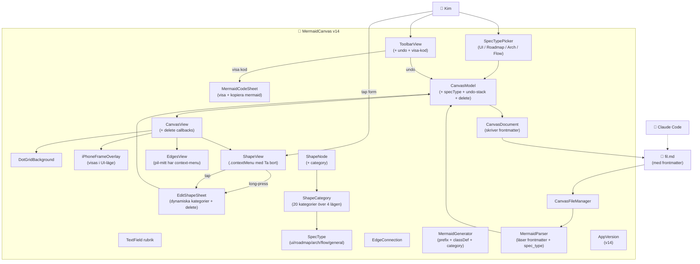

# ARKITEKTUR-MERMAID — Version v19
*Datum: 2026-05-15*

> **Status:** v19 = STOR major release. Lucidchart-grade canvas: pan/zoom på 3000×3000, direkt-manipulation via selection-handtag, multi-select drag-rectangle, edge waypoints, färgväljare, tabell + jump-link, expand/collapse, ny canvas-prompt. Allt round-trippas i mermaid + state-JSON.

## Ändringar från v18 — v19 STORA RELEASE

**Block A — Canvas-grund:**
- 3000×3000pt fast canvas, prickrutnät över hela
- Pan via en-finger-drag på tom area
- Pinch-zoom (MagnificationGesture)
- Dubbeltap = växla 1× ↔ 1.5× zoom
- iPhone-ram (UI-mode) som canvas-overlay med fast 393×852 centrerad

**Block B — Direkt-manipulation:**
- Tap = select (visar handtag), dubbeltap = öppna edit-sheet
- 4 hörn-handtag för resize (drag hörn = ändra size)
- 1 topp-knopp för rotation (drag = snurra)
- Handtag-storlek minst 24pt (HIG) oavsett zoom

**Block C — Multi-select:**
- Marker-mode-knapp i toolbar (rectangle.dashed)
- Drag-rectangle markerar alla former inom
- Markerings-ringar runt selected former
- I marker-mode: shapes dimmas till 0.6 opacity (visuell feedback)

**Block D — Edge waypoints:**
- EdgeConnection får `waypoints: [EdgeWaypoint]`
- Liten cirkel-handtag på edge-mitt (visas i color om waypoint finns)
- Drag → skapar L-formad path
- Context-menu på handle: "Räta ut" eller "Ta bort pil"

**Block E — Färg + note-badge:**
- ShapeNode.colorOverride: String? (hex)
- ColorPickerPopover med 8 palette-färger + "återställ till kategori"
- NoteBadge (gul med "note.text"-ikon) visas i topp-höger när shape.note inte är tom
- Tap på badge → öppnar edit-sheet (där note finns)

**Block F — Special-former:**
- ShapeType.table — 3×3 grid med streckade celler
- ShapeType.link — cirkel med länk-ikon + nummer
- SpecialShapesMenu (+ -knapp i toolbar) → tabell / jump-link
- Jump-link-par: två länkar med samma nummer skapas samtidigt; tap på en panar vyn till partner med spring-animation

**Block G — Canvas-management:**
- Ny canvas-knapp i ⋯-meny → confirmation-dialog "Spara först eller förkasta?"
- CollapseBadge (+/- indigo-knapp) visas i botten-höger på former med outgoing edges
- Tap på +/- kollapsar BFS-set av downstream-shapes
- collapsedIds: Set<UUID> i CanvasModel; sparas i state-JSON som `collapsed: [ids]`

**Block H — Mermaid + state-JSON utvidgning:**
- `%% NX color: #hex` i mermaid-block
- `%% NX link: N` för jump-link-nummer
- `%% NX table: 3×3` för tabeller
- `%% NX collapsed` för kollapsade
- `%% eN waypoint: x,y` för edge-mid-punkter
- State-JSON nodes: `color`, `linkNumber`
- State-JSON edges: `waypoints: [{x, y}]`
- State-JSON root: `collapsed: [mermaidIds]`

**Block I — Toolbar v19:**
- Vänster del scrollbar: 4 shapes (drag) + SpecialMenu + pil + marker
- Höger del fast: undo + ⋯ + Spara
- Tap-targets 44pt (HIG)
- ⋯-menyn: Färg (om selected), Preview, Visa filinnehåll, Ny canvas, Öppna fil

**Block J — Sub-agent-validerade fixar:**
- Sub-agent #1 (gesture-konflikt): markerMode disabler shape-gestures, gestures dispatchas korrekt
- Sub-agent #2 (toolbar-bredd): ScrollView wrapping shape-knappar, fasta knappar höger
- Sub-agent #3 (final UX): min tap-target 24pt på handles, badges 20pt, dimning i marker-mode

## Ändringar från v17

1. **Rotation per form:** nytt `rotation: CGFloat`-fält på ShapeNode (-180...180°). EditShapeSheet får rotation-slider med step 5°, Återställ-knapp. ShapeView applicerar `.rotationEffect`. Round-trippar i state-JSON och visas som `%% NX rot: 45°` i mermaid-blocket.
2. **iPhone-frame i canvas-meta:** ny `iphoneFrame: {x, y, width, height, designWidth, designHeight}` i state-JSON. Detta är iPhone-ramens **absoluta koordinater inom canvasens koordinatsystem** — så Claude kan exakt avgöra om en form ligger inom skärmen och beräkna iPhone-screen-relativa koordinater.
3. **Shared iPhone-matte (`iPhoneFrameMath.swift`):** en sanningskälla för aspect-fit-beräkningen, används av iPhoneFrameOverlay, UIScreenRenderer och MermaidGenerator. Tidigare hade var och en sin egen kopia som kunde drifta isär.
4. **showLabel synligt i mermaid:** `%% NX hidden-label` när text är dold.
5. **specType även i state-JSON:** dubbel-sanning så även filer utan korrekt frontmatter kan tolkas.

> 1. Mermaid-koden syntes inte i modalen (SwiftUI tolkade triple-backticks som markdown) — fix: `Text(verbatim:)`
> 2. Toolbar overflowade ~60% (~629pt på 393pt iPhone) — fix: ...-meny för sekundära actions, 44pt tap-targets
> 3. Preview-komponenter hamnade fel — fix: korrekt centrerings-matematik mot phone-origin

## Ändringar från v16

1. **MermaidCodeSheet — `Text(verbatim: code)`:** SwiftUI tolkade triple-backticks och `#`-rubriker som markdown vilket dolde mermaid-blocket. Verbatim stoppar all markdown-parsing.
2. **Toolbar redesignad — primary + ...-meny:** synligt: 4 shapes, pil, undo, ..., spara. ...-meny innehåller Preview, Visa filinnehåll, Öppna fil. Tap-targets ökade från 36 till 44pt (HIG).
3. **UIScreenRenderer — korrekt positionering:** `position(x: phoneOriginX + phone.width * relX, ...)` istället för broken offset-trick. Komponenter hamnar nu inom iPhone-ramen istället för i hörnet.

> Kim ser sin canvas + öppnar Preview → ser hur kategorierna översätts till faktisk SwiftUI-vy
> (iPhone-simulering i UI-läge, listsektioner i Roadmap, filträd i Arkitektur, numrerad pipeline i Flow).
> Om Preview ser fel ut: justera översättningsreglerna i `Sources/Preview/`.

## Ändringar från v15

1. **Preview-flik (eye-ikon i toolbar)** — öppnar en sheet med UIRenderer.
2. **UIRenderer** (dispatcher) väljer renderer per spec_type.
3. **UIScreenRenderer** (UI-mode) — iPhone-chassi med Dynamic Island, komponenter positioneras proportionellt. Inferens från label: knapp/mätare/textfält/titel/ikon → motsvarande SwiftUI-komponent. zone = streckad container, overlay = material-chip, note = filtreras bort (kommentar, inte UI).
4. **RoadmapRenderer** — listsektioner: Milestones → Features → Blockers → Future → Notes.
5. **ArchitectureRenderer** — folder/file-träd via närhets-heuristik + module/service/data som kort.
6. **FlowRenderer** — numrerad pipeline i ordning input → router → agent → tool → memory → output.
7. **PreviewSheet** — sheet-wrapper med stäng-knapp.

## Ändringar från v14

1. **ShapeType.text:** nya transparent text-objekt utan kant/fyllning. Drag-källa i toolbar (`textformat`-ikon).
2. **Anteckningar synliga i mermaid:** per-form `note`-fält skrivs som `%% NX note: ...` i mermaid-blocket. Storlek och position skrivs också som `%%`-kommentarer.
3. **iPhone-ram som subgraph:** när `specType == .ui` wrappas alla noder i `subgraph iphone["iPhone 393×852"]` så ramen är data i filen, inte bara visuell overlay.
4. **Kod-modal visar HELA filen:** frontmatter + mermaid + state-JSON — så Kim ser exakt vad som sparas och Claude läser.
5. **MermaidGenerator.generate(...)** tar nu också canvasSize och specType för korrekt ram + dimensioner.

## Diagram

## Ändringar från v13

1. **Fyra tankelägen i appen:** ny `SpecType` enum (`ui` / `roadmap` / `architecture` / `flow` / `general`). Topp-picker styr aktuellt läge. Sparas i frontmatter som `spec_type`.
2. **Utvidgad `ShapeCategory`:** 20 kategorier över alla fyra lägen. `ShapeCategory.available(for: specType)` returnerar relevanta kategorier per läge. `note` finns med överallt.
3. **Frontmatter i sparad fil:** `--- title / spec_type / last_updated ---` skrivs av `CanvasDocument`. `MermaidParser` läser frontmatter och sätter spec_type på model.
4. **Prickrutnät (`DotGridBackground.swift`):** subtila prickar för visuell alignment. Ingen export.
5. **iPhone-ram (`iPhoneFrameOverlay.swift`):** visas bara när `specType == .ui`. Aspect-fit 393:852 (iPhone 15 Pro), notch som visuell guide.
6. **Ta bort:** form-context-menu (long-press) → Redigera / Ta bort. Pil-mitt har context-menu → Ta bort pil. Edit-sheet har destructive delete-knapp med bekräftelse.
7. **Undo:** `CanvasModel` har snapshot-stack (30 djup). Toolbar-knapp ångrar senaste mutation. Stacken rensas vid fil-öppning.
8. **Visa Mermaid-kod (`MermaidCodeSheet.swift`):** bottom sheet visar genererad mermaid, copy-knapp.
9. **Dynamiska kategorier i EditShapeSheet:** ≤4 → segmented picker, >4 → grid. Visar bara kategorier för aktuell spec_type.
10. **AppVersion bumpad till v14.**

## Komponenter — ändringar/nya filer i v14

| Komponent | Fil | Status |
|---|---|---|
| SpecType | `Sources/Models/SpecType.swift` | **NY** — fem tankelägen + default-kategori per läge |
| ShapeCategory | `Sources/Models/ShapeCategory.swift` | Utvidgad: 20 kategorier över 4 lägen + färger via hex-helper + `available(for:)` |
| CanvasModel | `Sources/Models/CanvasModel.swift` | + `@Published specType`, undo-stack, `deleteShape`, `deleteEdge`, `setSpecType` |
| CanvasDocument | `Sources/Persistence/CanvasDocument.swift` | Skriver frontmatter med spec_type |
| MermaidParser | `Sources/Mermaid/MermaidParser.swift` | Läser frontmatter + spec_type |
| SpecTypePicker | `Sources/Views/SpecTypePicker.swift` | **NY** — topp-segmented picker |
| EditShapeSheet | `Sources/Views/EditShapeSheet.swift` | Dynamiska kategorier per spec_type + delete-knapp |
| DotGridBackground | `Sources/Views/DotGridBackground.swift` | **NY** — prickrutnät |
| iPhoneFrameOverlay | `Sources/Views/iPhoneFrameOverlay.swift` | **NY** — iPhone-ram-overlay i UI-läge |
| MermaidCodeSheet | `Sources/Views/MermaidCodeSheet.swift` | **NY** — kod-modal med kopiera |
| CanvasView | `Sources/Views/CanvasView.swift` | + delete-callbacks, prickrutnät, iPhone-ram, context-menu på shape och edge |
| ToolbarView | `Sources/Views/ToolbarView.swift` | + undo-knapp + visa-kod-knapp |
| ContentView | `Sources/ContentView.swift` | Pipa allt nytt — SpecTypePicker, callbacks, code-sheet |
| AppVersion | `Sources/AppVersion.swift` | `v13` → `v14` |

## Planerat för v15 och framåt

- **MVP-3 (kritisk grind)**: end-to-end-test där Claude genererar SwiftUI från en Kim-ritad ui-spec.md.
- **MVP-4**: UI-subtyper inom kategori `ui` (knapp, panel, mätare, ikon, textfält).
- **MVP-5**: pan/zoom på oändlig canvas + minimap.
- **MVP-6**: multiselect + flytta grupp, jump-links, kollaps/expand.
- **MVP-7**: NSFilePresenter för automatisk live-reload utan re-öppna.
