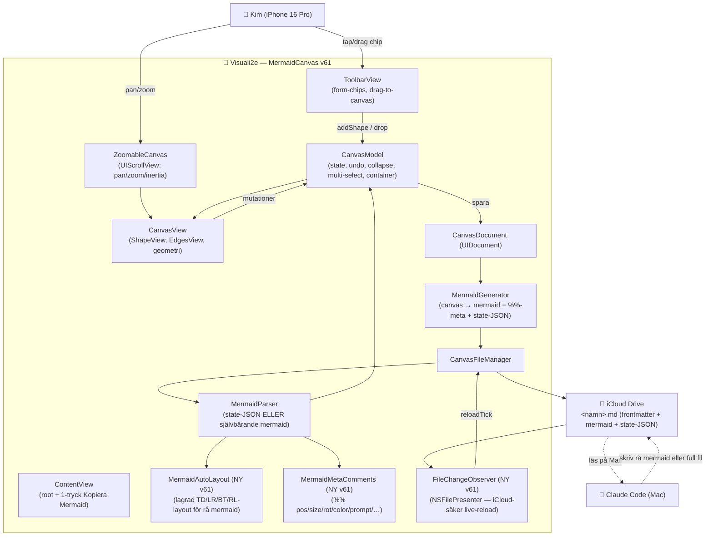

# ARKITEKTUR-MERMAID — Version v62
*Datum: 2026-06-06*

**Aktuell version:** v62 — Kims tre fynd från v61.2: (1) pilspetsar följer linjens
faktiska riktning (bezier-tangent, inte sid-normal), (2) kant-etiketter kan placeras
ovanför/under pilen (`EdgeConnection.labelPlacement`), (3) separat fyllnings- och
ram-färg per form (`colorOverride`/`strokeColorOverride` + Paket|Fyllning|Ram-segment
i färg-raden). Bygger på v61-serien: självbärande mermaid, auto-layout för rå
Claude-mermaid, iCloud-live-reload, skill-kedjor (`SKILL-KEDJA-KONTRAKT.md` +
skillen `flode`). Detaljer per version i ROADMAP.md.
**Single source of truth för version:** `app/MermaidCanvas/Sources/App/AppVersion.swift`

> Detta dokument speglar **nuvarande** kod (v61). Den kompletta modul-kartan med
> ansvarsfördelning bor i `BLUEPRINT.md` — det här dokumentet ger systemöversikten,
> dataflödet och Mermaid-diagrammet. Tidigare arkitektur-versioner: `arkiv/ARKITEKTUR-MERMAID-vN.md`.

---

## Vad appen är (oförändrat sedan grunden)

En native SwiftUI iPhone-app — en visuell flödesschema-editor (känsla: Lucidchart).
Former dras/skapas på en canvas, text bara *i* former, riktade pilar mellan former.
Allt persistas som **Mermaid-kod i en markdown-fil i iCloud Drive**. Claude Code läser
och skriver samma fil → tvåvägs visuellt språk mellan Kim och Claude Code.

Canvas-filer: `~/Library/Mobile Documents/com~apple~CloudDocs/00000. Claude Code/1. Mermaid/`

---

## Modul-karta (kondenserad — full version i BLUEPRINT.md)

```
Sources/
├── App/
│   ├── AppVersion.swift              versionsnummer (single source of truth)
│   ├── MermaidCanvasApp.swift        app-entry
│   ├── Orientation.swift             skärmläge porträtt/landskap (UIKit-livscykel, v60.1)
│   ├── ContentView.swift             root: toolbar + canvas + sheets + tomt-tillstånd
│   ├── Canvas/                        ZoomableCanvas (UIScrollView), CanvasViewportState, FloatingChipPreview
│   ├── Models/                        CanvasModel (state/undo/collapse/multi-select/container),
│   │                                  ShapeNode, EdgeConnection, ColorPack, TextStyle
│   ├── Views/                         CanvasView (ShapeView/EdgesView/geometri), ToolbarView,
│   │                                  EditShapeSheet, EmptyCanvasHint, badges, popovers, sheets
│   ├── Views/Handles/                 SelectionHandles (resize+rotation), SelectionOutline
│   ├── Persistence/                   CanvasDocument (UIDocument), CanvasFileManager (iCloud),
│   │                                  FileChangeObserver (NSFilePresenter live-reload, NY v61)
│   └── Preview/                       Flow/Architecture/UI/Godot/Roadmap-renderare
├── Mermaid/                           MermaidGenerator (canvas→kod), MermaidParser (kod→canvas),
│                                      MermaidAutoLayout (lagrad layout för rå mermaid, NY v61),
│                                      MermaidMetaComments (%%-kommentar-läsare, NY v61), SpecType
└── ClaudeCode/                        Platform, PlatformRules, ShapeCategory, ShapePack
```

**Kärninvarianter:**
- **Mermaid-blocket är självbärande (v61).** Fallback-parsern läser ALLA `%%`-metadata-
  kommentarer (pos, size, rot, width/height, color, pack, style, note, prompt, name,
  hidden-label, collapsed, link, table, line-end) → full round-trip även UTAN state-JSON.
  State-JSON förblir autoritativ när den finns.
- **Rå mermaid från Claude renderas som riktigt flödesschema (v61).** `MermaidAutoLayout`
  ger lagrad BFS-layout som följer `flowchart TD/LR/BT/RL` — inte cirkel. Parsern förstår
  inline-kanter (`a["X"] --> b["Y"]`), ocitate labels (`a[X]`), nakna id:n (`A --> B`),
  tjocka pilar (`==>`) och inline-etiketter (`-- text -->`).
- **Live-reload är iCloud-säker (v61).** `FileChangeObserver` (NSFilePresenter) får riktiga
  notiser när Claude/iCloud skriver i filen; innehålls-hash skiljer extern ändring från egen.
  Datum-polling kvar som fallback.
- **Chip ↔ canvas single source (v50.8):** `DesignTokens` — chips och canvas kan inte glida isär.
- **Modellen muteras aldrig direkt från View** — alltid via `CanvasModel`-metoder (undo-snapshot).
- **Förlustfri round-trip** (fidelity + semantik) är icke förhandlingsbar — `METOD-VISUELL-DIALOG.md`.
- **Ny data i ShapeNode/EdgeConnection** är alltid Codable med bakåtkompatibel default.

---

## Diagram



---

## v61 — denna version (gap-analys + "ren mermaid i backend")

Bygger på `GAP-ANALYS-v61.md` (4 granskar-agenter + adversarial verifiering, 23 agenter).
Målet: Kim ritar → kopierar mermaid rakt av till Claude Code; Claude ritar → Kim SER det.

1. **Rå mermaid från Claude → riktig layout.** Ny `MermaidAutoLayout`: BFS-nivåer från
   kanterna, följer `flowchart TD/LR/BT/RL`. Ersätter cirkel-placeringen.
2. **Mermaid-blocket självbärande.** Ny `MermaidMetaComments` läser alla `%%`-kommentarer
   som generatorn redan skrev men parsern aldrig läste (pos, size, rot, color, prompt, …).
3. **Claude-typisk syntax stöds:** inline-kanter `a["X"] --> b["Y"]`, ocitate labels,
   nakna id:n, `==>`, `-- text -->`, `subgraph id` utan label, `:::kategori` utan fantomnoder.
4. **iCloud-säker live-reload.** `FileChangeObserver` (NSFilePresenter) + innehålls-hash.
5. **1-tryck "Kopiera Mermaid-kod"** i Lägen-menyn (hela dokumentet till urklipp + haptik).
6. **Pil-tips i tom-canvas-hinten** (UX-009 delvis).
7. **`N8N-FLODE-KONTRAKT.md`** — kategori→nodtyp, kantetikett→villkor, prompt→trigger;
   Claude bygger n8n-workflow/skill utan att gissa.

**Tester:** `V61FallbackParserTests` (13 st) + `V61LiveReloadTests` (2 st). Hela
unit-sviten grön.

---

## Att verifiera på iPhone vid denna deploy (v61)

- [ ] Lägen-menyn → "Kopiera Mermaid-kod" → klistra in i Anteckningar = hela dokumentet
- [ ] Claude skriver rå mermaid (utan state-JSON) i canvas-filen → appen visar flödesschema, inte cirkel
- [ ] Claude ändrar i öppen fil → appen uppdaterar inom någon sekund (utan omöppning)
- [ ] Tom canvas visar pil-tipset
- [ ] Kvarstår från v60.1: forcerad landskap + container-drag-känsla
