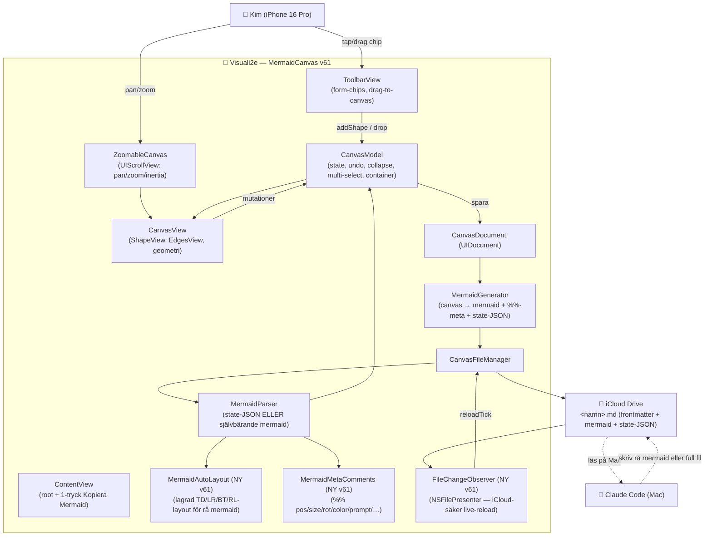

# ARKITEKTUR-MERMAID — Version v74
*Datum: 2026-06-11*

> **v74 "portabel skill-export + skill-nummer":** exporten är nu SJÄLVBÄRANDE — en
> exporterad skill-fil fungerar på vilken Claude Code som helst, utan skills och utan
> projekt (bevisat med främmande agenter: pass-, fail- och tomt-flöde-körningar).
> Kod-ändringar: (1) **`SkillExportContract.swift`** (ny, Sources/ClaudeCode/) — det frysta
> exekverings-kontraktet v1; master i repo-roten `EXPORT-KONTRAKT.md`. (2) **`SkillFileComposer.swift`**
> (ny, Sources/App/Persistence/) — "Spara skill som fil" bygger nu frontmatter
> (skill_name/skill_nr/contract_version) + kontrakt + mermaid + state-JSON;
> `ContentView.performSaveSkillFile` använder composern i stället för rå CanvasDocument.
> (3) **`ShapeNode.skillNumber`** (kedje-ordningsnummer, "Skill 2") — round-trippar via
> state-JSON OCH `%% <id> skill-nr: N`-kommentar (MermaidGenerator/MetaComments/Parser).
> (4) **Parserfix:** subgraph-containrar i ren-mermaid-fallback får kategori via id-prefix
> (var hårdkodad `.ui` → skill-identiteten tappades utan state-JSON). (5) **EditShapeSheet:**
> skill-containrar får sektionen "Skill-nummer (ordning i kedjan)" (toggle + stepper).
> (6) **Container-rendering:** skill-headern visar "Skill N · namn", lång text krymper/
> trunkeras snyggt, skill-ram 2pt/0.8 (vanlig grupp 1.5pt/0.6). Tester: `V74SkillNrTests`
> (5 st) + UI-testet `V74SkillExportUITest` som kör appen själv: skapar skill-container,
> sätter Skill 1, exporterar via long-press-menyn — filen verifierad portabel.
> Utanför appen: `visual-flow-test-portabel.md` + `demo-skill.md` (appens egen export) i
> iCloud-Mermaid; mfp-ritningarna har skill-nr 1 (site-intelligence) och 2 (sortiment).

> **v73 "audit-fixar + redundans-pipeline":** full UX-audit (Claude + 6 personas, se
> `UX_PERSONA_AUDIT.md`) följd av 11 fixar samma session. Kod-ändringar:
> (1) **UX-110 round-trip:** `MermaidGenerator.containerChildrenIds` använder nu explicit
> `childOfContainerId` (samma sanning som state-JSON) i stället för positions-gissning;
> `CanvasModel.addShape` låter containrar **adoptera direkt vid spawn** (`claimChildren`)
> och **kaskadas inte** (de ska wrappa mitten). (2) **Kaskad-steg 96pt** (var 28 — mindre än
> formerna, högen bara gled isär). (3) **"Spara skill som fil" frågar efter namn** när
> containern saknar riktigt namn (ny alert + `CanvasModel.renameShape`; namnet döper även
> containern). (4) **EditShapeSheet:** prompt-fältet flyttat ÖVER anteckningen + ny rubrik;
> `interactiveDismissDisabled` vid osparade ändringar (dataförlust-skydd); `ShapeEdit: Equatable`.
> (5) **A11y:** canvas-former exponeras som element med svensk label (kategori + namn);
> pilhandtaget heter "Skapa pil" (var "arrow.up.right"). (6) **Tomma noder** visar kategori-
> platshållare (bara visning, exporten orörd). (7) **UI- och Prompt-Process-paketen fick chips**
> (var döda segment — `availableCategories` var död kod); pack-chips radbryts inte längre.
> Skill-lagret (utanför appen): Skill 1 **mfp-site-intelligence v2** (4-vägs discovery-våg +
> gap-analys + konsensus-grind + verifieringsloop) och Skill 2 **mfp-sortiment** (E1/E2-par)
> byggda; redundans-mönstret låst i `SKILL-KEDJA-KONTRAKT.md` (våg-grupp = inre container).

> **v72 "save/handover":** dokumentations-milstolpe inför `/clear`. INGEN arkitektur-/kod-ändring
> (bara AppVersion v71→v72). Full beslutslogg + nuläge: **`arkiv/HANDOVER-v72.md`**. Arkitekturen
> nedan beskriver fortsatt v71-koden. Plan-filen + CLAUDE.md uppdaterade att peka på MFP-pipelinen.

> **v71 "legend som översättare":** varje skill-flödes mermaid bär nu ALLTID en legend som
> översätter formtyp → betydelse. `MermaidGenerator.generate()` auto-fyller `%% legend
> <kategori>: <text>` per använd kategori (manuell rad vinner, annars `ShapeCategory.pickerHint`).
> `MermaidCodeSheet` skickar nu `model.legend`. State-JSON lagrar bara manuella poster.
> Note/prompt-regel bekräftad (ingen kodändring): `prompt` blir skill, `note` är privat och
> round-trippar men ingår aldrig i skillen. Detaljer i ROADMAP.md.

> **v70 "skill-containrar":** efter utredning av hur ritade flöden blir skills + navigering.
> Vald arkitektur (Kims idé): **en pipeline-fil = helheten, varje skill = en container,
> varje container ejectbar.** Nytt: **"Spara skill som fil"** (tryck-håll container → sparar
> container + barn + kant-memory som egen `.md` i iCloud, utan att byta aktuell fil).
> `containerSubset()` bröts ut ur `generateForContainer` (delas av urklipp + fil-export);
> `CanvasFileManager.saveSkillFile` + `sanitizeFileName`. Hexagon-markör i container-headern
> när `category == .skill`. Reference-fil i iCloud: `mfp-pipeline.md` (4 skill-containrar).
> Utrett (svar+memory): mermaid→skill **konverteras till prosa** i SKILL.md (`flode` gör det);
> kedjor orkestreras av en dirigent. Detaljer i ROADMAP.md.

> **v69 "process-kontroll + första MFP-kedjan":** efter rådgivning om MFP-produkten.
> Ny **process-kontroll-vokabulär** för pålitliga skill-kedjor: (1) **Grind** (`ShapeCategory.gate`,
> romb, rosa) = måste-passera, skild från Router (väljer väg); (2) **Bevis** (`ShapeCategory.evidence`
> + ny `ShapeType.cylinder`/`CylinderShape`) = sparade belägg, NATIVE mermaid `[(...)]` (round-trip
> UTAN `%% shape-type`); (3) **Manual** (`ShapeCategory.manual`, åttahörning, röd) = mänsklig koll;
> (4) **Script** (`ShapeCategory.script`, rektangel, cyan) = deterministisk kod. n8n-paletten utökad
> till **13 chips i 3 rader** (`ShapePack.n8n.categories`). Medvetet bortvalt: tung Nod-inspektör.
> Levererat utanför appen: canvas-filen `mfp-site-intelligence.md` + skillen
> `~/.claude/skills/mfp-site-intelligence/SKILL.md`, validerad mot Canon Sverige. Detaljer i ROADMAP.md.

> **v68 "former klara + komplett n8n":** Kims 6 fynd efter v67.
> (2) ny **liksidig trekant** (`TriangleShape`) — grundformerna kompletta; round-trip
> som octagon/phoneFrame (rektangel-kropp + `%% shape-type: triangle`, alltid giltig
> mermaid); (5) canvas-former **+10%** (`ShapeGeometry.canvasScaleBoost` i width/height,
> chips opåverkade); (4) **inramad tabell-ikon** (`TableGlyph`) ersätter grid-symbolen;
> (3) **etiketter under Rad B-chipsen** (Container/Tabell/Länk/Linje/Notis); (1) iPhone-ramen
> flyttad från Former-raden till en **"Mallar"-meny** i paket-raden (iPhone 16 Pro, mått
> 180×391 = 0.460; modellnamn som caption på ramen via `PhoneFrameBackground.caption`);
> (6) **komplett n8n-palett** (9 chips i 2 rader: Input, Skill=container, Subagent, Agent,
> Verktyg, Router, MD-fil, Prompt, Output — `ShapePack.n8n.categories` utökad). Detaljer i ROADMAP.md.

> **v67 "lugnare canvas":** Kims 6 fynd efter v66-test.
> (1) flödesnoderna flyttade från Former-raden till ett **n8n-PAKET** (`ShapePack.n8n`
> + paket-raden visar de 6 flödes-chipsen när paketet är aktivt); (2) läs-LAPPARNA
> ritas nu i **CANVAS-space** (`NoteCardsLayer` inuti `CanvasView`-ZStacken) → de
> panorerar med tavlan i stället för att sitta fast på skärmen; (3) kollaps-**minus
> sitter vid pilens utgångspunkt på nodens kant** och bara när noden är markerad
> (`minusBadgePosition` utgår från `anchors.start`); (4) nya former **byggs i mitten**
> (`visibleCenterInCanvas` faller tillbaka till canvas-mitten när `globalFrame` ännu
> är `.zero`); (5) ny form **iPhone 16 Pro-ram** (`ShapeType.phoneFrame` +
> `PhoneFrameShape`/`PhoneFrameBackground` — bezel/skärm/dynamic island, round-trip via
> state-JSON + `%% shape-type`); (6) 3D-print = senare version. Detaljer i ROADMAP.md.

> **v66 "n8n-redo":** rotorsaks-driven storstädning efter Kims 6 fynd + UI/UX-svep.
> (1) `EdgeMath` — EN delad bezier-funktion, vinkelmedveten → rund båge för
> fromSide-pilar; (2) lager: container UNDER pilar (zIndex -1/0/1), bara fri
> resize för container, badges under headern; (3) läs-LAPPAR (`NoteCardsLayer`)
> ersätter QuickReadSheet — flera samtidigt, "Prompt (blir skill)" / "Anteckning
> (bara för dig)"; (4) `LineEndpointHandle` — strecket dras ut via lineEnd;
> (5) städad toolbar + SEMANTISK FLÖDES-PALETT (Input/Agent/Verktyg/Router/
> Memory/Output i ett tryck); (6) legend (state-JSON + `%% legend` + panel) och
> "Kopiera som skill" (`generateForContainer`); (7) horisontella LR-kedjor
> (webbskrap-flode-lr.md + morgonkoll-flode-lr.md) + LR-default för flow.
> Detaljer i ROADMAP.md.

> **v65:** autospar skriver ALDRIG över en öppnad befintlig fil — ändringar sparas
> som kopia "namn 2.md" (`CanvasFileManager.openedExisting`/`saveAsCopy`/`nextFreeURL`
> + baslinje-jämförelse `contentAtOpen` i ContentView). Ny referens-kedja med
> router-vägval: `webbskrap-flode.md` (iCloud).

> **v64:** ETT connection-handtag (ersätter fyra), valbar utgångssida per pil
> (`EdgeConnection.fromSide` + "Går ut från"-menyn + `sidePoint`), tydliga
> läs-IKONER (hjärna/text i stället för prickar).

> **v63:** pil = solid enhet med valbar färg (`EdgeConnection.colorHex`), kollaps PER GREN
> (`collapsedEdgeIds`, migration från nod-kollaps), markeringshandtag utanför hörnen,
> läs-badges (PromptBadge + NoteBadge → QuickReadSheet), kollaps-badges separerade.

**Aktuell version:** v62 — Kims tre fynd från v61.2: (1) pilspetsar följer linjens
faktiska riktning (bezier-tangent, inte sid-normal), (2) kant-etiketter kan placeras
ovanför/under pilen (`EdgeConnection.labelPlacement`), (3) separat fyllnings- och
ram-färg per form (`colorOverride`/`strokeColorOverride` + Paket|Fyllning|Ram-segment
i färg-raden). Bygger på v61-serien: självbärande mermaid, auto-layout för rå
Claude-mermaid, iCloud-live-reload, skill-kedjor (`SKILL-KEDJA-KONTRAKT.md` +
skillen `flode`). Detaljer per version i ROADMAP.md.
**Single source of truth för version:** `app/MermaidCanvas/Sources/App/AppVersion.swift`

> Detta dokument speglar **nuvarande** kod (v61). Den kompletta modul-kartan med
> ansvarsfördelning bor i `BLUEPRINT.md` — det här dokumentet ger systemöversikten,
> dataflödet och Mermaid-diagrammet. Tidigare arkitektur-versioner: `arkiv/ARKITEKTUR-MERMAID-vN.md`.

---

## Vad appen är (oförändrat sedan grunden)

En native SwiftUI iPhone-app — en visuell flödesschema-editor (känsla: Lucidchart).
Former dras/skapas på en canvas, text bara *i* former, riktade pilar mellan former.
Allt persistas som **Mermaid-kod i en markdown-fil i iCloud Drive**. Claude Code läser
och skriver samma fil → tvåvägs visuellt språk mellan Kim och Claude Code.

Canvas-filer: `~/Library/Mobile Documents/com~apple~CloudDocs/00000. Claude Code/1. Mermaid/`

---

## Modul-karta (kondenserad — full version i BLUEPRINT.md)

```
Sources/
├── App/
│   ├── AppVersion.swift              versionsnummer (single source of truth)
│   ├── MermaidCanvasApp.swift        app-entry
│   ├── Orientation.swift             skärmläge porträtt/landskap (UIKit-livscykel, v60.1)
│   ├── ContentView.swift             root: toolbar + canvas + sheets + tomt-tillstånd
│   ├── Canvas/                        ZoomableCanvas (UIScrollView), CanvasViewportState, FloatingChipPreview
│   ├── Models/                        CanvasModel (state/undo/collapse/multi-select/container),
│   │                                  ShapeNode, EdgeConnection, ColorPack, TextStyle
│   ├── Views/                         CanvasView (ShapeView/EdgesView/geometri), ToolbarView,
│   │                                  EditShapeSheet, EmptyCanvasHint, badges, popovers, sheets
│   ├── Views/Handles/                 SelectionHandles (resize+rotation), SelectionOutline
│   ├── Persistence/                   CanvasDocument (UIDocument), CanvasFileManager (iCloud),
│   │                                  FileChangeObserver (NSFilePresenter live-reload, NY v61)
│   └── Preview/                       Flow/Architecture/UI/Godot/Roadmap-renderare
├── Mermaid/                           MermaidGenerator (canvas→kod), MermaidParser (kod→canvas),
│                                      MermaidAutoLayout (lagrad layout för rå mermaid, NY v61),
│                                      MermaidMetaComments (%%-kommentar-läsare, NY v61), SpecType
└── ClaudeCode/                        Platform, PlatformRules, ShapeCategory, ShapePack
```

**Kärninvarianter:**
- **Mermaid-blocket är självbärande (v61).** Fallback-parsern läser ALLA `%%`-metadata-
  kommentarer (pos, size, rot, width/height, color, pack, style, note, prompt, name,
  hidden-label, collapsed, link, table, line-end) → full round-trip även UTAN state-JSON.
  State-JSON förblir autoritativ när den finns.
- **Rå mermaid från Claude renderas som riktigt flödesschema (v61).** `MermaidAutoLayout`
  ger lagrad BFS-layout som följer `flowchart TD/LR/BT/RL` — inte cirkel. Parsern förstår
  inline-kanter (`a["X"] --> b["Y"]`), ocitate labels (`a[X]`), nakna id:n (`A --> B`),
  tjocka pilar (`==>`) och inline-etiketter (`-- text -->`).
- **Live-reload är iCloud-säker (v61).** `FileChangeObserver` (NSFilePresenter) får riktiga
  notiser när Claude/iCloud skriver i filen; innehålls-hash skiljer extern ändring från egen.
  Datum-polling kvar som fallback.
- **Chip ↔ canvas single source (v50.8):** `DesignTokens` — chips och canvas kan inte glida isär.
- **Modellen muteras aldrig direkt från View** — alltid via `CanvasModel`-metoder (undo-snapshot).
- **Förlustfri round-trip** (fidelity + semantik) är icke förhandlingsbar — `METOD-VISUELL-DIALOG.md`.
- **Ny data i ShapeNode/EdgeConnection** är alltid Codable med bakåtkompatibel default.

---

## Diagram



---

## v61 — denna version (gap-analys + "ren mermaid i backend")

Bygger på `GAP-ANALYS-v61.md` (4 granskar-agenter + adversarial verifiering, 23 agenter).
Målet: Kim ritar → kopierar mermaid rakt av till Claude Code; Claude ritar → Kim SER det.

1. **Rå mermaid från Claude → riktig layout.** Ny `MermaidAutoLayout`: BFS-nivåer från
   kanterna, följer `flowchart TD/LR/BT/RL`. Ersätter cirkel-placeringen.
2. **Mermaid-blocket självbärande.** Ny `MermaidMetaComments` läser alla `%%`-kommentarer
   som generatorn redan skrev men parsern aldrig läste (pos, size, rot, color, prompt, …).
3. **Claude-typisk syntax stöds:** inline-kanter `a["X"] --> b["Y"]`, ocitate labels,
   nakna id:n, `==>`, `-- text -->`, `subgraph id` utan label, `:::kategori` utan fantomnoder.
4. **iCloud-säker live-reload.** `FileChangeObserver` (NSFilePresenter) + innehålls-hash.
5. **1-tryck "Kopiera Mermaid-kod"** i Lägen-menyn (hela dokumentet till urklipp + haptik).
6. **Pil-tips i tom-canvas-hinten** (UX-009 delvis).
7. **`N8N-FLODE-KONTRAKT.md`** — kategori→nodtyp, kantetikett→villkor, prompt→trigger;
   Claude bygger n8n-workflow/skill utan att gissa.

**Tester:** `V61FallbackParserTests` (13 st) + `V61LiveReloadTests` (2 st). Hela
unit-sviten grön.

---

## Att verifiera på iPhone vid denna deploy (v61)

- [ ] Lägen-menyn → "Kopiera Mermaid-kod" → klistra in i Anteckningar = hela dokumentet
- [ ] Claude skriver rå mermaid (utan state-JSON) i canvas-filen → appen visar flödesschema, inte cirkel
- [ ] Claude ändrar i öppen fil → appen uppdaterar inom någon sekund (utan omöppning)
- [ ] Tom canvas visar pil-tipset
- [ ] Kvarstår från v60.1: forcerad landskap + container-drag-känsla
