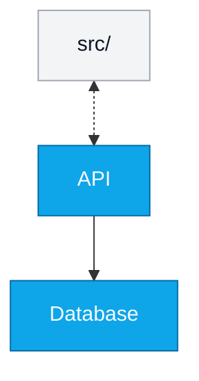

# v27 Sample — alla nya features

Genererad 2026-05-16 av MermaidCanvas v27 för verifiering av round-trip.

Detta är ett exempel-canvas som visar v27:s nya features i mermaid-format:
- Plattform = `blank` (Blank canvas, inga regler)
- Form-paketer = `basic` + `architecture` (toggle:ade i Lägen-menyn)
- Pilar med olika stilar: en solid one-way (`-->`), en dashed bidi (`<-.->`)
- Edges har `style: solid|dashed` i JSON-state

<!-- mermaidcanvas-state
{
  "canvas": {
    "width": 2000,
    "height": 2000,
    "shapeBaseWidth": 120,
    "shapeBaseHeight": 80,
    "unit": "pt"
  },
  "specType": "general",
  "platform": "blank",
  "shapePacks": ["basic", "architecture"],
  "nodes": [
    {"id": "module_N0", "x": 400, "y": 300, "label": "API", "type": "rectangle", "category": "module", "showLabel": true, "size": 1.0, "rotation": 0, "note": ""},
    {"id": "module_N1", "x": 700, "y": 300, "label": "Database", "type": "rectangle", "category": "module", "showLabel": true, "size": 1.0, "rotation": 0, "note": ""},
    {"id": "folder_N2", "x": 550, "y": 150, "label": "src/", "type": "rectangle", "category": "folder", "showLabel": true, "size": 1.0, "rotation": 0, "note": ""}
  ],
  "edges": [
    {"from": "module_N0", "to": "module_N1", "label": "", "bidirectional": false, "style": "solid"},
    {"from": "folder_N2", "to": "module_N0", "label": "", "bidirectional": true, "style": "dashed"}
  ]
}
-->
