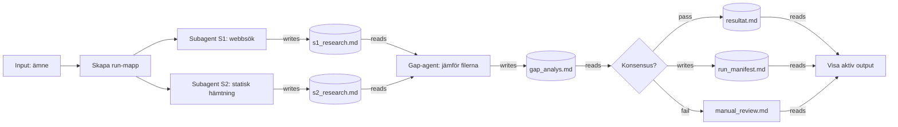

# demo-skill-3-subagents — Skill Protocol Package (referens)

Detta är ett **självbärande** Skill Protocol Package. Det beskriver ett helt
flöde — noder, kopplingar, körmodell, manifest, grind, output och validatorregler
— i en enda fil. En läsare som aldrig sett projektet ska kunna förstå och
**dry-runa** flödet enbart utifrån denna fil.

Mönstret som bevisas: **subagent är en egen nodtyp** (egen agent, eget
kontextfönster, egen uppgift) och **verktyg är metadata i nodens kontrakt** —
inte en egen nod. Två subagenter tar olika vägar, blinda för varandra, och
skriver var sin fil. En gap-agent jämför **enbart filerna**. En grind avgör utan
att skapa fakta. Resultatet är en **fil**.

---

## Så här läser och kör du detta protokoll (självbärande regler)

**Källordning:** `Node contracts` (YAML) är den exekverbara sanningen. `Mermaid`
är en vy av samma graf. Vid konflikt vinner contractet. `prompt`-fältet är bara
en naturlig instruktion — all hård logik (verktyg, läsrättigheter, skrivmål,
pass/fail) står i strukturerade fält, inte i prompten.

**Nodtyper (`type`):**
- `input` — det användaren ger när skillen startar.
- `script` — deterministiskt steg (kod, inte LLM).
- `subagent` — egen agent med eget kontextfönster; verktyg står i kontraktet
  (`allowed_tools`/`forbidden_tools`) och blindhet i `forbidden_reads`.
- `agent` — LLM som analyserar/syntetiserar **från redan skapade filer**; surfar
  aldrig.
- `gate` — kontrollpunkt; läser, utvärderar, dirigerar. **Skapar aldrig fakta.**
- `memory` — överlämningsfil (markdown) mellan steg; har en ägare och ett format.
  `role` förfinar: `handoff`, `result_writer`, `manifest`.
- `manual` — automatiken stoppar och flaggar till en människa.
- `output` — slutsteg; visar den aktiva outputfilen och pekar `latest/` rätt.

**Kant-typer (`kind`):** `normal` (kontrollflöde) · `pass`/`fail` (utgår från en
grind) · `writes` (en nod skriver till en memory-fil) · `reads` (en nod läser en
memory-fil).

**Körmodell:**
1. Skapa en unik `run_id` = `<datum>_<tid>_<ämnes-slug>`.
2. Skapa run-mappen `<run_root>/runs/<run_id>/`. **Allt** skrivs där — aldrig i
   run_root och aldrig i en äldre run-mapp.
3. Följ kanterna. Noder i samma parallella grupp körs samtidigt och MÅSTE vara
   blinda för varandras filer.
4. `run_manifest.md` skapas av script-noden och uppdateras av grind + output.
5. `<run_root>/latest/run_manifest.md` är alltid en kopia av senaste runnens
   manifest.

**PASS/FAIL:** grindens utfall följer av `gap_analys.md`. PASS ⇒ aktiv output är
`resultat.md` (ingen aktiv `manual_review.md`). FAIL ⇒ aktiv output är
`manual_review.md` (ingen `resultat.md` skapas). Manifestets `status` och `aktiv
outputfil` MÅSTE matcha utfallet.

---

## Mermaid



---

## Skill metadata

```yaml
skill_id: demo-skill-3-subagents
title: "Demo Skill 3 — Subagents (vokabulärsbeviset)"
description: "Två blinda subagenter researchar via olika verktyg, en gap-agent jämför enbart filerna, en grind avgör utan att skapa fakta, resultatet är en fil."
input: "ett ämne (fritext); default 'elcyklar'"
output: "<run_root>/runs/<run_id>/ med run_manifest.md + aktiv outputfil; <run_root>/latest/run_manifest.md pekar på senaste körningen"
run_root: "demo-skill-3"
```

---

## Node contracts

```yaml
nodes:
  - id: input_amne
    type: input
    title: "Input: ämne"
    inputs: []
    outputs: [ämne]
    pass_conditions: "alltid (fältet har default 'elcyklar')"
    prompt: "Trigger: användaren säger 'kör demo-skill-3' + valfritt ämne. Obligatoriskt: nej. Default: 'elcyklar'."

  - id: script_mapp
    type: script
    role: run_initializer
    title: "Skapa run-mapp"
    inputs: [ämne]
    outputs: [run_id, "runs/<run_id>/", "runs/<run_id>/run_manifest.md"]
    allowed_tools: [Bash]            # date, mkdir -p
    forbidden_tools: [WebSearch]
    write_scope: "runs/<run_id>/"
    pass_conditions: "run-mappen och run_manifest.md (rader run_id, input, status: STARTAD) finns efteråt"
    fail_behavior: "gå till manual_koll med felet"
    prompt: "Skapa run_id = <datum>_<tid>_<ämnes-slug>, skapa runs/<run_id>/ bredvid denna fil, skriv run_manifest.md med run_id, input (ämnet), status: STARTAD."

  - id: subagent_s1
    type: subagent
    role: researcher
    title: "Subagent S1: webbsök"
    inputs: [ämne, run_id]
    outputs: ["runs/<run_id>/s1_research.md"]
    allowed_tools: [WebSearch]
    forbidden_tools: [static_fetch]
    allowed_reads: []
    forbidden_reads: ["runs/<run_id>/s2_research.md"]     # blind för syskonet
    write_scope: "runs/<run_id>/s1_research.md"
    pass_conditions: "filen har H1 'S1 Research: <ämne>' + exakt 3 rader '- <fakta> (källa: <URL>)' + raden 'Sökfraser:'"
    fail_behavior: "skriv rubriken FEL + orsaken i filen och fortsätt (gap-agenten ser felet)"
    prompt: "Hitta 3 aktuella fakta om ämnet, var och en med källa, via webbsökning. Hitta aldrig på källor."

  - id: subagent_s2
    type: subagent
    role: researcher
    title: "Subagent S2: statisk hämtning"
    inputs: [ämne, run_id]
    outputs: ["runs/<run_id>/s2_research.md"]
    allowed_tools: [static_fetch]    # t.ex. Bash curl mot kända källsidor
    forbidden_tools: [WebSearch]
    allowed_reads: []
    forbidden_reads: ["runs/<run_id>/s1_research.md"]     # blind för syskonet
    write_scope: "runs/<run_id>/s2_research.md"
    pass_conditions: "filen har H1 'S2 Research: <ämne>' + exakt 3 rader '- <fakta> (källa: <URL>)' + raden 'Hämtade sidor:'"
    fail_behavior: "skriv rubriken FEL + orsaken i filen och fortsätt"
    prompt: "Hitta 3 aktuella fakta om ämnet via en ANNAN väg än S1: hämta rå text direkt från kända källsidor. Hitta aldrig på källor."

  - id: memory_s1
    type: memory
    role: handoff
    title: "s1_research.md"
    outputs: ["runs/<run_id>/s1_research.md"]
    write_scope: "runs/<run_id>/s1_research.md (ägare: subagent_s1)"
    pass_conditions: "filen finns och följer formatet (H1 + 3 källrader + 'Sökfraser:')"

  - id: memory_s2
    type: memory
    role: handoff
    title: "s2_research.md"
    outputs: ["runs/<run_id>/s2_research.md"]
    write_scope: "runs/<run_id>/s2_research.md (ägare: subagent_s2)"
    pass_conditions: "filen finns och följer formatet (H1 + 3 källrader + 'Hämtade sidor:')"

  - id: agent_gap
    type: agent
    role: synthesizer
    title: "Gap-agent: jämför filerna"
    inputs: ["runs/<run_id>/s1_research.md", "runs/<run_id>/s2_research.md"]
    outputs: ["runs/<run_id>/gap_analys.md"]
    allowed_reads: ["runs/<run_id>/s1_research.md", "runs/<run_id>/s2_research.md"]
    forbidden_tools: [WebSearch, static_fetch]   # surfar aldrig, skapar ingen ny fakta
    forbidden_reads: ["runs/<annan_run_id>/*"]   # aldrig filer från andra runs
    write_scope: "runs/<run_id>/gap_analys.md"
    pass_conditions: "varje påstående har en status (BEKRÄFTAT/ENSAMT/KONFLIKT)"
    fail_behavior: "gå till manual_koll"
    prompt: "Jämför påståendena i de två filerna och klassa varje: BEKRÄFTAT (båda), ENSAMT (en väg), KONFLIKT (motsäger). Skriv en tabell Påstående | S1 | S2 | Status."

  - id: memory_gap
    type: memory
    role: handoff
    title: "gap_analys.md"
    outputs: ["runs/<run_id>/gap_analys.md"]
    write_scope: "runs/<run_id>/gap_analys.md (ägare: agent_gap)"
    pass_conditions: "H1 'Gap-analys: <ämne>' + tabell med kolumnen Status ifylld för varje rad"

  - id: gate_konsensus
    type: gate
    title: "Konsensus?"
    allowed_reads: ["runs/<run_id>/gap_analys.md"]    # ENDAST aktuell run
    forbidden_tools: [WebSearch, static_fetch]        # skapar aldrig fakta
    pass_conditions: "minst 2 påståenden har status BEKRÄFTAT och ingen KONFLIKT är olöst"
    fail_behavior: "vidare till manual_koll"
    write_scope: "runs/<run_id>/run_manifest.md (endast bokföring: gatevillkor, gateutfall, status, aktiv outputfil)"
    prompt: "GRIND. Läs bara gap_analys.md i aktuell run-mapp. PASS ⇒ resultat.md. FAIL ⇒ manual_review.md. Uppdatera run_manifest.md med utfallet."

  - id: memory_resultat
    type: memory
    role: result_writer
    title: "resultat.md"
    outputs: ["runs/<run_id>/resultat.md"]
    write_scope: "runs/<run_id>/resultat.md (ägare: kedjan; skrivs ENBART efter PASS, ALDRIG i en FAIL-run)"
    pass_conditions: "H1 'Resultat: <ämne>' + rader run_id, Status: PASS, Gate-villkor, + de BEKRÄFTADE påståendena med båda källorna"

  - id: memory_manifest
    type: memory
    role: manifest
    title: "run_manifest.md"
    outputs: ["runs/<run_id>/run_manifest.md"]
    write_scope: "runs/<run_id>/run_manifest.md (kedjan: script skapar, gate+output uppdaterar)"
    pass_conditions: "rader run_id, input, status, aktiv outputfil, 'Skapade filer', gatevillkor, gateutfall finns OCH PASS/FAIL-reglerna håller"

  - id: manual_koll
    type: manual
    title: "manual_review.md"
    outputs: ["runs/<run_id>/manual_review.md"]
    write_scope: "runs/<run_id>/manual_review.md (ägare: kedjan vid FAIL)"
    pass_conditions: "innehåller run_id, vilket villkor som föll, vad som testats, varför automatiken stoppar, exakt vad användaren ska kontrollera"
    prompt: "STOPP — mänsklig koll. Gissa inte, reparera inte tyst. I en PASS-run får filen bara finnas om den är märkt 'Scope-beslut'."

  - id: output_visa
    type: output
    title: "Visa aktiv output"
    inputs: ["runs/<run_id>/run_manifest.md"]
    allowed_reads: ["runs/<run_id>/run_manifest.md", "runs/<run_id>/resultat.md", "runs/<run_id>/manual_review.md"]
    write_scope: "runs/<run_id>/run_manifest.md (slutför fillistan) + latest/run_manifest.md"
    pass_conditions: "den aktiva outputfilen (enligt manifest) visas ordagrant; latest/run_manifest.md är en kopia av aktuella manifestet; första raden i svaret är PASS/PARTIAL/FAIL"
    prompt: "Visa den aktiva outputfilen enligt run_manifest.md i AKTUELL run-mapp. Komplettera manifestets fillista. Skriv latest/run_manifest.md som kopia."
```

---

## Edge contracts

```yaml
edges:
  - { from: input_amne,     to: script_mapp,     kind: normal }
  - { from: script_mapp,    to: subagent_s1,     kind: normal }
  - { from: script_mapp,    to: subagent_s2,     kind: normal }
  - { from: subagent_s1,    to: memory_s1,       kind: writes }
  - { from: subagent_s2,    to: memory_s2,       kind: writes }
  - { from: memory_s1,      to: agent_gap,       kind: reads }
  - { from: memory_s2,      to: agent_gap,       kind: reads }
  - { from: agent_gap,      to: memory_gap,      kind: writes }
  - { from: memory_gap,     to: gate_konsensus,  kind: reads }
  - { from: gate_konsensus, to: memory_resultat, kind: pass }
  - { from: gate_konsensus, to: manual_koll,     kind: fail }
  - { from: gate_konsensus, to: memory_manifest, kind: writes }
  - { from: memory_resultat, to: output_visa,    kind: reads }
  - { from: memory_manifest, to: output_visa,    kind: reads }
  - { from: manual_koll,    to: output_visa,     kind: reads }
```

---

## Execution policy

```yaml
execution:
  run_id_format: "<datum>_<tid>_<ämnes-slug>"      # t.ex. 2026-06-11_2249_elcyklar
  run_dir: "demo-skill-3/runs/<run_id>/"
  parallel_groups:
    - [subagent_s1, subagent_s2]                   # blinda för varandra
  ordering: follow_edges
  manifest:
    file: run_manifest.md
    required_fields: [run_id, input, status, "aktiv outputfil"]
    written_by: script_mapp
    updated_by: [gate_konsensus, output_visa]
  latest:
    dir: "demo-skill-3/latest/"
    copy_of: run_manifest.md
  rules:
    - "Allt en körning skapar skrivs under run_dir — aldrig i demo-skill-3/ eller i en äldre run."
    - "gate_konsensus skapar aldrig fakta; den läser, utvärderar och dirigerar."
    - "subagent_s1 och subagent_s2 är blinda för varandras filer (forbidden_reads)."
```

---

## Validator spec

```yaml
validator:
  manifest_required_fields: [run_id, input, status, "aktiv outputfil"]
  filelist_section: "Skapade filer"
  outcomes:
    PASS:
      active: resultat.md
      must_exist: [resultat.md]
      forbid_active: [manual_review.md]      # får bara finnas märkt "Scope-beslut"
    FAIL:
      active: manual_review.md
      must_exist: [manual_review.md]
      must_not_exist: [resultat.md]
    ARKIV:
      active: INGEN
  gate_from_file:
    source_file: gap_analys.md
    count_column: Status
    pass_when: { min: { BEKRÄFTAT: 2 }, max: { KONFLIKT: 0 } }
  scope:
    write_must_be_under: "runs/<run_id>/"
    each_memory_single_owner: true           # undantag: role: manifest ägs av kedjan
  latest:
    must_copy_latest: true
```

---

## Dry-run-checklista (för en läsare som vill verifiera förståelsen)

1. Användaren säger "kör demo-skill-3 elcyklar". `input_amne` ger ämne=elcyklar.
2. `script_mapp` skapar `run_id` (t.ex. `2026-06-11_2249_elcyklar`), mappen
   `demo-skill-3/runs/2026-06-11_2249_elcyklar/` och `run_manifest.md` (STARTAD).
3. `subagent_s1` (WebSearch) och `subagent_s2` (static_fetch) körs parallellt,
   blinda för varandra, och skriver `s1_research.md` resp. `s2_research.md`.
4. `agent_gap` läser BARA de två filerna och skriver `gap_analys.md` (tabell med
   Status per påstående). Surfar aldrig.
5. `gate_konsensus` läser bara `gap_analys.md`: ≥2 BEKRÄFTAT och 0 KONFLIKT ⇒ PASS.
6. PASS ⇒ `resultat.md` skrivs; manifest: status PASS, aktiv outputfil resultat.md.
   FAIL ⇒ `manual_review.md` skrivs; ingen resultat.md; manifest aktiv = manual_review.md.
7. `output_visa` visar aktiv outputfil, slutför manifestets fillista och kopierar
   manifestet till `demo-skill-3/latest/run_manifest.md`.
8. Giltig run ⇔ alla validatorregler ovan håller.
