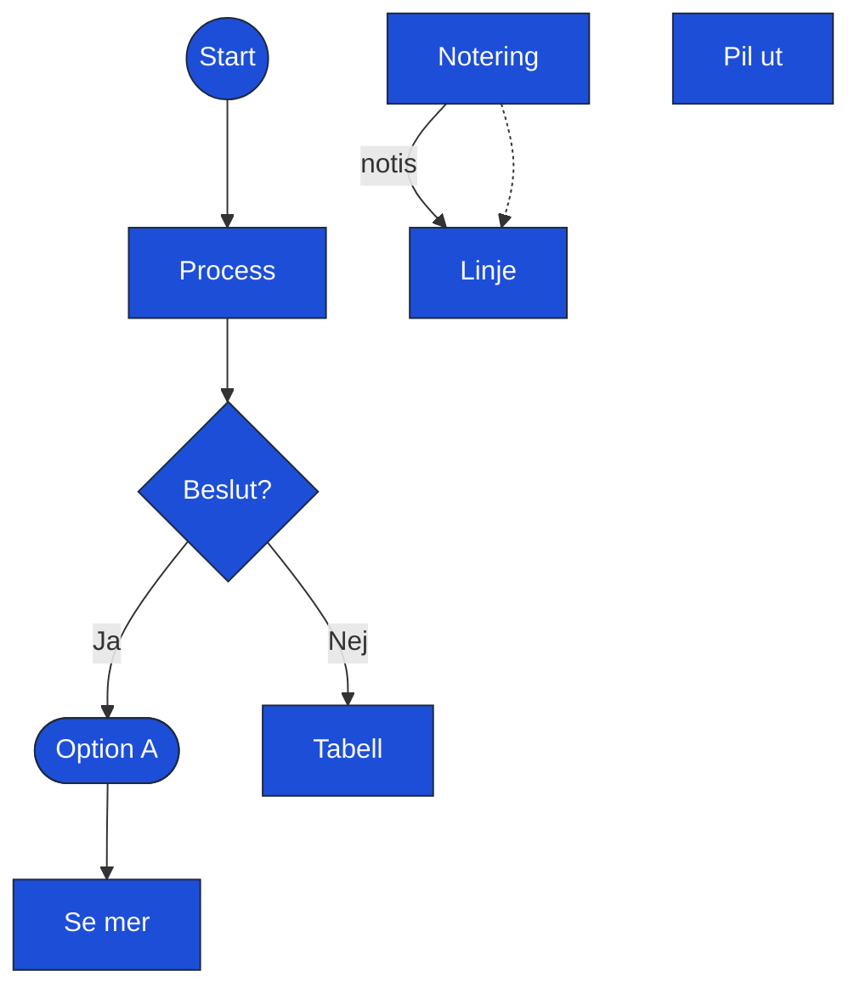

# Test v35.1 — alla former med pilar

Genererad 2026-05-19T17:12:38Z. Samma 9 former + 7 pilar. Edges styr layout — inga ~~~-hints.

<!-- mermaidcanvas-state
{
  "platform": "blank",
  "shapePacks": [
    "basic"
  ],
  "specType": "general",
  "nodes": [
    {
      "id": "ui_N0",
      "type": "circle",
      "x": 1800,
      "y": 1750,
      "label": "Start",
      "category": "ui",
      "showLabel": true,
      "size": 1.0,
      "rotation": 0,
      "note": ""
    },
    {
      "id": "ui_N1",
      "type": "rectangle",
      "x": 2000,
      "y": 1750,
      "label": "Process",
      "category": "ui",
      "showLabel": true,
      "size": 1.5,
      "rotation": 0,
      "note": ""
    },
    {
      "id": "ui_N2",
      "type": "diamond",
      "x": 2200,
      "y": 1750,
      "label": "Beslut?",
      "category": "ui",
      "showLabel": true,
      "size": 1.0,
      "rotation": 0,
      "note": ""
    },
    {
      "id": "ui_N3",
      "type": "pill",
      "x": 1800,
      "y": 1950,
      "label": "Option A",
      "category": "ui",
      "showLabel": true,
      "size": 0.8,
      "rotation": 0,
      "note": ""
    },
    {
      "id": "ui_N4",
      "type": "text",
      "x": 2000,
      "y": 1950,
      "label": "Notering",
      "category": "ui",
      "showLabel": true,
      "size": 1.0,
      "rotation": 0,
      "note": ""
    },
    {
      "id": "ui_N5",
      "type": "table",
      "x": 2200,
      "y": 1950,
      "label": "Tabell",
      "category": "ui",
      "showLabel": true,
      "size": 2.0,
      "rotation": 0,
      "note": ""
    },
    {
      "id": "ui_N6",
      "type": "link",
      "x": 1800,
      "y": 2150,
      "label": "Se mer",
      "category": "ui",
      "showLabel": true,
      "size": 1.0,
      "rotation": 0,
      "note": ""
    },
    {
      "id": "ui_N7",
      "type": "line",
      "x": 2000,
      "y": 2150,
      "label": "Linje",
      "category": "ui",
      "showLabel": true,
      "size": 1.0,
      "rotation": 0,
      "note": ""
    },
    {
      "id": "ui_N8",
      "type": "arrow",
      "x": 2200,
      "y": 2150,
      "label": "Pil ut",
      "category": "ui",
      "showLabel": true,
      "size": 1.0,
      "rotation": 0,
      "note": ""
    }
  ],
  "edges": [
    {
      "from": "ui_N0",
      "to": "ui_N1",
      "label": "",
      "bidirectional": false,
      "style": "solid"
    },
    {
      "from": "ui_N1",
      "to": "ui_N2",
      "label": "",
      "bidirectional": false,
      "style": "solid"
    },
    {
      "from": "ui_N2",
      "to": "ui_N3",
      "label": "Ja",
      "bidirectional": false,
      "style": "solid"
    },
    {
      "from": "ui_N2",
      "to": "ui_N5",
      "label": "Nej",
      "bidirectional": false,
      "style": "solid"
    },
    {
      "from": "ui_N3",
      "to": "ui_N6",
      "label": "",
      "bidirectional": false,
      "style": "solid"
    },
    {
      "from": "ui_N4",
      "to": "ui_N7",
      "label": "notis",
      "bidirectional": false,
      "style": "solid"
    },
    {
      "from": "ui_N4",
      "to": "ui_N7",
      "label": "notis",
      "bidirectional": false,
      "style": "dashed"
    }
  ],
  "canvas": {
    "width": 4000,
    "height": 4000,
    "shapeBaseWidth": 120,
    "shapeBaseHeight": 80,
    "unit": "pt",
    "iphoneFrame": {
      "x": 1304,
      "y": 1074,
      "width": 393,
      "height": 852,
      "designWidth": 393,
      "designHeight": 852
    }
  }
}
-->
